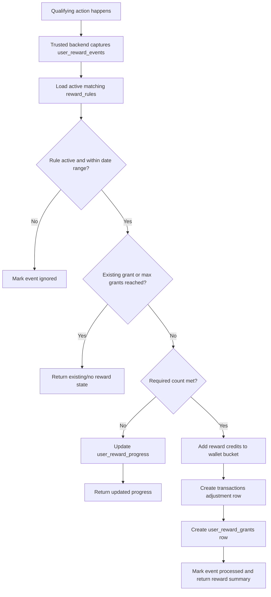
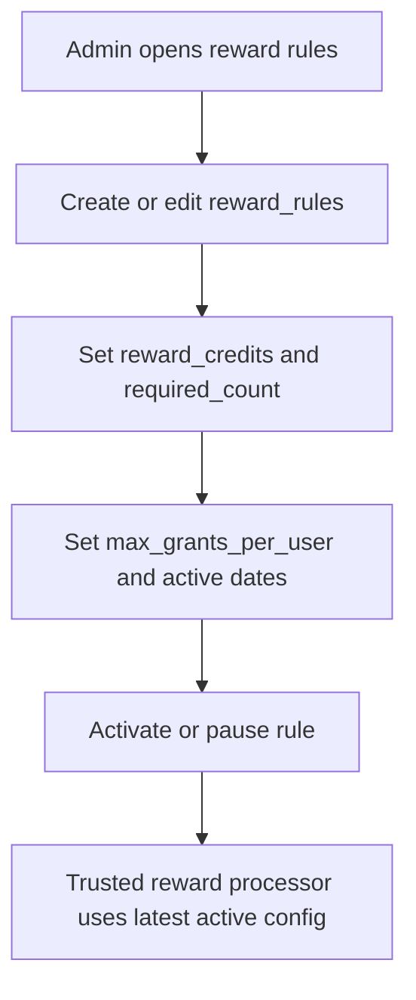
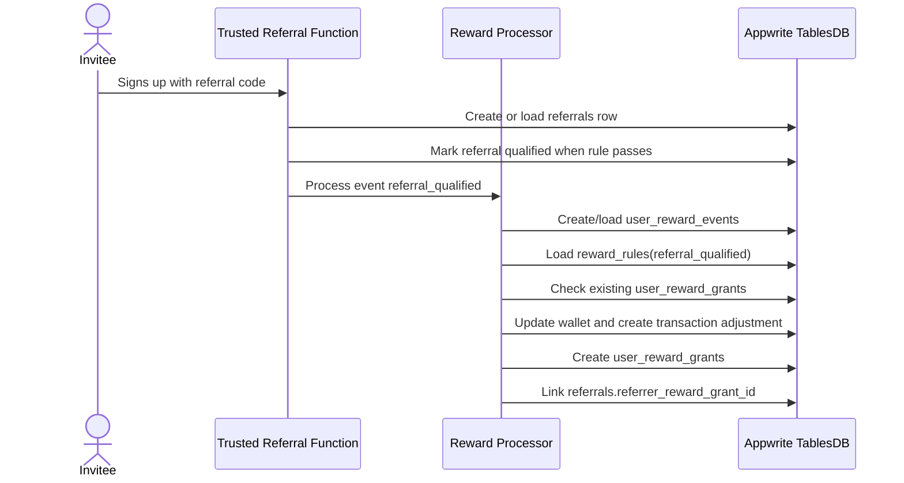
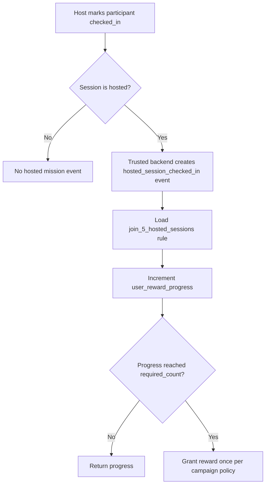
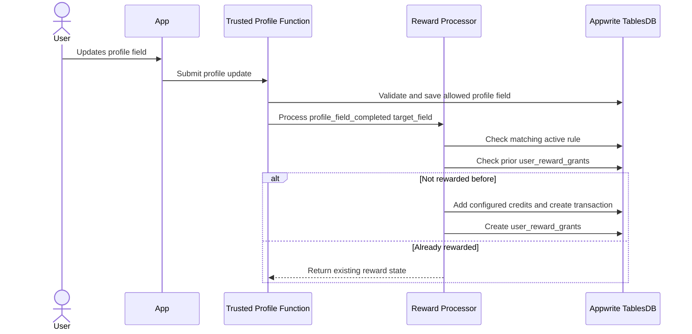

# Gamification Reward Workflow

This document is the **Credits / Utility pillar** child workflow of the PikaCircle gamification system. It defines how
editable reward rules create auditable wallet credits through trusted backend logic.

> **Table rename:** The reward rule table is `reward_rules` (formerly `gamification_reward_rules`; renamed for
> consistency with `penalty_rules`). The companion tables `user_reward_events`, `user_reward_progress`, and
> `user_reward_grants` are unchanged.

> **Scope:** This document covers the **credit reward engine** — profile completion rewards, LinkedIn/job-title
> verification rewards, referral credit bonuses, hosted-session attendance missions, attendance streak milestones, and
> future campaign/weekly missions. Referral and profile completion are **first-class gamification reward categories**,
> not separate systems.
>
> This document does **not** cover: reputation score calculation, access gate evaluation, or Player Level derivation.
> Those belong to the umbrella plan:
> `docs/app workflows/gamification-system-plan.md`
>
> Referral attribution, code lifecycle, and abuse prevention are in the referral child doc:
> `docs/app workflows/referral-system-workflow.md`
>
> Attendance streak computation and reputation impact live in the system plan; this doc covers only the credit reward
> side of streak milestones.

## Goals

- Reward useful user actions such as referrals, hosted-session attendance, and profile completion.
- Keep every reward amount editable through data rows, not app code.
- Prevent duplicate one-off rewards and repeated retry grants.
- Support fractional reward credits such as `0.15`.
- Keep all wallet changes auditable through `transactions`.
- Let Flutter display missions and progress without trusting Flutter to grant credits.

## Core rules

- **Editable values**
  - Rule: Reward amounts, thresholds, active dates, max grants, and campaign status live in `reward_rules`.
- **Credit owner**
  - Rule: Credits are granted only by trusted Appwrite Functions or server-side code.
- **Ledger**
  - Rule: Every granted reward writes `transactions.type = adjustment`.
- **Idempotency**
  - Rule: `user_reward_events`, `user_reward_progress`, and `user_reward_grants` prevent duplicate rewards.
- **Wallet bucket**
  - Rule: Gamification rewards default to `wallet.free_credits` because they are bonus credits.
- **Membership**
  - Rule: Gamification credits do not count toward paid-credit membership unless a future rule explicitly marks them as
    qualifying paid credits.
- **Client trust**
  - Rule: Flutter can display rewards and call trusted functions, but it must not write reward, wallet, or transaction
    rows directly.

## Data model

Use these active schema tables from `docs/database.md`:

- `reward_rules` - editable reward definitions and seed values.
- `user_reward_events` - idempotent record of qualifying actions.
- `user_reward_progress` - per-user progress for multi-step missions.
- `user_reward_grants` - source of truth for credits already granted.
- `wallet` - current free/paid credit balances.
- `transactions` - credit ledger for reward adjustments.
- `referrals` - referral attribution, linked to reward grants.
- `session_participants` and `sessions` - source for hosted attendance missions.
- `users` - source for profile-completion fields.

Recommended seed rules are defaults only. Admin/backend tooling may edit these values later without changing schema or
Flutter code.

## Reward family taxonomy

| Reward family | `trigger_event_type` | Example rule code | Counts toward paid membership? | Reputation impact? |
|--------------|---------------------|------------------|-------------------------------|-------------------|
| Profile completion | `profile_field_completed` | `profile_avatar_added`, `profile_birthday_set`, etc. | No | No |
| Profile verification | `profile_field_verified` | `profile_job_title_verified` | No | No |
| Referral qualified | `referral_qualified` | `referral_qualified` | No | No |
| Hosted-session attendance | `hosted_session_checked_in` | `join_5_hosted_sessions` | No | ✅ (separate reputation event) |
| Attendance streak milestone | `admin_adjustment` (MVP) / future `streak_milestone` | `streak_4_weeks` | No | ✅ (separate streak_milestone reputation event) |
| Admin campaign / weekly missions | `admin_adjustment` | campaign-defined | No | No (unless explicitly configured) |

- **`referral_qualified`**
  - Trigger: Accepted referral qualifies
  - Default reward: `3`
  - Required count: `1`
  - Max grants per user: Campaign-defined
- **`join_5_hosted_sessions`**
  - Trigger: User is checked in to hosted sessions
  - Default reward: `2`
  - Required count: `5`
  - Max grants per user: Campaign-defined
- **`profile_avatar_added`**
  - Trigger: User adds avatar/profile picture
  - Default reward: `0.15`
  - Required count: `1`
  - Max grants per user: `1`
- **`profile_birthday_set`**
  - Trigger: User sets birthday/date of birth
  - Default reward: `0.5`
  - Required count: `1`
  - Max grants per user: `1`
- **`profile_gender_set`**
  - Trigger: User sets gender
  - Default reward: `0.5`
  - Required count: `1`
  - Max grants per user: `1`
- **`profile_job_title_added`**
  - Trigger: User adds job title
  - Default reward: `2`
  - Required count: `1`
  - Max grants per user: `1`
- **`profile_job_title_verified`**
  - Trigger: Trusted LinkedIn job-title verification succeeds
  - Default reward: `2`
  - Required count: `1`
  - Max grants per user: `1`
- **`profile_industry_added`**
  - Trigger: User adds industry
  - Default reward: `1`
  - Required count: `1`
  - Max grants per user: `1`
- **`profile_salary_range_added`**
  - Trigger: User adds salary range
  - Default reward: `1`
  - Required count: `1`
  - Max grants per user: `1`
- **`profile_phone_number_added`**
  - Trigger: User adds phone number
  - Default reward: `1`
  - Required count: `1`
  - Max grants per user: `1`
- **`profile_location_added`**
  - Trigger: User adds location
  - Default reward: `1`
  - Required count: `1`
  - Max grants per user: `1`

## End-to-end reward flow

Processing requirements:

1. The backend receives or detects a qualifying action.
2. The backend creates or loads one idempotent `user_reward_events` row.
3. The backend loads active `reward_rules` by `trigger_event_type`, optional `target_field`, active date
   range, and rule-specific conditions.
4. The backend checks `user_reward_grants` and `max_grants_per_user` before any wallet update.
5. If the rule needs multiple events, the backend updates `user_reward_progress`.
6. When the user qualifies, the backend increments the configured wallet bucket.
7. The backend writes a `transactions.type = adjustment` row with positive `credits_delta` and a stable remark such as
   `reward_profile_avatar_added`.
8. The backend creates `user_reward_grants` with `credits_awarded`, `rule_id`, `event_id`, optional `progress_id`, and
   `transaction_id`.

## Rule configuration workflow

Admin-editable fields include:

- `reward_credits`
- `required_count`
- `max_grants_per_user`
- `cooldown_days`
- `wallet_credit_bucket`
- `starts_at`
- `ends_at`
- `is_active`
- `sort_order`
- rule display `name` and `description`

Do not edit historical `user_reward_grants.credits_awarded` when changing a rule. Past grants should remain as snapshots
of what was actually awarded at that time.

## Referral reward flow

Referral rewards start from the referral workflow, but the credit amount comes from `reward_rules`.

Referral requirements:

1. Keep one referral attribution per invitee through `referrals.invitee_user_id`.
2. Reject self-referrals before reward processing.
3. Use the inviter as the reward `user_id` for `referral_qualified`.
4. Link the resulting grant to `referrals.referrer_reward_grant_id`.
5. If invitee rewards are enabled later, create a separate rule and grant for the invitee so both sides remain
   auditable.

## Hosted-session mission flow

The initial hosted-session mission is `join_5_hosted_sessions`: a user receives the configured reward after being
checked in to five hosted sessions.

Hosted mission requirements:

1. Count only sessions where `sessions.host_id` is present or the session is otherwise identified as hosted by trusted
   backend logic.
2. Prefer `session_participants.status = checked_in` so rewards reflect attendance, not just booking.
3. Use `session_participants.$id` as `user_reward_events.source_id` to prevent the same attended session from counting
   twice.
4. Store progress in `user_reward_progress.progress_count`.
5. Grant only when `progress_count >= reward_rules.required_count`.

## Profile-completion reward flow

Profile-completion rewards are one-off rewards for adding useful profile data.

Profile-completion requirements:

1. Reward only the first valid completion for one-off rules.
2. Do not remove a prior reward if the user later clears or changes a field unless an explicit admin reversal flow is
   used.
3. Do not store raw sensitive values such as salary details in `user_reward_events`. Store only `target_field` and
   non-sensitive context.
4. Treat phone number verification separately from phone number entry if a future rule distinguishes them.
5. LinkedIn job-title verification must come from trusted verification logic, not a user-controlled profile update.

## Reversal and support flow

Rewards should normally be append-only. If support must reverse a reward:

1. Admin loads the `user_reward_grants` row.
2. Backend verifies the grant is currently `granted`.
3. Backend creates a reversing `transactions.type = adjustment` row with negative `credits_delta`.
4. Backend decreases the same wallet bucket used by the original grant, without allowing balances to go below
   product-approved limits.
5. Backend sets `user_reward_grants.grant_status = reversed`, `reversed_at`, `reversed_by_user_id`, and `reason`.

Do not delete reward grants or transaction history; support and abuse review need the audit trail.

## Edge cases

- **Rule inactive**
  - Expected behavior: Capture event if useful, but mark ignored or do not grant.
- **Rule amount changed**
  - Expected behavior: New grants use the new amount; old grants keep their snapshot.
- **Repeated profile save**
  - Expected behavior: Return existing grant; do not award again.
- **Retried referral callback**
  - Expected behavior: Reuse existing `referrals` and reward grant.
- **Host toggles check-in twice**
  - Expected behavior: Count the participant source row once.
- **Wallet update succeeds but grant write fails**
  - Expected behavior: Retry idempotently by transaction/source IDs; repair missing grant if needed.
- **Reward transaction fails**
  - Expected behavior: Do not create a grant marked `granted`; leave event pending or failed for retry.
- **User is blocked by penalty system**
  - Expected behavior: Penalty blocks joining, not historical reward display; future rules can decide whether blocked
    users can earn campaign rewards.

## Backend security requirements

- All reward processing must run in trusted Appwrite Functions or server-side code.
- Flutter must not write `reward_rules`, `user_reward_events`, `user_reward_progress`,
  `user_reward_grants`, `wallet`, or `transactions`.
- Reward processors must derive `user_id` from trusted context or trusted source rows, not from arbitrary client
  payloads.
- Reward processors must check rule activity, date windows, max grants, and idempotency before moving wallet credits.
- Every wallet movement must create a transaction ledger row.
- Reward credits should default to `free_credits` and should not affect paid-credit membership calculation.
- Admin rule editing must be restricted to admin/backend tooling.

## Client behavior

Flutter may:

- display active reward missions from trusted reads;
- show progress such as `3 / 5 hosted sessions`;
- show earned reward history from `user_reward_grants` and `transactions`;
- call trusted profile, referral, and session functions that may trigger rewards;
- show reward amounts returned by backend reads.

Flutter must not:

- calculate final reward eligibility locally;
- award credits locally;
- write reward events or grants;
- write wallet balances or transaction rows;
- edit reward rule values from a normal user session.

## Current implementation status

### Schema and seeds — provisioned ✅

- `reward_rules`, `user_reward_events`, `user_reward_progress`, and `user_reward_grants` tables are
  provisioned in the Appwrite MVP schema.
- Seed rules are provisioned for: all profile-completion fields, LinkedIn/job-title verification, referral qualified,
  join-5-hosted-sessions, and streak milestone badges.
- `referral_codes` and `referrals` tables are provisioned.
- Reward amounts are editable seed values, not hard-coded constants.
- Wallet and transaction credit deltas support decimal reward values.

### Trusted functions and UI — not yet implemented

- Trusted reward processor function (shared by profile, referral, hosted-session, and streak flows).
- Trusted referral code generation and referral acceptance functions (see `referral-system-workflow.md`).
- Profile update flow emitting profile-completion reward events.
- Attendance/check-in flow emitting hosted-session reward events.
- Admin UI/API for editing reward rules.
- Flutter reward mission/progress UI.
- Reward grant tests for idempotency and duplicate prevention.
- Backfill/repair job for existing users who already completed profile fields.
- Enum expansion for a dedicated `streak_milestone` trigger type (MVP can route via `admin_adjustment` with
  `target_field = attendance_streak` until the enum is extended).

## Attendance Streak Milestone Rewards *(schema support provisioned; reward logic planned — V1)*

Attendance streaks count **weekly checked-in sessions only** — no daily login streaks. When a player reaches a weekly
play streak milestone, a trusted backend function should create an idempotent reward event and process the matching
`reward_rules` row. Streak computation and reputation impact are documented in
`docs/app workflows/gamification-system-plan.md`; this section covers only the credit reward side.

Implementation note: the current reward-rule schema is already provisioned, but the enum values for
`reward_rules.trigger_event_type` and `user_reward_events.event_type` must be expanded to include a dedicated
`streak_milestone` trigger before using that exact event value. Until that migration is made, a backend implementation may
route streak rewards through `admin_adjustment` with `target_field = attendance_streak`, while preserving idempotency via
`user_reward_events.source_id` / `user_event_source_key`.

Suggested seed rules for streak milestones (editable defaults; add as `reward_rules` rows):

- **`streak_2_weeks`**
  - Trigger: Player completes 2 consecutive active weeks with at least one `checked_in` session per week
  - Default reward: `1` credit
  - Required count: `1` (milestone reached)
  - Max grants per user: Configurable; could be `1` or repeatable each cycle
- **`streak_4_weeks`**
  - Trigger: 4 consecutive active weeks
  - Default reward: `2` credits
  - Required count: `1`
  - Max grants per user: Configurable
- **`streak_8_weeks`**
  - Trigger: 8 consecutive active weeks
  - Default reward: `3` credits
  - Required count: `1`
  - Max grants per user: Configurable
- **`streak_12_weeks`**
  - Trigger: 12 consecutive active weeks
  - Default reward: `5` credits
  - Required count: `1`
  - Max grants per user: Configurable

These are additional reward rules to be added to the `reward_rules` table when V1 gamification is
implemented. All amounts are seed defaults editable by admin/backend tooling without schema changes.

## MVP implementation checklist

**Schema / seeds — provisioned ✅**

- [x] `reward_rules`, `user_reward_events`, `user_reward_progress`, `user_reward_grants` tables provisioned in Appwrite schema.
- [x] Seed editable default reward rules (profile completion, verification, referral, hosted-session attendance).
- [x] Seed attendance streak badge definitions; streak credit reward rules remain planned until the reward enum/seed
  migration is added.
- [x] `referral_codes` and `referrals` tables provisioned in Appwrite schema.
- [x] Wallet and transaction fields support decimal credits.

**Trusted functions and UI — not yet implemented**

- [ ] Implement a trusted reward processor shared by referral, profile, and session flows.
- [ ] Update referral acceptance to call the reward processor (see `referral-system-workflow.md`).
- [ ] Update profile update flow to emit profile-completion events.
- [ ] Update attendance/check-in flow to emit hosted-session events.
- [ ] Add admin/backend tooling to edit reward rules.
- [ ] Add Flutter UI for available missions, progress, and earned rewards.
- [ ] Add tests for one-off profile rewards, referral idempotency, hosted-session progress, and reward reversal.
