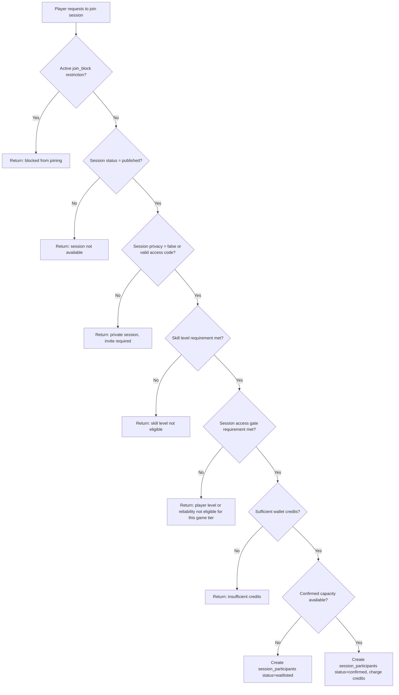
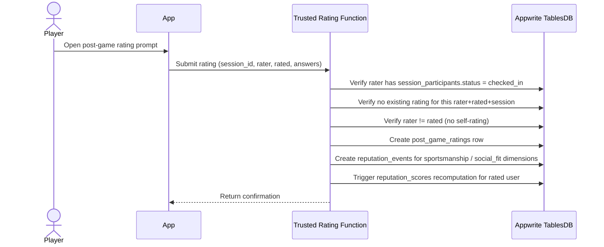

# Gamification System Plan

This is the authoritative planning document for PikaCircle's full gamification strategy, covering all three player axes,
reputation/access mechanics, phased rollout scope, provisioned gamification tables, and implementation guardrails.

**Cross-references:**

- `docs/database.md` — active schema and provisioned gamification tables
- `docs/app workflows/membership-level-credit-workflow.md` — Spending Membership axis (separate from gamification rewards)
- `docs/app workflows/gamification-reward-workflow.md` — Credits/Utility reward engine (child workflow)
- `docs/app workflows/referral-system-workflow.md` — Referral attribution and invite mechanics (child workflow)
- `docs/app workflows/session-workflow.md` — join validation, attendance check-in/no-show source events

---

## Strategy

PikaCircle gamifies **access**, not activity. The goal is to make better games more accessible to players who earn them
through real play quality, reliability, and respect — not through streaks, logins, or spam activity.

Core loop:

```
Reputation → Access → Better Games → Social Status → Repeat Play
```

Design principles:

- Reward weekly real play, not daily logins.
- Gate quality experiences behind proven behavior.
- Keep incentive structures transparent and editable without app releases.
- Never let high skill override bad reliability or poor sportsmanship.
- Backend computes all eligibility; Flutter only displays results.
- Profile completion and referrals are first-class gamification mechanics: completing a profile earns free credits,
  and inviting a verified new player earns a referral credit bonus.

---

## Gamification Pillars and Child Workflows

PikaCircle's gamification system spans four pillars. Each has one or more child workflow docs that own the details.

| Pillar | What it covers | Child doc(s) |
|--------|---------------|-------------|
| **Access / Status** | Player Level / Reputation scores, access gate rules, game quality labels, post-game ratings, Player Card | This document (`gamification-system-plan.md`) |
| **Credits / Utility** | Editable reward rules, free-credit grants for profile completion, referral bonuses, hosted-session attendance missions, streak milestones, future weekly missions | `gamification-reward-workflow.md` |
| **Identity** | Badges, player card display, seasonal/trophy cabinet (V2/V3) | `gamification-system-plan.md` (badge tables); `gamification-reward-workflow.md` (badge trigger via streak rules) |
| **Community / Growth** | Referral attribution, invite code lifecycle, abuse prevention, future clubs/leagues/PCL | `referral-system-workflow.md` |

**Child workflow quick-reference:**

| Doc | Pillar | Owns | Does NOT own |
|-----|--------|------|-------------|
| `membership-level-credit-workflow.md` | — (separate axis) | Spending Membership (paid-credit tier); wallet balance; monthly free credits | Reputation scores; gamification rewards |
| `gamification-reward-workflow.md` | Credits / Utility | `reward_rules` engine; credit grant idempotency; profile, referral, hosted-session, streak reward families | Reputation score calculation; access gates |
| `referral-system-workflow.md` | Community / Growth + Credits | Referral code lifecycle; attribution; abuse prevention | Credit reward amounts (those live in `reward_rules`) |
| `session-workflow.md` | (source events) | Session lifecycle; join validation; check-in/no-show attendance | Reputation computation; reward grants |

---

## Reward vs Reputation

Some player actions affect credit rewards, some affect reputation scores, and some affect both. Trusted backend
functions must emit the right downstream events for each action.

| Action | Credit reward? | Reputation impact? | Source tables | Notes |
|--------|----------------|-------------------|---------------|-------|
| Complete profile field (avatar, birthday, etc.) | ✅ via `reward_rules` | — | `users`, `user_reward_events` | One-off; schema provisioned, trusted function pending |
| LinkedIn / job-title verification | ✅ via `reward_rules` | — | `users`, `user_reward_events` | Trusted verification flow; one-off |
| Referral qualified (invitee signs up) | ✅ via `reward_rules` | — | `referrals`, `user_reward_grants` | MVP qualification = completed signup; future = first attended session or verified profile |
| Checked-in to hosted session | ✅ via `join_5_hosted_sessions` rule | ✅ reliability + activity `reputation_event` | `session_participants`, `reputation_events` | Both reward and reputation streams needed |
| Attendance streak milestone | ✅ via streak milestone rules | ✅ `streak_milestone` `reputation_event` | `attendance_streaks`, `reputation_events` | Credit reward + badge trigger |
| Post-game rating submitted | — (no direct credit) | ✅ sportsmanship + social_fit `reputation_events` | `post_game_ratings`, `reputation_events` | Drives reputation, not credits |
| No-show | — | ✅ strong negative reliability `reputation_event` + `user_penalty_events` | `session_participants`, `reputation_events` | Penalty flow integration |
| Late cancellation | — | ✅ mild negative reliability `reputation_event` | `session_participants`, `reputation_events` | No automatic refund |
| Early cancellation | — (refund applies) | — | `session_participants` | No reputation penalty |

---

## Three-Axis Player Model

PikaCircle defines three independent, non-interchangeable axes for every player. They serve different purposes and must
not collapse into each other.

| Axis | Values | Based On | Drives | Status |
|------|--------|----------|--------|--------|
| **Spending Membership** | Bronze / Silver / Gold / Platinum / GOAT | Net lifetime paid credits from `transactions` | Monetization recognition, perks, discounts | Already implemented |
| **Skill Level** | Beginner / Intermediate / Competitive | Host/admin assigned ability assessment | Skill-gated session joins | Already implemented |
| **Player Level / Reputation** | Open Player / Social Player / Trusted Player / Competitive Player / Circle Elite | Reliability + Sportsmanship + Skill + Activity + Social Fit score | Access unlock to better games | **Schema provisioned; workflow planned V1** |

### Axis 1: Spending Membership

- Stored in `users.membership_level_id` → `membership_levels` table.
- Derived from net lifetime paid credits: purchases minus refunds from the `transactions` ledger.
- Levels: `bronze` (0), `silver` (500), `gold` (1000), `platinum` (5000), `goat` (10000) — seed values only, editable.
- Purpose: reward financially committed players with recognition and perks.
- Does **not** affect join eligibility or game access gates directly.
- Gamification free credits do not count toward paid-credit membership unless explicitly configured.
- See `docs/app workflows/membership-level-credit-workflow.md` for full workflow.

### Axis 2: Skill Level

- Stored in `skills.level` as `beginner`, `intermediate`, or `competitive`.
- Assigned by host or admin; never user-controlled.
- Used for skill-gated session joins: a session with `skill_level = competitive` only accepts players with matching
  skill.
- Does **not** reflect reputation, reliability, or sportsmanship.
- See `docs/app workflows/session-workflow.md` for skill join validation.

### Axis 3: Player Level / Reputation *(schema provisioned — workflow not yet implemented)*

- Stored in provisioned `player_levels` and `reputation_scores` tables (see database section below).
- Computed by trusted backend functions from weighted reputation events.
- Five levels: `open_player`, `social_player`, `trusted_player`, `competitive_player`, `circle_elite`.
- Purpose: gate access to higher-quality games for proven, reliable, respectful players.
- Does **not** replace Spending Membership or Skill Level.
- Weights and thresholds are editable data stored in `reputation_score_weights` and `player_levels`.

---

## Phased Scope

### V1 — Core Reputation & Access *(schema provisioned; trusted functions pending)*

**Access / Status:**
- Player Level / Reputation system (three-axis model axis 3)
- Skill Rating integration (connect `skills.overall_skill_rating` to reputation score)
- Reliability Score (computed from attendance and no-show history)
- Post-Game Rating (4-question session feedback from checked-in participants)
- Game Quality Label (derived from ratings + session config)
- Access Unlock gates (Social / Trusted / Competitive / Circle Elite games)
- No-Show / Cancellation penalty flow integration with reputation events

**Credits / Utility *(schema and seed rules provisioned; trusted functions pending)*:**
- Profile Completion Credit Rewards — per-field free credits (avatar, birthday, gender, job title, industry, etc.) via `reward_rules`
- LinkedIn / Job-Title Verification Reward — one-off credit bonus via `reward_rules`
- Referral Credit Rewards — inviter earns free credits when an invitee qualifies via `reward_rules`
- Hosted-Session Attendance Mission — `join_5_hosted_sessions` rule; earns credits after 5 checked-in hosted sessions
- Attendance Streak Credit Milestones — 2/4/8/12-week streak rewards via `reward_rules`

**Identity / Display:**
- Attendance Streak tracking (weekly play streak, not daily login streak)
- Player Card (shows all three axes, reliability %, badges, streak, match stats)

### V2 — Social & Community *(planned, not MVP)*

- Badges and badge definitions
- Host Ranking
- Club Profiles and XP
- PCL stats, voting, and support ranking
- Weekly Missions (via `reward_rules`)
- Leaderboards (global, city, club)
- Seasonal Reset
- Social Sharing

### V3 — Advanced & Premium *(future)*

- Fantasy PCL
- Advanced analytics
- Premium / sponsored missions
- Non-cash battle pass
- Regional rankings and city championship
- Trophy cabinet
- PCL Club League (league flags on sessions)

> **Note:** Clubs, Leagues, PCL, and Fantasy are future V2/V3 gamification features, not MVP. Do not build or
> release these until separately scoped and promoted.

---

## Appwrite Tables

These tables are provisioned in the Appwrite MVP schema. V1 workflow tables support Player Level / Reputation, access
gates, post-game ratings, session quality labels, and attendance streaks. V2 support tables for badges, seasons, and
leaderboards are also provisioned, but their product workflows should remain disabled until the corresponding V2 work is
implemented. All values noted as defaults are seed values only; admin/backend tooling may edit them.

### `player_levels` *(schema provisioned — V1 workflow)*

Defines the named Player Level tiers and their minimum reputation score thresholds.

- `$id` / `id` — primary key; use slug such as `open_player`
- `name` — enum slug: `open_player`, `social_player`, `trusted_player`, `competitive_player`, `circle_elite`
- `label` — e.g. `Open Player`, `Circle Elite`
- `min_reputation_score` — editable inclusive lower bound (0–100 scale); seed defaults below
- `description` — nullable; what this level means
- `benefits` — nullable player-facing description of access/status benefits
- `sort_order`
- `is_active` — boolean; hide a level without deleting history
- `created_by` — nullable platform-management audit user ID

**Seed defaults (editable):**

| Level | Slug | Min Score |
|-------|------|-----------|
| Open Player | `open_player` | 0 |
| Social Player | `social_player` | 40 |
| Trusted Player | `trusted_player` | 60 |
| Competitive Player | `competitive_player` | 75 |
| Circle Elite | `circle_elite` | 90 |

### `reputation_scores` *(schema provisioned — V1 workflow)*

Stores each user's current computed reputation sub-scores and total score.

- `$id` / `id` — primary key; may mirror `user_id` for one-to-one lookup
- `user_id` — **string Appwrite user ID** (`varchar 64`), not an Appwrite relationship column
- `player_level_id` — relationship to `player_levels`; derived and stored by trusted backend
- `weight_id` — nullable relationship to `reputation_score_weights`; config used for latest calculation
- `composite_score` — decimal 0–100; weighted composite of sub-scores
- `reliability_score` — decimal; based on check-in history vs. no-shows
- `sportsmanship_score` — decimal; derived from post-game ratings
- `skill_score` — decimal; derived from `skills.overall_skill_rating` and skill level
- `activity_score` — decimal; based on sessions played, recency, attendance streak
- `social_fit_score` — decimal; derived from post-game ratings (would you play with them again?)
- `level_snapshot` — nullable cached Player Level label/slug for fast display
- `calculated_at` — nullable timestamp
- `updated_at`
- `user_level_key` — denormalized unique key, normally equal to `user_id`

### `reputation_score_weights` *(schema provisioned — V1 workflow)*

Admin-editable weights and configuration for the reputation calculation engine.

- `$id` / `id` — primary key; use a single row per active config, e.g. `default_reputation_weights`
- `name` — unique admin-facing name
- `reliability_weight` — decimal; default `0.30` (30%)
- `sportsmanship_weight` — decimal; default `0.25` (25%)
- `skill_weight` — decimal; default `0.20` (20%)
- `activity_weight` — decimal; default `0.15` (15%)
- `social_fit_weight` — decimal; default `0.10` (10%)
- `is_active` — boolean; only one active config row should exist at a time
- `starts_at` / `ends_at` — optional activation window
- `created_at`
- `updated_at`
- `created_by` — nullable admin/system actor ID

**Seed defaults (editable):**

| Dimension | Default Weight |
|-----------|---------------|
| Reliability | 30% |
| Sportsmanship | 25% |
| Skill | 20% |
| Activity | 15% |
| Social Fit | 10% |

Trusted backend may update these weights. After editing, trigger a re-computation batch for affected users.

### `reputation_events` *(schema provisioned — V1 workflow)*

Append-only log of individual reputation-impacting events for each user.

- `$id` / `id` — primary key
- `user_id` — **string Appwrite user ID** (`varchar 64`), not an Appwrite relationship column
- `reported_by_user_id` — nullable **string Appwrite user ID** (`varchar 64`)
- `event_type` — enum: `checked_in`, `early_cancel`, `late_cancel`, `no_show`, `post_game_rating_positive`,
  `post_game_rating_negative`, `host_report`, `admin_adjustment`, `streak_milestone`, `skill_update`; extend as needed
- `score_component` — nullable enum: `skill`, `reliability`, `sportsmanship`, `social_fit`, `activity`, `composite`
- `session_id` — nullable relationship to `sessions`
- `participant_id` — nullable relationship to `session_participants`
- `source_table` — nullable; e.g. `session_participants`, `post_game_ratings`
- `source_id` — nullable source row ID for idempotency
- `score_delta` — nullable decimal; approximate score impact for audit/display
- `occurred_at`
- `processed_at` — nullable
- `status` — enum: `pending`, `processed`, `ignored`, `voided`
- `notes` — nullable
- `user_event_source_key` — denormalized unique key, e.g. `userId:eventType:sourceId`

Create `user_event_source_key` when `source_id` is present to prevent duplicate events from retries.

### `access_gate_rules` *(schema provisioned — V1 workflow)*

Admin-editable table defining what conditions are required to join each session access tier.

- `$id` / `id` — primary key; use slug such as `social_games`
- `name` — unique admin-facing gate name
- `access_tier` — enum: `open`, `social`, `trusted`, `competitive`, `circle_elite`, `invite_only`, `pcl_club_league`
- `min_player_level_id` — nullable relationship to `player_levels`; minimum Player Level required
- `min_reliability_score` — nullable decimal; minimum reliability score required
- `min_composite_score` — nullable decimal
- `required_skill_level` — nullable enum: `beginner`, `intermediate`, `competitive`; minimum skill level required
- `requires_skill_verified` — boolean; whether a verified skill rating is required
- `requires_invite` — boolean; true for Circle Elite / invite-only
- `requires_active_membership` — boolean; reserved for gates tied to paid-credit membership
- `is_active` — boolean
- `starts_at` / `ends_at` — optional activation window
- `sort_order`
- `created_by` — nullable platform-management audit user ID

**Seed defaults (editable):**

| Gate | Min Player Level | Min Reliability | Skill Requirement |
|------|-----------------|-----------------|-------------------|
| Open Game | any active, not blocked | — | — |
| Social Game | Social Player+ | 50 | — |
| Trusted Game | Trusted Player+ | 70 | — |
| Competitive Game | Competitive Player+ | — | Competitive or verified skill rating threshold |
| Circle Elite / Invite-only | Circle Elite or admin/host invite | — | — |
| PCL Club League | future V3/V2 league flags | — | — |

### `post_game_ratings` *(schema provisioned — V1 workflow)*

Stores post-game feedback submitted by checked-in participants after a session.

- `$id` / `id` — primary key
- `session_id` — relationship to `sessions`
- `rater_user_id` — **string Appwrite user ID** (`varchar 64`); the participant submitting the rating
- `rated_user_id` — nullable **string Appwrite user ID** (`varchar 64`); the participant being rated (null for
  session-wide questions)
- `moderated_by_user_id` — nullable **string Appwrite user ID** (`varchar 64`)
- `participant_id` — relationship to `session_participants`; rater's roster row (must be `checked_in`)
- `balanced_rating` — nullable integer score for "Was the game balanced?"
- `reliability_rating` — nullable integer score for "Did players show up and were they reliable?"
- `enjoyment_rating` — nullable integer score for "Was it enjoyable?"
- `play_again_rating` — nullable integer score for "Would you play with them again?"
- `sportsmanship_rating` — nullable integer score
- `social_fit_rating` — nullable integer score
- `comment` — nullable text
- `status` — enum: `submitted`, `voided`, `hidden`
- `submitted_at`
- `moderated_at` — nullable timestamp
- `rater_session_key` — denormalized unique key for one session-wide rating per rater/session
- `rater_rated_session_key` — denormalized unique key for one rating per rater/rated user/session

Use `rater_session_key` and `rater_rated_session_key` to prevent duplicate ratings. Only players with
`session_participants.status = checked_in` may submit ratings. Prevent self-rating in trusted backend logic.

### `session_quality_labels` *(schema provisioned — V1 workflow)*

Stores the derived quality label for a completed session.

- `$id` / `id` — primary key; same as `session_id` for one-to-one lookup
- `session_id` — relationship to `sessions`
- `rule_id` — nullable relationship to `access_gate_rules`
- `label` — enum: `balanced`, `trusted`, `social`, `competitive`, `premium`; see Game Quality Labels below
- `score` — nullable derived score
- `source` — nullable source label such as `post_game_ratings` or `admin`
- `calculated_at` — timestamp when trusted backend computed the label
- `expires_at` — nullable
- `is_active` — boolean
- `session_label_key` — denormalized unique key, normally `sessionId:label`

### `attendance_streaks` *(schema provisioned — V1 workflow)*

Stores each user's current and best weekly attendance streak.

- `$id` / `id` — primary key
- `user_id` — **string Appwrite user ID** (`varchar 64`), not an Appwrite relationship column
- `last_session_id` — nullable relationship to `sessions`; latest qualifying session
- `last_participant_id` — nullable relationship to `session_participants`; latest qualifying participant row
- `current_weeks` — integer; number of consecutive calendar weeks with at least one `checked_in` session
- `best_weeks` — integer; all-time best streak
- `last_qualifying_week` — nullable ISO week reference
- `week_anchor` — nullable configured week-start anchor
- `status` — enum: `active`, `paused`, `reset`
- `updated_at`
- `paused_at` / `reset_at` — nullable timestamps
- `user_streak_key` — denormalized unique key, normally equal to `user_id`

### `badge_definitions` *(schema provisioned — V2 workflow)*

Defines available badges and their criteria.

- `$id` / `id` — primary key; use stable slug such as `streak_4_weeks`
- `code` — unique stable slug
- `name`
- `description`
- `icon_url` — nullable
- `category` — enum: `streak`, `reputation`, `skill`, `social`, `seasonal`, `admin`
- `criteria_type` — enum: `streak_milestone`, `reputation_threshold`, `admin_grant`; extend as needed
- `criteria_value` — nullable decimal; e.g. streak length or reputation score threshold
- `is_active` — boolean
- `phase` — enum: `v2`, `v3`; marks which release phase this badge belongs to
- `sort_order`
- `created_by` — nullable platform-management audit user ID

### `user_badges` *(schema provisioned — V2 workflow)*

Records badges awarded to users.

- `$id` / `id` — primary key
- `user_id` — **string Appwrite user ID** (`varchar 64`), not an Appwrite relationship column
- `badge_id` — relationship to `badge_definitions`
- `awarded_at`
- `awarded_by_user_id` — nullable **string Appwrite user ID** (`varchar 64`); admin/system actor ID
- `source_table` — nullable; e.g. `attendance_streaks`, `reputation_scores`
- `source_id` — nullable source row ID
- `status` — enum: `awarded`, `hidden`, `revoked`
- `reason` — nullable text
- `user_badge_key` — denormalized unique key for badge idempotency

Use `user_badge_key` for lifetime-once badge idempotency; allow duplicates for repeatable seasonal badges by using a
different key strategy.

### `seasons` *(schema provisioned — V2 workflow)*

Defines seasonal periods for leaderboards and seasonal resets.

- `$id` / `id` — primary key
- `name` — e.g. `Season 1 Q1 2026`
- `starts_at`
- `ends_at`
- `is_active` — boolean
- `reset_on_end` — boolean; whether reputation or activity resets at end of season
- `created_by` — nullable platform-management audit user ID

### `user_season_stats` *(schema provisioned — V2 workflow)*

Per-user stats snapshot for a given season.

- `$id` / `id` — primary key
- `user_id` — **string Appwrite user ID** (`varchar 64`), not an Appwrite relationship column
- `season_id` — relationship to `seasons`
- `games_played`
- `checked_in_count`
- `no_show_count`
- `late_cancel_count`
- `reputation_score` — decimal snapshot
- `points` — integer leaderboard/season points
- `rank` — nullable integer
- `updated_at`
- `user_season_key` — denormalized unique key, normally `userId:seasonId`

Use `user_season_key` for uniqueness.

### `leaderboard_entries` *(schema provisioned — V2 workflow)*

Stores ranked leaderboard positions for a given scope and season.

- `$id` / `id` — primary key
- `user_id` — nullable **string Appwrite user ID** (`varchar 64`), not an Appwrite relationship column
- `season_id` — nullable relationship to `seasons`; null for all-time leaderboards
- `leaderboard_type` — enum: `reputation`, `reliability`, `attendance_streak`, `sportsmanship`, `host`, `club`,
  `seasonal`, `pcl`
- `scope` — enum: `all_time`, `seasonal`, `city`, `club`; extend as needed
- `scope_value` — nullable; city name or club ID for scoped leaderboards
- `rank` — integer
- `score` — decimal
- `display_label` — nullable cached public display label
- `updated_at`
- `leaderboard_entry_key` — denormalized unique key for one entry per board/scope/user/season

---

## Core Workflows

### Join Validation — with Access Gates *(V1 addition)*

The full join validation sequence for trusted join logic. The access gate check is a **new V1 addition** and must run
after restrictions/status/privacy/skill and before wallet charge and capacity confirmation.



Access gate check (step F) must load the session's configured `access_gate_rules` (if any), then load the player's
`reputation_scores` and `player_levels` to verify eligibility. Flutter must never compute this check locally.

### Attendance Streak Flow *(planned — V1)*

- Count `checked_in` sessions by calendar week (Mon–Sun), not by calendar day.
- Streak advances **once per week** — multiple check-ins in the same week count as one week.
- A week without any `checked_in` session breaks the streak (resets to 0) unless the streak is paused by policy.
- `no_show` or `late_cancel` events may **pause** streak advancement for a configurable number of weeks (editable
  policy in `reputation_score_weights` or a future penalty policy config row).
- Streak milestones trigger `reputation_events` of type `streak_milestone` and may trigger credit rewards via
  `reward_rules`.
- **No daily login streak.** Only real play (checked-in sessions) counts.

Suggested editable milestone examples (seed defaults):

| Weeks | Example Reward |
|-------|---------------|
| 2 weeks | Badge: `streak_2_weeks` + small credit reward |
| 4 weeks | Badge: `streak_4_weeks` + medium credit reward |
| 8 weeks | Badge: `streak_8_weeks` + larger credit reward |
| 12 weeks | Badge: `streak_12_weeks` + premium reward or Circle Elite visibility |

### No-Show and Cancellation Penalty Flow *(V1 — extends existing penalty system)*

This flow builds on the existing `penalty_rules`, `user_penalty_events`, and `user_restrictions` tables and adds
reputation dimension tracking.

| Action | Reliability Impact | Refund | Restriction Risk |
|--------|-------------------|--------|-----------------|
| `checked_in` | Positive `reputation_event` (reliability + activity) | N/A | Reduces risk |
| Early cancellation (within refund window) | No reliability penalty | Refund if within window | None |
| Late cancellation (outside refund window) | Negative `reputation_event` (reliability) | No automatic refund | Low |
| No-show (`no_show` status) | Strong negative `reputation_event` (reliability) | No refund | May trigger `join_block` |
| Repeated no-shows | Accumulating negative events | No refund | Triggers `user_restrictions.join_block` per `penalty_rules` |

All transitions must run through trusted Appwrite Functions. Flutter must not write `reputation_events`,
`reputation_scores`, or `user_restrictions` directly.

### Post-Game Rating Flow *(planned — V1)*

After a session is marked `completed`, checked-in participants may submit a post-game rating.



Four rating questions:

1. **Was the game balanced?** → feeds `avg_balanced_score` → influences Game Quality Label
2. **Did players show up and were they reliable?** → feeds `sportsmanship_score` and reliability dimension
3. **Was it enjoyable and respectful?** → feeds `sportsmanship_score`
4. **Would you play with them again?** → feeds `social_fit_score`

Requirements:

- Only `checked_in` participants may rate.
- No self-rating; backend must reject `rater_user_id == rated_user_id`.
- No duplicate ratings per rater-ratee-session combination (enforced by composite index).
- Aggregate ratings after a minimum threshold (e.g. 3 ratings) before influencing reputation to reduce noise.
- Session-wide questions (game balanced, quality) feed `session_quality_labels`; player-specific questions feed
  individual reputation.

### Game Quality Labels *(planned — V1)*

After rating aggregation, trusted backend derives a session quality label stored in `session_quality_labels`.

| Label | Derivation Signal |
|-------|------------------|
| **Balanced** | High balanced-game ratings, similar skill levels in session |
| **Trusted** | High reliability/show-up ratings, Trusted Player+ participants |
| **Social** | High enjoyable/respectful ratings, Social Player+ participants |
| **Competitive** | Competitive skill level session, Competitive Player+ participants |
| **Premium** | Circle Elite participants, high ratings across all dimensions |

Labels are not mutually exclusive in computation but only one primary label should be displayed per session for
simplicity.

---

## Player Card

The Player Card is the user's public profile summary. It must show all three axes **distinctly** and must **not** merge
or conflate them.

```
┌─────────────────────────────────────────┐
│  [Avatar]  Name                         │
│  📍 City/Area                           │
│                                         │
│  🏅 Spending Membership: Gold           │
│  ⭐ Player Level: Trusted Player        │
│  🎯 Skill Level: Intermediate           │
│                                         │
│  Reliability: 78%                       │
│  Attendance Streak: 5 weeks 🔥          │
│                                         │
│  Badges: [streak_4_weeks] [verified]    │
│                                         │
│  Match Stats: 32 games | 21W 11L        │
│                                         │
│  [V2] Social: @handle (if public)       │
└─────────────────────────────────────────┘
```

Privacy rules for Player Card:

- Show: display name, broad location (city/area), skill level, Player Level, Spending Membership level, reliability %
  (rounded), badges, streak, match stats.
- **Do not show:** exact salary, phone number, exact home coordinates, job title unless user has opted in to show it,
  private social handles.
- Sensitive profile fields collected for matching/trust (salary range, phone, exact location) must **never** appear on
  public Player Cards.

---

## Backend Security Rules

These rules apply across all gamification features:

- **Trusted functions only:** All reputation score computation, Player Level derivation, access gate evaluation,
  post-game rating submission, and streak updates must run in trusted Appwrite Functions or server-side code.
- **Client display only:** Flutter may display player levels, reputation scores, streak counts, badges, and quality
  labels. It must **not** compute eligibility, write reputation tables, or write access gates.
- **No client-side eligibility:** Access gate checks for join validation must run server-side. Flutter must not determine
  or cache a user's own Player Level for join decisions.
- **Admin-only writes:** `player_levels`, `reputation_score_weights`, `access_gate_rules`, `badge_definitions`, and
  `seasons` are admin/backend-managed tables. Normal user sessions must not write them.
- **Derive user_id from trusted context:** Reputation processors must derive `user_id` from trusted session context or
  verified source rows, not from arbitrary client payloads.
- **Idempotent events:** `reputation_events.source_id` composite index prevents double-counting check-ins, ratings, or
  no-shows from retries.
- **Appwrite Auth proves identity only:** All game-level authorization (roles, reputation gates, skill gates) must be
  enforced by trusted server logic.
- **String user IDs in wide gamification tables:** The tables `reputation_scores`, `reputation_events`,
  `post_game_ratings`, `attendance_streaks`, `user_badges`, `user_season_stats`, and `leaderboard_entries` store
  user references as **plain `varchar(64)` string columns** holding the Appwrite Auth / `users` row ID, not as
  Appwrite relationship columns. This is necessary because Appwrite relationship columns to the already-wide `users`
  table add reverse-relationship metadata that triggers Appwrite's per-table row-width limit. Trusted backend
  functions must validate these string IDs against the `users` table when authorization or existence checks are
  required. Do not add new user relationships to these tables. Relationships to narrower tables (`player_levels`,
  `access_gate_rules`, `badge_definitions`, `seasons`, `sessions`, `session_participants`) are kept as normal Appwrite
  relationship columns because those tables are narrow enough to stay within the limit.

---

## What Not To Do

These are explicit guardrails to prevent common gamification anti-patterns:

- ❌ **Do not gamify daily login.** Attendance streaks count weekly checked-in sessions only. No daily login bonus, daily
  claim, or login streak.
- ❌ **Do not reward no-skill spam activity.** Joining many low-effort sessions should not inflate reputation as much as
  high-quality checked-in play.
- ❌ **Do not let high skill override bad reliability or sportsmanship.** Skill is only one of five dimensions. A player
  with great skill but a long history of no-shows can still be gated from Trusted/Competitive games.
- ❌ **Do not expose sensitive data on the Player Card.** Salary range, exact phone, home coordinates, and other private
  profile fields must never appear on public profiles.
- ❌ **Do not let Flutter compute eligibility or reputation.** All gate checks, reputation scores, and Player Level
  derivations must run server-side. Flutter is a display layer only.
- ❌ **Do not conflate the three axes.** High Spending Membership does not grant access to Trusted games. High skill does
  not grant Social Player status. Each axis is independent.
- ❌ **Do not build Clubs, Leagues, or PCL features in MVP.** These are V2/V3 scope. Do not ship until separately
  promoted and scoped.

---

## Implementation Checklists

### V1 Checklist

**Schema / seeds — provisioned ✅**

- [x] `player_levels` table provisioned with seeded defaults (5 tiers: Open → Circle Elite)
- [x] `reputation_scores` table provisioned (one row per user via string user_id)
- [x] `reputation_score_weights` table provisioned with seeded default weights
- [x] `reputation_events` table provisioned with idempotency key (`user_event_source_key`)
- [x] `access_gate_rules` table provisioned with seeded defaults (open/social/trusted/competitive/elite/pcl)
- [x] `post_game_ratings` table provisioned with uniqueness keys
- [x] `session_quality_labels` table provisioned
- [x] `attendance_streaks` table provisioned (string user_id)
- [x] `reward_rules` table provisioned with seeded rules (profile completion, verification, referral,
  hosted-session attendance)
- [x] `badge_definitions` contains seeded attendance streak badge definitions; streak credit reward rules still need a
  dedicated reward-rule seed/migration if credits are enabled for streak milestones
- [x] `user_reward_events`, `user_reward_progress`, `user_reward_grants` tables provisioned
- [x] `referral_codes`, `referrals` tables provisioned

**Trusted workflow functions — not yet implemented**

- [ ] Implement trusted reputation score computation function (weighted aggregate from `reputation_score_weights`)
- [ ] Implement trusted attendance streak update function (weekly calendar week, not daily)
- [ ] Implement trusted post-game rating submission function (self-rating prevention, duplicate prevention)
- [ ] Implement trusted game quality label derivation function
- [ ] Integrate access gate check into the existing trusted join function (after skill check, before wallet check)
- [ ] Integrate reputation events for `check_in`, `no_show`, `late_cancel` into existing attendance/penalty flows
- [ ] Implement trusted reward processor (shared by profile, referral, hosted-session, and streak flows)
- [ ] Implement trusted referral code generation and referral acceptance/reward functions
- [ ] Update profile update flow to emit profile-completion events to reward processor
- [ ] Update attendance/check-in flow to emit hosted-session events to reward processor

**Admin tooling and display — not yet implemented**

- [ ] Protect `reputation_scores`, `player_levels`, `reputation_score_weights` from client writes
- [ ] Add admin tooling to edit `player_levels` thresholds, score weights, and gate rules
- [ ] Add admin/backend tooling to edit reward rules
- [ ] Add Flutter display for Player Level, reliability score, attendance streak on player card
- [ ] Add Flutter display for access gate eligibility messaging on session join screen
- [ ] Add Flutter UI for reward missions, progress, and earned history
- [ ] Add Flutter UI for referral invite/share and referral status
- [ ] Implement Player Card read endpoint (all three axes, reliability %, badges, streak, match stats)
- [ ] Write tests for gate evaluation, score computation, rating idempotency, streak logic, and reward idempotency

### V2 Checklist *(planned — post-V1)*

**Schema / seeds — provisioned ✅**

- [x] `badge_definitions` table provisioned with seeded starter badges (streak milestones, reliable_player, good_sport)
- [x] `user_badges` table provisioned (string user_id)
- [x] `seasons` table provisioned
- [x] `user_season_stats` table provisioned (string user_id)
- [x] `leaderboard_entries` table provisioned (string user_id)

**Trusted workflow functions — not yet implemented**

- [ ] Implement badge award logic triggered by streak milestones and reputation thresholds
- [ ] Implement end-of-season stats snapshot logic
- [ ] Implement trusted leaderboard update function
- [ ] Implement Host Ranking score and display
- [ ] Implement Club Profiles and XP (requires club tables, out of scope for V1)
- [ ] Implement Weekly Missions via new `reward_rules` rows
- [ ] Add seasonal reset logic for eligible reputation dimensions
- [ ] Add social sharing cards for Player Level / streak milestones

### V3 Checklist *(future — not yet planned)*

- [ ] Fantasy PCL table design and game mechanics
- [ ] PCL Club League flag on sessions and league-level access gates
- [ ] Advanced analytics dashboard for player growth
- [ ] Regional rankings and city championship mechanics
- [ ] Trophy cabinet for lifetime achievement display
- [ ] Non-cash battle pass flow
- [ ] Premium / sponsored mission flow
