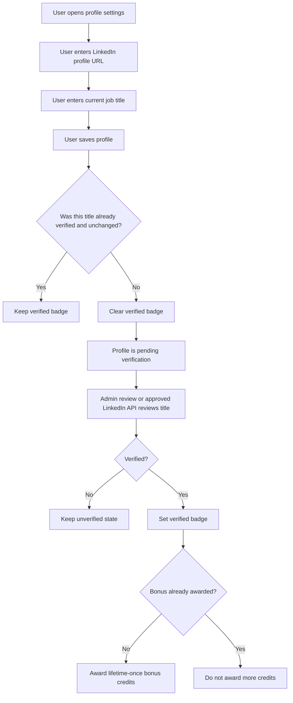

# LinkedIn Verified Badge Workflow

This document defines the PikaCircle workflow for verifying a user's job title with LinkedIn evidence and showing a
verified job-title badge.

## Goals

- Encourage users to add a current job title and LinkedIn profile URL.
- Show a verified badge only after trusted backend/admin verification.
- Award the job-title verification bonus only once in a user's lifetime.
- Allow users to update their job title later, while requiring re-verification.
- Support manual admin review now and restricted LinkedIn API verification later.

## Core rules

- **User input**
  - Requirement: User can input and edit `job_title` and `linkedin_profile_url`.
- **Verification owner**
  - Requirement: Only trusted backend/admin logic can set `job_title_verified = true`.
- **Client restriction**
  - Requirement: Flutter must never let users self-verify or self-award credits.
- **Editing after verification**
  - Requirement: If user changes job title or LinkedIn URL, verified status is removed.
- **Re-verification**
  - Requirement: Manual admin review can verify now; LinkedIn API verification requires approved restricted access.
- **Badge**
  - Requirement: Badge appears only when `job_title_verified = true` for the current stored values.
- **Credit reward**
  - Requirement: Initial bonus is `5` credits, configurable later.
- **Reward frequency**
  - Requirement: Bonus is lifetime-once per user, even after later re-verification.

## Data fields

Use these `users` fields in the active schema:

- `job_title`
- `linkedin_profile_url`
- `job_title_verified`
- `job_title_verified_at`
- `job_title_verified_by` - optional admin/system actor id
- `job_title_credit_awarded_at`
- `company` - optional

Use these wallet/ledger fields for the reward:

- `wallet.free_credits` or `wallet.paid_credits`, depending on product decision
- `transactions.type = adjustment`
- `transactions.credits_delta = +5` initially
- `transactions.remarks = job_title_verification_bonus`

## User workflow

## Backend verification workflow

1. Load the user's current `job_title` and `linkedin_profile_url`.
2. Check that both values are present and valid.
3. Use manual admin review for MVP, or use an approved LinkedIn API path after PikaCircle receives restricted access.
   Standard LinkedIn OIDC cannot verify current job title.
4. If verification fails:
   - keep `job_title_verified = false`;
   - do not award credits;
   - optionally store/admin-note the reason outside the client-facing profile.
5. If verification passes:
   - set `job_title_verified = true`;
   - set `job_title_verified_at`;
   - optionally set `job_title_verified_by` to an admin/system actor id.
6. Check lifetime bonus eligibility:
   - if `job_title_credit_awarded_at` is empty and no prior `job_title_verification_bonus` transaction exists, award the
     configured bonus;
   - otherwise, skip credit award.
7. If awarding credits:
   - update the wallet;
   - create `transactions.type = adjustment`;
   - set positive `credits_delta`;
   - set remarks to `job_title_verification_bonus`;
   - set `job_title_credit_awarded_at`.

## Edit-after-verification workflow

Users are allowed to change job title or LinkedIn URL later.

When either value changes:

1. Save the new value.
2. Clear `job_title_verified`.
3. Keep `job_title_credit_awarded_at` unchanged.
4. Hide the verified badge until the new value is verified again.
5. Re-run manual admin review, or LinkedIn API verification if approved restricted access is available, for the new
   value.
6. If re-verified, show the badge again.
7. Do not award another 5 credits if the lifetime bonus was already awarded.

## Badge display states

- **No job title**
  - Conditions: `job_title` empty
  - UI: No job-title badge.
- **Job title added**
  - Conditions: `job_title` present, not verified
  - UI: Neutral `Job title added` chip.
- **Verified**
  - Conditions: `job_title_verified = true` and title/URL unchanged since verification
  - UI: Green verified chip.
- **Changed after verification**
  - Conditions: User edits title/URL
  - UI: Remove verified chip; show unverified/pending state.

## Security requirements

- Never trust the client to set `job_title_verified`.
- Never trust the client to award credits.
- Keep LinkedIn API tokens and secrets server-side.
- Make bonus awarding idempotent using `job_title_credit_awarded_at` and the transaction ledger.
- Treat the credit amount as backend configuration so it can change later without app release.

## LinkedIn API limitation

Standard LinkedIn OpenID Connect can prove the user controls a LinkedIn identity and can return basic identity claims
such as name, picture, and email. It does not return structured current-position data and must not be marketed as
job-title verification. Official current-position verification requires restricted LinkedIn access, such as Verified on
LinkedIn Plus-tier access with `r_primary_current_experience`. Until that access exists, the safest approach is manual
admin review of user-submitted LinkedIn profile URL and job title.

## Implementation notes

- Current Flutter profile settings already allow users to edit LinkedIn URL and job title.
- Current Flutter display should only show verified state read from backend data.
- The backend/admin portal owns verification, credit grant, and re-verification.
- The job-title bonus is lifetime-once even when users change roles later.
