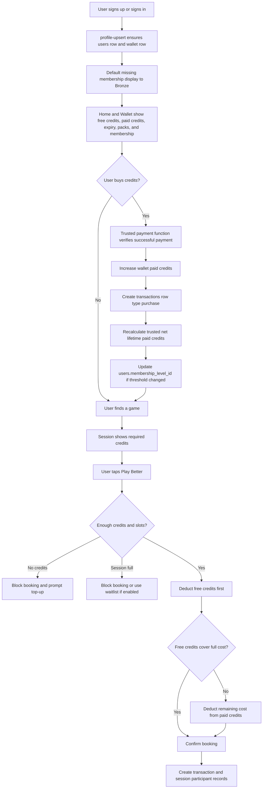
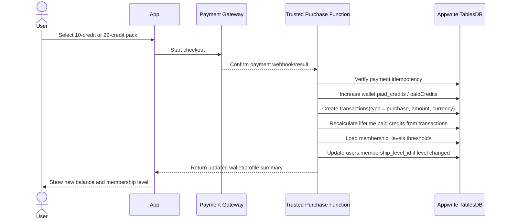
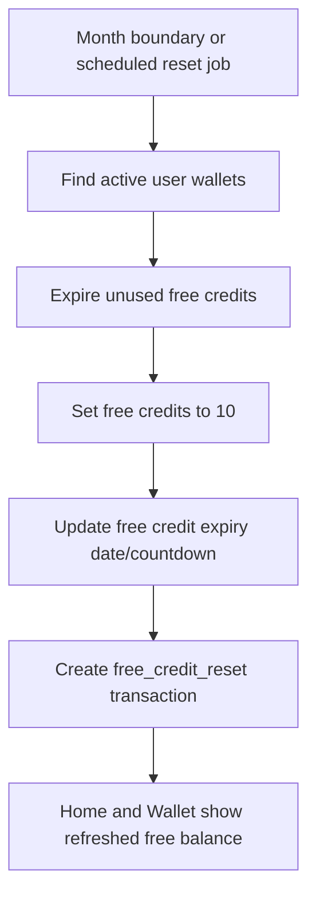
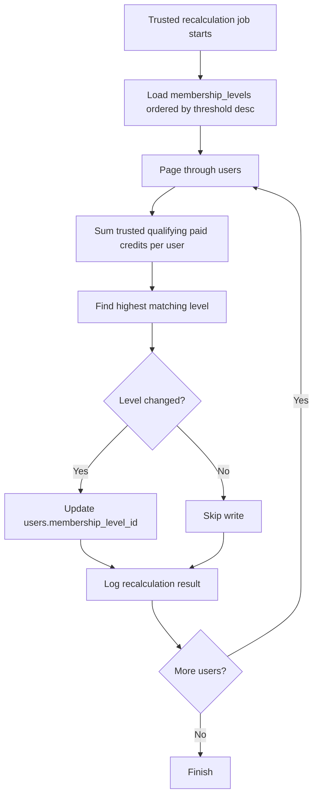

# Membership Level and Credit Workflow

This document defines PikaCircle's wallet credit rules, paid-credit purchase flow, and membership-level calculation as
one connected workflow because membership tiers are derived from trusted paid-credit activity.

Membership is a paid-credit-based recognition tier. It is separate from application roles such as `user`, `host`, or
`admin`, which control permissions and workflows.

> **Important — Three-Axis Model Clarification:**
> Spending Membership is one of three independent player axes in PikaCircle. It is **not** the same as:
>
> - **Skill Level** (`beginner` / `intermediate` / `competitive`) — host/admin assigned ability gate; see
>   `docs/app workflows/session-workflow.md`.
> - **Player Level / Reputation** (`Open Player` → `Circle Elite`) — trust and access tier derived from reliability,
>   sportsmanship, activity, and social fit scores; see `docs/app workflows/gamification-system-plan.md`.
>
> Gamification free credits and reputation events do **not** count toward paid-credit Spending Membership unless a
> future `reward_rules` row explicitly marks them as qualifying paid credits. Each axis is independent.
> For the full three-axis plan and V1/V2/V3 scope, see `docs/app workflows/gamification-system-plan.md`.

## Source-of-truth rules

- **Monthly free credits**
  - Rule: Each user receives `10` free credits per month.
- **Free credit expiry**
  - Rule: Free credits expire completely at the end of the month and do not carry forward.
- **Paid credit expiry**
  - Rule: Paid credits are purchased credits and never expire.
- **Spend priority**
  - Rule: Free credits are always used first, then paid credits.
- **Non-hosted session cost**
  - Rule: Non-hosted sessions cost `2` credits.
- **Hosted session cost**
  - Rule: Hosted sessions cost `4` credits.
- **Hosted session + PB Vision cost**
  - Rule: Hosted session + PB Vision costs `8` credits.
- **Booking validation**
  - Rule: If credits are insufficient, booking is blocked. If the session is full, booking is blocked or waitlisted.
- **Credit packs**
  - Rule: `10` credits = `MYR 50`; `22` credits = `MYR 100`.
- **Job-title verification bonus**
  - Rule: Users can earn `5` bonus credits once in their lifetime after trusted verification.
- **Membership basis**
  - Rule: Membership level is based on trusted net lifetime paid credits from `transactions`, not current wallet
    balance.

## Core concepts

- The `wallet` table stores current balances only: free credits and paid credits.
- The `transactions` table is the credit ledger and source of truth for credit history, paid purchases, refunds, monthly
  resets, adjustments, and session charges.
- Membership levels are stored in the `membership_levels` lookup table.
- A user's current membership level is stored on `users.membership_level_id`, which relates to one row in
  `membership_levels`.
- Membership thresholds are editable data in `membership_levels.min_lifetime_paid_credits`; they must not be hardcoded
  in Flutter.
- Users must not edit wallet balances, transaction rows, or `users.membership_level_id` directly from Flutter.
- All credit-changing and membership-changing actions must run through trusted Appwrite Functions or server-side code.

## Credit types

### Free credits

- Display color: red.
- Monthly allocation: `10` credits.
- Expiry: end of the month.
- Carry-forward: no. Any unused free credits expire completely.
- Primary purpose: reduce friction for onboarding, activation, and repeat play.
- Notification opportunity: remind users when free credits are expiring soon, for example: "You still have 6 free
  credits expiring soon."

### Paid credits

- Display color: green.
- Source: trusted credit-pack purchase.
- Expiry: none.
- Primary purpose: partial monetisation and early revenue.
- Paid credits are only consumed after free credits are exhausted.
- Successful paid-credit purchases contribute to membership qualification.

### Bonus or adjusted credits

- Job-title verification can award `5` bonus credits once in a user's lifetime.
- Bonus credits should be granted by trusted backend/admin workflow only.
- Store every bonus or support adjustment in `transactions` for auditability.
- Bonus/adjustment credits usually do not count toward paid-credit membership qualification unless explicitly marked as
  qualifying paid credits.

## Membership level definitions

The active MVP levels are:

- **`bronze`**
  - Display label: Bronze
  - Tier: 1
  - Default paid-credit threshold: `0`
  - Meaning: Starter membership for every registered player.
- **`silver`**
  - Display label: Silver
  - Tier: 2
  - Default paid-credit threshold: `500`
  - Meaning: User has crossed the first paid-credit threshold.
- **`gold`**
  - Display label: Gold
  - Tier: 3
  - Default paid-credit threshold: `1000`
  - Meaning: User has meaningful paid activity.
- **`platinum`**
  - Display label: Platinum
  - Tier: 4
  - Default paid-credit threshold: `5000`
  - Meaning: High-value regular player.
- **`goat`**
  - Display label: GOAT
  - Tier: 5
  - Default paid-credit threshold: `10000`
  - Meaning: Highest recognition tier.

Thresholds are stored as integer paid-credit counts; one credit equals one unit of wallet credit and never represents
money. Admin/backend tooling may edit `membership_levels.min_lifetime_paid_credits` without changing Flutter code. Use
`membership_levels.sort_order` for display order only; use `min_lifetime_paid_credits` for membership calculation.

## End-to-end user workflow



## Registration defaults

Every new player should start at Bronze with a wallet row.

Implementation requirements:

1. Preferred: trusted profile provisioning writes `users.membership_level_id = bronze` when the `users` row is first
   created.
2. Trusted profile provisioning creates a `wallet` row if missing.
3. Wallet provisioning initializes monthly free credits according to launch policy.
4. Defensive UI behavior: if `membership_level_id` is null or unknown, Flutter displays Bronze.

The database should still store the explicit Bronze relationship for clean admin queries, support workflows, and future
segmentation.

## Booking charge rules

1. Load the user's wallet.
2. Determine the session cost:
   - `2` credits for non-hosted sessions.
   - `4` credits for hosted sessions.
   - `8` credits for hosted sessions with PB Vision.
   - In Appwrite this should be stored on `sessions.credit_cost`; the Flutter app also displays `sessions.credits`.
3. Calculate available balance:
   - `availableCredits = freeCredits + paidCredits`.
4. If `availableCredits < session.credit_cost`, block booking before creating a confirmed participant.
5. If the session is full, block booking or create a waitlist row depending on the session workflow.
6. Deduct credits in this order:
   - spend as many free credits as possible first;
   - spend the remaining cost from paid credits.
7. Create a `transactions` row with `type = session_charge` and a negative `credits_delta`.
8. Create or update `session_participants` with the charged amount in `credits_charged`.

Example deductions:

| Wallet before       | Session    | Cost | Wallet after       |
| ------------------- | ---------- | ---- | ------------------ |
| Free `10`, paid `0` | Non-hosted | `2`  | Free `8`, paid `0` |
| Free `3`, paid `10` | Hosted     | `4`  | Free `0`, paid `9` |
| Free `0`, paid `10` | Non-hosted | `2`  | Free `0`, paid `8` |
| Free `1`, paid `0`  | Non-hosted | `2`  | Booking blocked    |

## Purchase, top-up, and membership uplevel workflow

Use this flow after a credit-pack payment succeeds.



Credit pack and backend requirements:

- `10` paid credits cost `MYR 50`.
- `22` paid credits cost `MYR 100`.
- Wallet must update immediately after a successful trusted purchase.
- Never trust the Flutter client to report payment success.
- Make payment handling idempotent using payment gateway event IDs or another unique payment reference.
- Update the wallet and create the transaction in the same trusted flow.
- Recalculate membership after the ledger write, not before.
- If the calculated membership level is unchanged, leave `users.membership_level_id` as-is.

## Membership calculation rule

Use `transactions`, not `wallet`, to calculate lifetime paid credits.

- **`wallet.free_credits`**
  - Purpose: Current free credit balance.
  - Membership use: Do not count toward paid credits used for membership.
- **`wallet.paid_credits`**
  - Purpose: Current paid credit balance.
  - Membership use: Do not use as lifetime paid credits because it decreases when credits are used.
- **`transactions.type = purchase`**
  - Purpose: Successful paid top-ups.
  - Membership use: Count toward lifetime paid credits after payment is trusted.
- **`transactions.type = refund`**
  - Purpose: Returned credits.
  - Membership use: Subtract refunded paid credits from qualification totals.
- **`transactions.type = adjustment`**
  - Purpose: Admin/system credit movement.
  - Membership use: Usually exclude unless explicitly marked as qualifying paid credits.
- **`transactions.type = session_charge`**
  - Purpose: Credits spent joining sessions.
  - Membership use: Do not count as lifetime paid credits; the purchase was already counted.
- **`transactions.type = free_credit_reset`**
  - Purpose: Monthly free-credit reset.
  - Membership use: Exclude.

Recommended MVP rule: calculate **net paid lifetime credits** as successful purchase transaction credit amounts minus
refunded paid-credit amounts. If refund handling is not finalized yet, document the chosen behavior in the trusted
purchase/refund Function before enabling automatic downleveling.

To calculate a user's level:

1. Calculate trusted net lifetime paid credits from `transactions`.
2. Load all active `membership_levels` rows.
3. Sort by `min_lifetime_paid_credits` descending.
4. Select the first level where:

   ```text
   lifetime_paid_credits >= membership_levels.min_lifetime_paid_credits
   ```

5. Update `users.membership_level_id` to that level ID.

If no threshold matches, use `bronze`. Exactly one level should have a threshold of `0`, normally Bronze.

## Monthly reset workflow



Monthly reset requirements:

- Run from trusted backend/server code, not from the client.
- Reset every user's free credits to `10` each month.
- Do not add `10` on top of unused free credits.
- Do not change paid credits.
- Record the movement in `transactions` with `type = free_credit_reset`.
- Update countdown/expiry display fields so Home and Wallet can warn about expiring free credits.
- Free-credit resets do not affect membership level because membership is based on paid-credit qualification.

## Refund, cancellation, and membership downlevel workflow

Refund policy is not fully specified in the product PDFs. Until policy is finalized, implement refunds only through
trusted backend logic and record every movement in `transactions`.

Session cancellation refund flow:

1. Load the participant row and its `credits_charged` value.
2. Load the related `sessions` row.
3. Check `sessions.refund_available`.
4. Check `sessions.refund_window_hours`, which must be one of `12`, `24`, or `48`.
5. Calculate the refund cutoff as `sessions.starts_at - refund_window_hours`.
6. If `refund_available = true` and `now <= cutoff`, restore credits according to the original charge split where
   possible.
7. If `refund_available = true` and `now <= cutoff`, create a `transactions` row with `type = refund` and a positive
   `credits_delta`.
8. If `refund_available = false` or `now > cutoff`, do not refund automatically; write an audit note through the trusted
   session action flow.
9. Update participant status, such as `cant_go`, `waitlisted`, `checked_in`, or `no_show`.
10. If a waitlist exists, promote the next eligible user and charge that user only when they become confirmed.

Paid-credit purchase refund flow:

1. Trusted refund logic creates `transactions.type = refund` with the refunded paid-credit amount.
2. Recalculate net lifetime paid credits from the transaction ledger.
3. Select the highest matching membership threshold.
4. Update `users.membership_level_id` even if the result is lower.
5. Optionally notify the user that their tier changed because a refund reduced qualifying paid credits.

## Job-title verification bonus workflow

The job-title bonus encourages users to add a current role and LinkedIn profile. It must be granted by a trusted
backend/admin workflow, not by the Flutter client.

Initial rule:

- Award `5` bonus credits after the user's job title is verified for the first time.
- Treat `5` as a configurable backend/admin setting so PikaCircle can adjust it later.
- Prevent duplicate awards for the same user forever. Re-verification can restore the badge, but it must not grant the
  bonus again.

Recommended flow:

1. User enters a LinkedIn profile URL and current job title in the profile screen.
2. User profile remains unverified until reviewed.
3. Admin/backend portal reviews the LinkedIn profile and job title.
4. If approved, backend sets `users.job_title_verified = true` and verification metadata.
5. Backend checks whether `users.job_title_credit_awarded_at` is already set or a prior `job_title_verification_bonus`
   transaction exists.
6. If no prior award exists, backend adds the configured bonus credits to the wallet and sets
   `job_title_credit_awarded_at`.
7. Backend writes a `transactions` row with `type = adjustment`, positive `credits_delta`, and remarks such as
   `job_title_verification_bonus`.
8. If a prior award exists, backend updates verification state only and does not add credits.
9. Flutter displays the verified job-title badge after reading the verified state.

Important controls:

- Users must not be able to set their own verified flag.
- Users must not be able to award their own bonus credits.
- Users can update the job title or LinkedIn URL later.
- If the job title or LinkedIn URL changes after verification, clear verification until a LinkedIn API/backend check
  confirms the new value.
- The 5-credit reward can only happen once in the user's lifetime, even if the user changes jobs and is verified again
  later.
- Store every bonus as a transaction ledger entry so support/admins can audit it.

## Editing membership thresholds

Membership thresholds are operational data.

Admin/backend tooling may edit:

- `membership_levels.min_lifetime_paid_credits`
- `membership_levels.description`
- `membership_levels.benefits`
- `membership_levels.sort_order`

Threshold editing rules:

- Keep Bronze at `0` unless there is a deliberate replacement starter level.
- Avoid duplicate thresholds unless ties are intentionally resolved by `sort_order` or a deterministic backend rule.
- Ensure thresholds increase as tiers increase.
- After changing thresholds, run a trusted recalculation job for all users so stored `users.membership_level_id` values
  match the new rules.
- Keep labels stable (`bronze`, `silver`, `gold`, `platinum`, `goat`) unless the Flutter mapping and admin docs are
  updated together.

## Membership recalculation job

Run a repair/recalculation job when:

- a purchase succeeds;
- a paid-credit purchase refund is issued;
- an admin edits membership thresholds;
- historical transaction data is imported;
- support fixes a user's transaction ledger;
- a scheduled consistency check runs.

Recommended batch flow:



The job must run with server-side credentials. Do not expose bulk membership recalculation to the Flutter client.

## Data model mapping

The canonical database model in `docs/database.md` uses snake_case field names, while the current Flutter/Appwrite reads
use camelCase display fields. Keep this mismatch in mind during schema migration.

- **Current user level**
  - Canonical table/field: `users.membership_level_id`
  - Current Flutter/Appwrite usage: `AccountProfile.membershipLabel`, `ProfileSummary.level`
  - Notes: Relationship to `membership_levels`; Flutter reads only.
- **Level definitions**
  - Canonical table/field: `membership_levels`
  - Current Flutter/Appwrite usage: Flutter maps level IDs to labels
  - Notes: Lookup table for labels, benefits, thresholds, display order.
- **Editable threshold**
  - Canonical table/field: `membership_levels.min_lifetime_paid_credits`
  - Current Flutter/Appwrite usage: Backend/admin only
  - Notes: Inclusive lower bound in paid credits.
- **User wallet**
  - Canonical table/field: `wallet` with one row per user
  - Current Flutter/Appwrite usage: `wallet` row ID is the Appwrite user ID.
  - Notes: Current balance only.
- **Free credits**
  - Canonical table/field: `wallet.free_credits`
  - Current Flutter/Appwrite usage: App reads `freeCredits`.
  - Notes: Monthly expiring balance.
- **Paid credits**
  - Canonical table/field: `wallet.paid_credits`
  - Current Flutter/Appwrite usage: App reads `paidCredits`.
  - Notes: Current paid balance; not lifetime paid credits.
- **Expiry/countdown**
  - Canonical table/field: `wallet.free_credits_expiry_date`, `wallet.reset_countdown`
  - Current Flutter/Appwrite usage: App reads `resetCountdown` and `freeCreditsExpiring`.
  - Notes: Drives Wallet/Home warnings.
- **Credit packs**
  - Canonical table/field: `credit_packs`
  - Current Flutter/Appwrite usage: App reads `name`, `credits`, and `priceLabel`.
  - Notes: Purchase catalog.
- **Session cost**
  - Canonical table/field: `sessions.credit_cost`
  - Current Flutter/Appwrite usage: App writes both `credit_cost` and display field `credits`.
  - Notes: Used during booking validation.
- **Participant charge**
  - Canonical table/field: `session_participants.credits_charged`
  - Current Flutter/Appwrite usage: Documented; not yet implemented in Flutter booking flow.
  - Notes: Records confirmed charge amount.
- **Ledger**
  - Canonical table/field: `transactions`
  - Current Flutter/Appwrite usage: Some trusted functions write rows
  - Notes: Source for paid lifetime, wallet history, and audit.
- **Purchase amount**
  - Canonical table/field: `transactions.amount`, `transactions.currency`
  - Current Flutter/Appwrite usage: Backend purchase flow
  - Notes: Use successful paid purchases for membership paid credits.

## Client behavior

Flutter may:

- display current free credits, paid credits, expiry countdown, credit packs, and membership label;
- display benefits copied from `membership_levels` when a read path is added;
- show progress to the next tier if a trusted backend endpoint returns current qualifying paid credits and the next
  threshold;
- default unknown/null membership values to Bronze for defensive UX;
- call trusted intent endpoints for purchase, booking, cancellation, and profile verification workflows.

Flutter must not:

- write wallet balances directly;
- write `transactions` rows directly;
- write `users.membership_level_id`;
- calculate final membership from local wallet balances;
- trust local purchase success without backend/payment confirmation;
- update `membership_levels` thresholds directly from a normal user session;
- award verification bonus credits from the client.

## Backend enforcement rules

- All credit-changing actions must run in trusted Appwrite Functions or server-side code. The client may display
  balances and call intent endpoints, but it must not directly decide or write credit deductions.
- Verify the authenticated user owns the wallet being charged.
- Verify `sessions.status = published` before allowing booking.
- Verify capacity before confirmation.
- Verify available credits before charging.
- Deduct free credits before paid credits.
- Write `wallet`, `transactions`, and `session_participants` updates in one idempotent flow.
- Prevent duplicate charges from repeated taps or network retries.
- Keep `transactions` as the credit ledger; do not treat `wallet` or `session_participants` as the full wallet history.
- `membership_level_id` is a protected profile field. The `profile-upsert` Function rejects it from client profile
  updates.
- Appwrite does not provide database triggers for this workflow, so each trusted wallet-changing function must
  explicitly call membership recalculation when it writes qualifying paid-credit ledger entries.
- Role changes and membership changes are separate. Teams/roles decide access; credits decide membership level.
- Support/admin overrides should be audited through a transaction, support note, or a future membership audit table
  before changing `users.membership_level_id`.

## Current implementation status

### Implemented

- `membership_levels` table exists with five seeded levels.
- `membership_levels.min_lifetime_paid_credits` stores editable thresholds.
- `users.membership_level_id` exists as a relationship to `membership_levels`.
- Flutter maps `membership_level_id` to Bronze, Silver, Gold, Platinum, or GOAT.
- Missing or null membership displays as Bronze defensively.
- `profile-upsert` protects `membership_level_id` from client writes.
- `profile-upsert` provisions a wallet row for signed-in users when missing.
- Wallet provisioning initializes monthly free credits according to launch policy.
- `AppwritePikaCircleService.fetchHomeOverview()` overlays signed-in wallet balances on the Home screen.
- `WalletController` and `WalletView` load and display free credits, paid credits, expiry/countdown information, wallet
  rules, and credit packs.
- `SessionCreationDraft.toAppwriteData()` writes both `credits` and `credit_cost` when an admin creates a session.
- `SessionCard` displays the session credit requirement.
- `session-join` charges wallet credits and writes `transactions.type = session_charge`.

### Not yet implemented

- Trusted purchase/payment Function for credit-pack checkout.
- Transaction ledger writes for successful paid purchases.
- Automatic membership recalculation after purchases and paid-credit refunds.
- Explicit Bronze relationship assignment during first profile creation.
- Admin UI/API for editing `membership_levels` thresholds and benefits.
- Batch recalculation job after threshold edits or historical imports.
- User-facing progress indicator to the next membership level.
- Monthly scheduled reset that expires unused free credits and grants the next `10` free credits.
- Backend/admin job-title verification bonus credit adjustment.
- Payment gateway integration for credit packs.
- Exact refund policy.
- Push notifications for expiring free credits.

## MVP implementation checklist

- [x] Create `membership_levels` lookup rows for Bronze, Silver, Gold, Platinum, and GOAT.
- [x] Store editable thresholds in `membership_levels.min_lifetime_paid_credits`.
- [x] Protect `users.membership_level_id` from client profile updates.
- [x] Display membership labels from `users.membership_level_id` in Flutter.
- [x] Update wallet provisioning to initialize monthly free credits according to launch policy.
- [ ] Normalize the Appwrite schema field naming or document the current camelCase compatibility layer.
- [ ] Seed `credit_packs` with `10 credits = MYR 50` and `22 credits = MYR 100`.
- [ ] Set `users.membership_level_id = bronze` when creating a new user profile.
- [ ] Implement monthly free-credit reset and expiry countdown.
- [ ] Implement payment gateway checkout and webhook-driven paid-credit top-up.
- [ ] Implement trusted booking function with free-first deduction.
- [ ] Implement transaction history for purchases, charges, resets, refunds, and adjustments.
- [ ] Implement reusable membership recalculation logic.
- [ ] Recalculate membership after purchases, paid-credit refunds, and threshold edits.
- [ ] Add admin tooling to edit thresholds and benefits.
- [ ] Implement insufficient-credit UI prompt from booking failure to Wallet top-up.
- [ ] Implement credit-expiry push notification.
- [ ] Add tests for threshold selection and protected membership updates.
