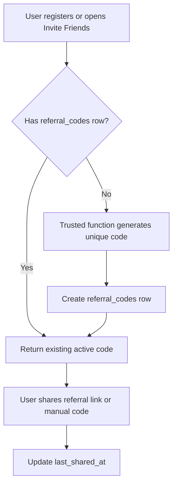
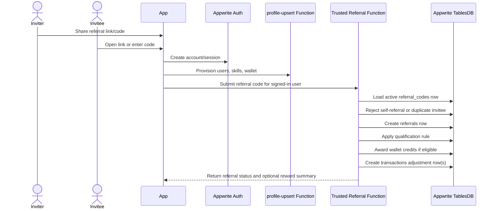
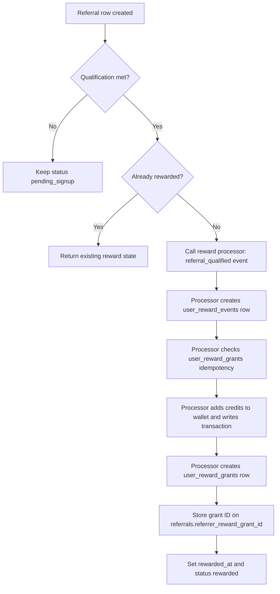

# Referral System Workflow

This document is a child workflow of the PikaCircle gamification system, sitting within the **Community / Growth** and
**Credits / Utility** pillars. It owns referral attribution, invite code lifecycle, and abuse prevention.

> **Gamification context:** Referrals are a first-class gamification mechanic. Inviting a new player and earning a
> credit bonus when they qualify is part of the Credits / Utility reward pillar. The credit reward amounts and grant
> idempotency are controlled by `reward_rules` and detailed in:
> `docs/app workflows/gamification-reward-workflow.md`
>
> The umbrella gamification plan (pillars, reward-vs-reputation table, phased scope) is in:
> `docs/app workflows/gamification-system-plan.md`
>
> **PDF mechanic — "Invite verified player → credit bonus":** For MVP, the qualification rule is completed account
> signup. Future qualification can be tightened to require the invitee's first attended session, phone verification,
> LinkedIn job-title verification, or a paid credit purchase, by updating `reward_rules` and the trusted
> referral function without an app release.

## Goals

- Let every registered user share an invite code or invite link.
- Attribute each new account to at most one referrer.
- Prevent self-referrals, duplicate rewards, and client-side reward abuse.
- Keep referral rewards auditable through `wallet` and `transactions`.
- Support simple MVP rewards now while leaving room for future campaign rules.

## Core rules

- **Invite owner**
  - Rule: Every inviter is an existing `users` row.
- **Invite artifact**
  - Rule: A user shares one active `referral_codes.code` value or link.
- **Attribution**
  - Rule: One invitee account can be linked to only one referral.
- **Self-referral**
  - Rule: Reject if `referrer_user_id == invitee_user_id`.
- **Reward owner**
  - Rule: Rewards are granted only by trusted Appwrite Functions or server-side code.
- **Ledger**
  - Rule: Every credit reward must create a `transactions.type = adjustment` row.
- **Idempotency**
  - Rule: Repeated signup callbacks must not create duplicate referrals or duplicate rewards.
- **Membership**
  - Rule: Referral bonus credits do not count toward paid-credit membership unless a future policy explicitly marks them
    as qualifying paid credits.

## Data model

Use these active schema tables from `docs/database.md`:

- `referral_codes` - one shareable code per inviting user.
- `referrals` - one accepted referral attribution/reward ledger row per invitee.
- `users` - owns both inviter and invitee profile rows.
- `wallet` - stores current bonus/free/paid credit balances.
- `transactions` - audit ledger for referral credit rewards.
- `reward_rules` - source of truth for the referral reward amount and qualification conditions.
- `user_reward_events` - idempotent record of the `referral_qualified` trigger event.
- `user_reward_grants` - preferred idempotency record for the referral credit grant; `referrals.referrer_reward_grant_id` links back to this row.

The trusted referral function should delegate credit grant logic to the shared reward processor (see
`gamification-reward-workflow.md`). Legacy direct transaction relationships on `referrals`
(`referrer_transaction_id`, `invitee_transaction_id`) remain for backwards-compatibility and support queries.

Recommended MVP configuration:

- **Referrer reward**
  - Seed value: `3` free credits via `reward_rules.referral_qualified`
  - Notes: Backend-configured and editable; granted after invitee qualification.
- **Invitee reward**
  - Initial value: `0` credits
  - Notes: Product decision; if enabled later, add a separate invitee reward rule and grant row.
- **Qualification rule**
  - Initial value: Completed account signup
  - Notes: Can later require first booking, first paid top-up, or first attended session.
- **Code status**
  - Initial value: `active`
  - Notes: Users can share while active; admin/backend can pause or revoke.

Referral rewards should be treated as bonus/adjustment credits. If they are added to wallet balance, prefer
`wallet.free_credits` / `freeCredits` unless the business explicitly wants referral rewards to behave like paid credits.

## Invite-code lifecycle

Generation requirements:

1. Generate codes server-side, not in Flutter.
2. Normalize codes before storage and lookup, for example uppercase alphanumeric plus safe separators.
3. Check `referral_codes.code` uniqueness before returning a code.
4. Reuse the user's existing active code instead of creating many codes by default.
5. Do not expose internal API keys or reward configuration to the client.

## New-user referral signup flow

Signup requirements:

1. Capture the referral code from the invite link or manual code entry before or during onboarding.
2. Create the Appwrite Auth user and session first.
3. Run `profile-upsert` so the invitee has a `users` row and `wallet` row.
4. Call a trusted referral function with the authenticated invitee context and the submitted code.
5. The trusted function resolves the code, validates status, rejects self-referral, and checks whether
   `referrals.invitee_user_id` already exists.
6. If valid, create or return the idempotent `referrals` row.
7. If the qualification rule is met, transition the referral to `rewarded` and write wallet/transaction updates in the
   same trusted flow.

## Reward workflow

The trusted referral function delegates credit grant processing to the shared gamification reward processor. The
processor creates a `user_reward_events` row, checks `user_reward_grants` for idempotency, grants credits through
`wallet` + `transactions`, and writes a `user_reward_grants` row. The resulting grant ID is stored back on
`referrals.referrer_reward_grant_id`. See `gamification-reward-workflow.md` for the full reward processor flow.

Reward requirements:

1. Load the `referrals` row using a deterministic ID or unique `invitee_user_id` lookup.
2. Check `status`, `rewarded_at`, and `referrer_reward_grant_id` before calling the reward processor.
3. Delegate credit grant to the shared reward processor with `event_type = referral_qualified`.
4. The processor writes `transactions.type = adjustment` with a stable remark such as `referral_referrer_bonus`.
5. Store the resulting `user_reward_grants` ID on `referrals.referrer_reward_grant_id` for support/audit.
6. Legacy `referrer_transaction_id` may also be set for backwards-compatibility.
7. Increment `referral_codes.uses_count` only when a referral is accepted or rewarded.

Referral adjustment credits are excluded from membership-level paid credit calculations unless a future campaign
explicitly marks them as qualifying via `reward_rules.wallet_credit_bucket`.

## Rejection and edge cases

| Case                          | Expected behavior                                                  |
| ----------------------------- | ------------------------------------------------------------------ |
| Invalid code                  | Show a non-blocking signup message; do not create referral row.    |
| Revoked or paused code        | Reject attribution and ask invitee to request a new link.          |
| Existing invitee referral     | Return existing referral status; do not overwrite attribution.     |
| Self-referral                 | Reject and write no reward.                                        |
| Deleted/referrer missing      | Reject or mark `rejected` with `rejection_reason`.                 |
| Reward write partially fails  | Retry idempotently from `referrals` and transaction relationships. |
| Invitee signs up without code | Allow normal signup; no referral row.                              |

## Backend security requirements

- Flutter may display a user's own referral code and submit an invitee's entered code, but it must not write
  `referral_codes`, `referrals`, wallet balances, or transaction rows directly.
- The trusted referral function must derive `invitee_user_id` from the signed-in execution context, not from a
  client-provided user ID.
- Validate the referral code status server-side every time.
- Enforce uniqueness for `referral_codes.code` and `referrals.invitee_user_id`.
- Reject self-referrals server-side.
- Make reward grants idempotent so retries do not duplicate wallet credits.
- Store every credit movement in `transactions` for support and abuse review.
- Keep reward amounts server-configured so campaigns can change without an app release.

## Client behavior

Flutter may:

- show the user's invite code/link after login;
- open the platform share sheet with a referral link;
- accept a referral code during onboarding;
- call a trusted referral function after registration;
- display referral status, invite count, and reward history returned by backend reads.

Flutter must not:

- create or update referral rows directly;
- decide whether a referral qualifies;
- award credits locally;
- choose arbitrary referral codes without backend validation;
- overwrite an existing referral attribution for a user.

## Current implementation status

### Schema — provisioned ✅

- `referral_codes` and `referrals` tables are provisioned in the Appwrite MVP schema with all documented columns,
  relationships, and indexes.
- `reward_rules` seed row for `referral_qualified` (3 free credits, editable) is provisioned.
- `user_reward_grants` idempotency chain is provisioned (`referrals.referrer_reward_grant_id` relationship exists).
- Self-referral prevention and unique `referrals.invitee_user_id` constraint are schema-level.

### Trusted functions and UI — not yet implemented

- Trusted referral-code generation function.
- Trusted referral acceptance/reward function (calls shared reward processor).
- Flutter invite/share UI.
- Referral-code capture in onboarding links/manual entry.
- Admin/support tooling for referral abuse review.
- Tests for self-referral, duplicate invitee, invalid code, and idempotent reward retry behavior.

## MVP implementation checklist

**Schema — provisioned ✅**

- [x] `referral_codes` and `referrals` tables provisioned in Appwrite schema.
- [x] Unique index for `referral_codes.code` and `referrals.invitee_user_id` provisioned.
- [x] Relationship indexes for inviter, invitee, code, and status provisioned.
- [x] `reward_rules` seed row for `referral_qualified` provisioned (editable reward amount).
- [x] `user_reward_grants` idempotency chain provisioned.

**Trusted functions and UI — not yet implemented**

- [ ] Implement a trusted function to generate or return the current user's referral code.
- [ ] Implement a trusted function to accept referral codes after signup (calls shared reward processor).
- [ ] Add Invite Friends UI in Profile or Wallet.
- [ ] Add referral-code capture to onboarding deep links/manual entry.
- [ ] Confirm or tighten qualification rule (current: completed signup; future: first booking, first attended session, or first phone/job verification).
- [ ] Add abuse controls for self-referral and duplicate device/payment patterns.
- [ ] Add unit/integration tests for idempotent reward behavior.
