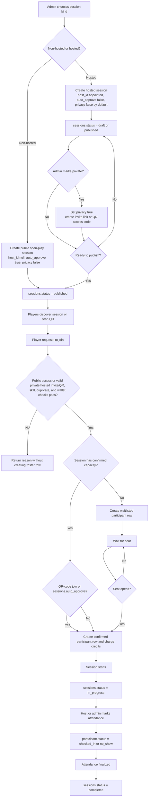
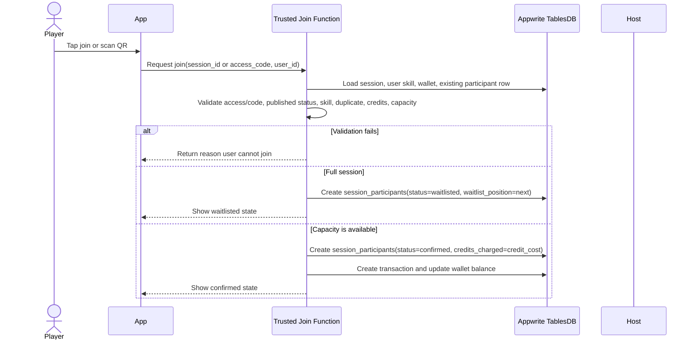
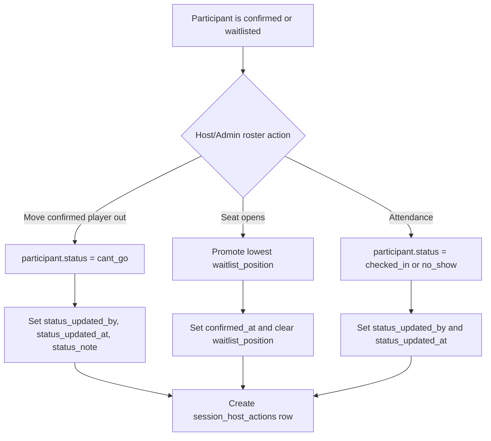
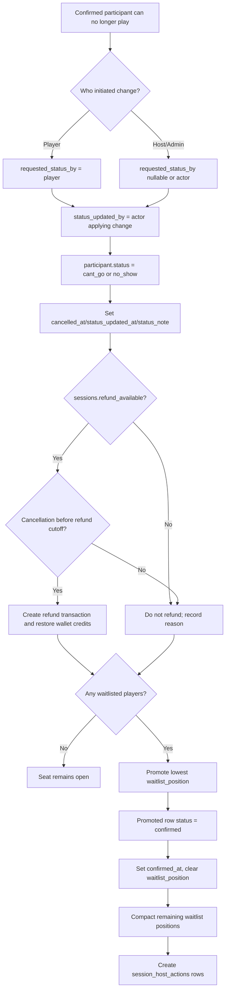
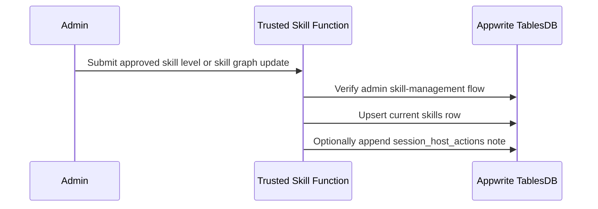

# Session Workflow

This document explains how a PikaCircle session works from creation to completion. It complements `docs/database.md` by
describing the MVP business workflow that writes to `sessions`, `session_participants`, `session_access_codes`,
`session_host_actions`, `transactions`, `wallet`, and current `skills`. PB Vision recording, analysis, and historical
skill snapshot tables are future-only until the integration phase starts.

## Core concepts

- A `sessions` row is the game/session container. It owns host assignment, venue, timing, skill requirement, credit
  cost, visibility, approval behavior, and lifecycle status.
- A `session_participants` row is one user's current roster state for one session. It is the source of truth for
  confirmed players, waitlisted players, cannot-go states, check-ins, and no-shows.
- A `session_host_actions` row is append-only host/admin history. It records what the host did, who was affected, and
  the before/after status when state changes.
- A `session_access_codes` row powers QR and invite joins. It grants access to the join flow, but it does not bypass
  capacity, credit, duplicate, session status, or skill checks.
- A `skills` row stores the user's current skill level and skill graph. In the MVP, signup seeds the initial level from
  onboarding, and trusted admin tooling can adjust it later through backend flows.
- **Player Level / Reputation access gates** *(schema provisioned; V1 join logic not yet implemented)*: Sessions may
  carry a configured access gate tier (e.g. Social Game, Trusted Game, Competitive Game) checked by trusted join logic
  after skill and before wallet charge. See `docs/app workflows/gamification-system-plan.md` for gate rules and player
  level definitions.
- **Post-game ratings** *(schema provisioned; V1 rating flow not yet implemented)*: After a session is `completed`,
  checked-in participants may submit a 4-question post-game rating. Ratings feed sportsmanship, social fit, and game quality label
  computation. See `docs/app workflows/gamification-system-plan.md` for the rating flow.
- Future PB Vision tables such as `session_recordings`, `pb_vision_analyses`, and `participant_skill_snapshots` are
  planning-only for now. They should not be created or written by the current app.
- `users.roles` stores application access flags such as `user`, `host`, and `admin`. It controls which functionality a
  user may access, but trusted server code must still verify every privileged action.
- Appwrite Auth only proves identity. Session rules must be enforced by trusted Appwrite Functions or server-side code
  because clients cannot be trusted to apply capacity, skill, credit, waitlist, role, admin-only, or host-only checks.

## Role model

All signed-in users should have a `users` row whose row ID matches their Appwrite Auth user `$id`. The `users.roles`
array starts as `['user']` and can later include elevated flags.

- **`user`**
  - Who gets it: Every regular player account.
  - Access it unlocks: Discover sessions, join eligible sessions, manage own profile/wallet/history.
- **`host`**
  - Who gets it: Users approved to host PikaCircle sessions.
  - Access it unlocks: Manage assigned hosted sessions, mark check-ins/no-shows, and provide operational feedback.
- **`admin`**
  - Who gets it: PikaCircle operators.
  - Access it unlocks: Create non-hosted and hosted sessions, appoint hosts, publish/cancel sessions, and manage
    lookup/content tables.

Roles are cumulative. For example, a host normally has `['user', 'host']`, while an operator may have
`['user', 'admin']` or `['user', 'host', 'admin']`. Add future permission groups as additional role strings instead of
replacing the whole model with a single account type.

Backend authorization should follow these rules:

- Admin-only actions require `users.roles` to contain `admin`.
- Host actions require the caller to either own the session through `sessions.host_id` and have `host`, or have `admin`.
- Normal join actions require `user` and all session-specific validation such as status, privacy, skill level, wallet
  credits, duplicate participation, and capacity.
- Client UI may use roles to hide buttons, but every trusted function must load the caller's `users` row and verify
  roles before writing privileged data.

## Lifecycle overview

## Admin session creation flow

Admins create exactly one of two session kinds. The create-session operation is admin-only: the trusted function must
verify the caller's `users.roles` contains `admin` before writing the `sessions` row, appointing a host, or publishing
the session.

### Non-hosted session creation

Use this for open play where everyone eligible can join without a host managing approval. Non-hosted sessions are always
public; do not create private or invite-only non-hosted sessions.

1. Admin creates a `sessions` row with:
   - `host_id = null` unless PikaCircle uses a system/venue host account
   - `auto_approve = true`
   - `skill_level = null` by default so the session is open to all skill levels
   - `privacy = false`; this is mandatory for non-hosted sessions
   - `status = published` when it should appear immediately in discovery
   - `session_type`, `session_duration`, `max_participants`, `credit_cost`, venue/timing fields, and display labels
     required by the app
2. If joining happens through a court QR code, create a `session_access_codes` row for scan-to-join convenience:
   - `purpose = qr_join`
   - `status = active`
   - `max_uses = null` for unlimited joins until expiry/revocation, or a number for limited QR campaigns
3. No host participant row is created because no appointed host manages the session.
4. When a player joins and checks pass, trusted join logic creates `session_participants.status = confirmed` and charges
   credits immediately when capacity is available. If confirmed capacity is full, create
   `session_participants.status = waitlisted` with the next `waitlist_position`.

### Hosted session creation

Use this when PikaCircle appoints a host to manage the session. Hosted sessions default to public and only become
private when an admin/trusted backend flow sets `sessions.privacy = true`.

1. Admin creates a `sessions` row with:
   - `host_id = appointed host users.$id`; this is required
   - `auto_approve = true`; retained for compatibility because eligible joins now confirm or waitlist immediately
   - optional `skill_level`; `null` means open to all skill levels
   - `privacy = false` by default; only an admin/trusted backend flow may set `true` for invite/private hosted sessions
   - `status = draft` while the host/admin is preparing details, or `published` if it is immediately ready for discovery
   - `session_type`, `session_duration`, `max_participants`, `credit_cost`, venue/timing fields, and display labels
     required by the app
2. The appointed host's `users.roles` should include `host`; if it does not, admin should add the `host` role before or
   during host assignment.
3. For private hosted sessions, create one or more `session_access_codes` rows before publishing or sending invitations:
   - `purpose = private_invite` for shareable invitation links
   - `purpose = qr_join` for generated QR codes that players scan; valid QR scans auto-confirm when capacity exists and
     waitlist when full
   - `status = active`
   - `max_uses` and `expires_at` based on the event's invitation policy
   - QR payloads and links should include only the join URL/code; the trusted join function validates the access-code
     row server-side.
4. If the host is also playing, create one `session_participants` row:
   - `user_id = sessions.host_id`
   - `role = host`
   - `status = confirmed`
   - `credits_charged = 0`
   - This row counts toward `sessions.max_participants`.
5. Publishing should create a `session_host_actions` row with `action_type = publish_session`.

## Shared session creation fields

Both session kinds use one `sessions` row with:

Session type and duration are inline enums on `sessions`. Do not create or read from `session_types` or
`session_durations`; those lookup tables are obsolete.

1. Identity and ownership:
   - `host_id` for hosted sessions; `null` or a system/venue host for non-hosted open-play sessions
   - `venue_id`
   - optional `sponsor_id`
2. Session details:
   - `title`, `description`, `starts_at`
   - `session_type`, `session_duration`
   - optional `skill_level`; null means open to all skill levels
   - `max_participants`
   - `privacy`
   - `credit_cost`
   - `auto_approve`
   - `status`
3. Current Flutter display fields until the app derives labels from normalized relationships:
   - `venue`
   - `timeLabel`
   - `skill`
   - `location`
   - `hosted`
   - `credits`
   - `remainingSlots`
   - `timeOfDay`
   - optional `sponsor`

For public QR joins, create a `session_access_codes` row with `purpose = qr_join` only when scan-to-join is needed. For
private hosted sessions, create `session_access_codes` rows with `purpose = private_invite` for invitation links and/or
`purpose = qr_join` for generated QR codes. Non-hosted sessions must keep `privacy = false`, so their QR codes are
shortcuts into a public join flow rather than privacy gates. Any valid `qr_join` scan follows the same outcome rule:
confirm the player when capacity exists, or waitlist the player when confirmed capacity is full; do not create an
host approval row for QR scans.

When a draft session is ready, trusted server logic changes `sessions.status` to `published`. The same server flow
creates a `session_host_actions` row:

- `session_id`
- `actor_user_id = host_id` or admin user ID
- `action_type = publish_session`
- `before_status = draft`
- `after_status = published`

## Player join flow

Join validation should check:

- `sessions.status = published`
- `sessions.privacy = false` for public sessions, including all non-hosted sessions
- when `sessions.privacy = true`, the session must be hosted and the request must include a `session_access_codes` row
  with `purpose = private_invite` or `qr_join`
- QR/invite code is active, not expired, not revoked, and below `max_uses` when a `session_access_codes` row is used
- confirm immediately when capacity exists or waitlist when full
- `sessions.skill_level` is null or matches the user's eligible level
- no existing `session_participants` row exists for the same `session_id` + `user_id`
- *(schema provisioned; V1 join logic not yet implemented)* **access gate requirement**: if the session is tagged with
  an access gate tier (Social Game, Trusted Game, Competitive Game, etc.), the trusted join function must check the
  player's `reputation_scores.player_level_id` and `reputation_scores.reliability_score` against the active
  `access_gate_rules` row for that tier. This check runs **after** the skill check and **before** the wallet/capacity
  check. See `docs/app workflows/gamification-system-plan.md` for gate definitions.
- the user has enough available credits for `sessions.credit_cost`
- confirmed capacity, counted from rows where `status` is `confirmed` or `checked_in`; use this to choose `confirmed`
  when a seat exists or `waitlisted` when the session is full

## Host roster management

Eligible join requests no longer enter a manual approval queue. The trusted join function confirms the player when
capacity is available, or waitlists them when full. Hosts manage operational roster changes after that point.

For every waitlist move, attendance update, participant removal, or session cancellation:

1. Update the current state on `sessions` or `session_participants`.
2. Set actor fields such as `status_updated_by`, `status_updated_at`, and `status_note` when the action affects a
   participant.
3. Create a `session_host_actions` row with the relevant `action_type`, `target_user_id`, `participant_id`,
   `before_status`, `after_status`, `reason`, and `note`.

## Waitlist and cancellation flow

Confirmed capacity is derived, not stored. Count `session_participants` rows where `status` is `confirmed` or
`checked_in`.

Credit behavior should follow the participant transition:

- If a player is confirmed, charge credits and store the amount in `credits_charged`.
- Admin controls refund eligibility with `sessions.refund_available`.
- Admin controls the refund cutoff with `sessions.refund_window_hours`, one of `12`, `24`, or `48` hours before
  `sessions.starts_at`.
- Trusted cancellation logic must load the session and check `sessions.refund_available = true` before issuing any
  refund.
- Trusted cancellation logic must also verify `now <= sessions.starts_at - refund_window_hours` before issuing any
  automatic refund.
- If both checks pass, create a `transactions` row with `type = refund` and restore wallet credits according to the
  original charge split where possible.
- If either check fails, do not refund automatically; record the reason in `session_host_actions.reason` or `note`.
- If a host/admin moves a participant out of a confirmed seat before play starts, refund only when both refund checks
  pass or another explicit admin override flow exists.
- `cancelled_at` is kept as the timestamp field name for `cant_go` transitions.
- Keep the wallet balance and transaction history in `wallet` and `transactions`; do not use `session_participants` as
  the full credit ledger.

## Session start, attendance, and completion

1. When play starts, set `sessions.status = in_progress`.
2. Host records attendance from the roster:
   - present player: `session_participants.status = checked_in`
   - absent player: `session_participants.status = no_show`
3. Each attendance change writes a `session_host_actions` row:
   - `action_type = mark_attended` or `mark_no_show`; `mark_attended` maps to `after_status = checked_in`
   - `target_user_id`
   - `participant_id`
   - `before_status = confirmed`
   - `after_status = checked_in` or `no_show`
4. After attendance and optional post-session uploads are done, set `sessions.status = completed`.
5. *(schema provisioned; V1 rating flow not yet implemented)* After `sessions.status = completed`, trusted backend may
   prompt checked-in participants to submit post-game ratings. Ratings feed the reputation system (sportsmanship, social
   fit, game quality label). Only checked-in participants may rate; self-rating is prevented; duplicate ratings per
   rater-ratee-session are prevented. See `docs/app workflows/gamification-system-plan.md` for the post-game rating and
   game quality label flow.

## Skill-level operations and future PB Vision analysis

In the MVP, onboarding creates the user's initial skill level. Later skill changes should be handled by trusted admin
operations. PB Vision may still be used outside PikaCircle as an operational aid, but
PikaCircle does not yet upload recordings, call PB Vision APIs, create PB Vision analysis rows, or automatically update
skill graphs from PB Vision.

The current skill workflow should follow these rules:

- Treat `skills` as the current source of truth for skill-gated joins and participant skill display.
- Signup may seed `skills.level` once from the user's onboarding choice (`beginner`, `intermediate`, or `competitive`)
  through the trusted `profile-upsert` Function. Later changes should go through trusted admin flows; users should
  not directly write the `skills` table.
- When a trusted flow updates `serve`, `return`, `offense`, `defense`, `agility`, or `consistency`, it must compute
  `overall_skill_rating` as `(serve + return + offense + defense + agility + consistency) / 6`. Leave
  `overall_skill_rating` null until all six sub-scores are available.
- If PB Vision is used manually outside PikaCircle, any resulting skill update is still entered through an admin flow in the MVP.
- Do not create `session_recordings`, `pb_vision_analyses`, or `participant_skill_snapshots` in the current app. Those
  tables are reserved for a later automated PB Vision integration.
- When future PB Vision integration starts, store recordings in Appwrite Storage, track asynchronous processing in
  `pb_vision_analyses`, preserve historical `participant_skill_snapshots`, and update `skills` only after the analysis
  is reviewed/accepted.

## Non-hosted session variant

Non-hosted sessions are public open-play sessions where users can discover the session or scan a QR code and join
without host approval.

Operational behavior:

- Discovery can show the session immediately when `sessions.status = published` and `privacy = false`.
- `sessions.privacy` must remain `false`; private/invite-only behavior is not valid for non-hosted sessions.
- QR entry can use an active `session_access_codes` row with `purpose = qr_join`, but the QR only shortcuts the public
  join flow.
- Join requests skip host approval because `sessions.auto_approve = true`.
- `session_participants.status = confirmed` when capacity, duplicate, credit, session status, privacy, and optional QR
  checks pass.
- If confirmed capacity is full, create `session_participants.status = waitlisted` with the next `waitlist_position`.

The participant list and skill levels can still be shown to players by reading `session_participants` and the
participants' current `skills` rows. Historical join-time skill snapshots are deferred until the future PB
Vision/snapshot phase, so MVP UI should use current `skills`. Because there is no active host approval step,
admin/server logic should handle exceptional status changes and create `session_host_actions` with an admin/system actor
when needed.

## Hosted session variant

Hosted sessions use the full host management workflow. They are public by default with `sessions.privacy = false`;
admins can make a hosted session private by setting `sessions.privacy = true` and generating invite links or QR codes.

Operational behavior:

- The appointed host is `sessions.host_id`.
- The appointed host should have `host` in `users.roles`; admins can still override host actions when needed.
- Public hosted sessions are discoverable when `sessions.status = published` and `sessions.privacy = false`.
- Private hosted sessions are not open discovery joins; players must arrive through an invitation link or generated QR
  code backed by an active `session_access_codes` row.
- Valid generated QR scans auto-confirm eligible players when capacity exists and waitlist them when full, even when
  `sessions.auto_approve = false`.
- Eligible players are confirmed when capacity exists and waitlisted when full; hosted sessions do not create a manual
  approval queue.
- The host can move players to waitlist, mark `cant_go`, mark check-ins/no-shows, and view attendance history.
- Host actions should append `session_host_actions` rows so admin/support can audit operational decisions.
- If the host is also playing, the host has a `session_participants` row with `role = host` and `status = confirmed`.

Hosted sessions should use server-side authorization for all host actions. The client may show buttons, but the trusted
function must verify the caller has `host` and owns the session through `sessions.host_id`, or has `admin`, before
changing rows.

## State reference

### `sessions.status`

| Status        | Meaning                                                     | Common next states         |
| ------------- | ----------------------------------------------------------- | -------------------------- |
| `draft`       | Created but not visible/joinable yet                        | `published`, `cancelled`   |
| `published`   | Visible/joinable according to privacy and QR/invite rules   | `in_progress`, `cancelled` |
| `in_progress` | Session has started                                         | `completed`, `cancelled`   |
| `completed`   | Session is finished and attendance can be finalized         | none                       |
| `cancelled`   | Session will not happen or was stopped                      | none                       |

### `session_participants.status`

| Status       | Meaning                                                | Common actor  |
| ------------ | ------------------------------------------------------ | ------------- |
| `waitlisted` | Player is waiting for an open seat                     | system/host   |
| `confirmed`  | Player has a seat and counts toward capacity           | host/system   |
| `cant_go`    | Player says they cannot attend                         | player/host   |
| `no_show`    | Player did not attend                                  | host          |
| `checked_in` | Player attended and was checked in                     | host          |

## Implementation rules

- Keep current state in `sessions` and `session_participants`.
- Keep action history in `session_host_actions`.
- Create a unique composite index on `session_participants.session_id + session_participants.user_id`.
- Do not let clients directly update host-controlled state.
- Do not let clients directly assign `users.roles`; role changes are admin-only.
- Check `users.roles` in trusted functions before admin-only or host-only writes.
- Use trusted Appwrite Functions or server-side code for join, approve, reject, waitlist promotion, attendance,
  cancellation, and credit charge/refund.
- Use trusted Appwrite Functions or server-side code for current `skills` updates. Recording registration, PB Vision job
  creation, and skill snapshot creation are future integration concerns, not MVP behavior.
- Make each server flow idempotent where possible so repeated taps or network retries do not create duplicate
  participant rows or duplicate charges.
