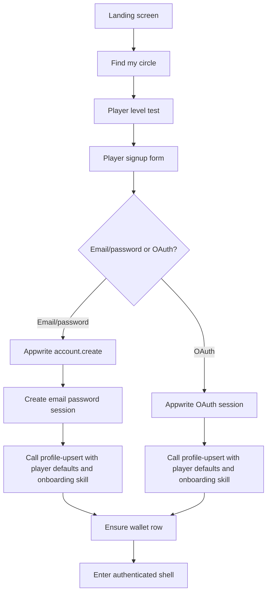
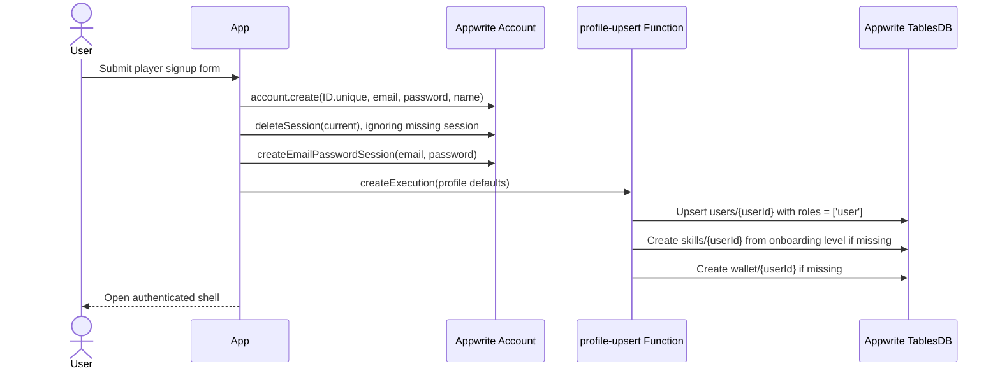
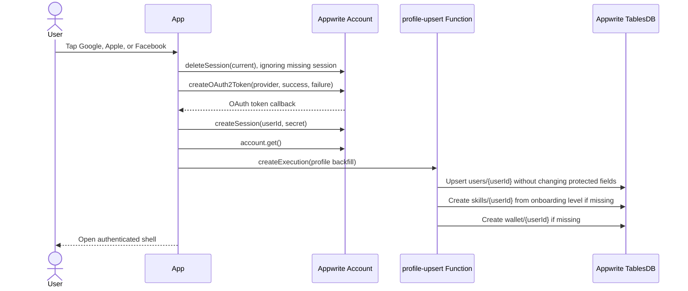

# User Registration and Admin Host Assignment Workflow

This document defines the PikaCircle registration and authentication workflow for normal users, plus the admin-only
process for granting host access. Client-side registration always creates a player account. Host access is not
self-service; it is assigned by an administrator through Appwrite Console or trusted server tooling.

## Core concepts

- Appwrite Auth proves identity and owns email/password and OAuth sessions.
- Flutter does not store workflow/profile data in Appwrite account prefs. Client signups always become normal player
  accounts through trusted backend defaults.
- Host access is only applied by an admin or trusted server-side process.
- Workflow is derived from trusted `users.roles` and confirmed Teams memberships, not from account prefs. Host-only
  writes must still be enforced by trusted Appwrite Functions, Teams, labels, or a backend-controlled `users.roles`
  model.
- Every signed-in account receives or loads a wallet row so players and admin-assigned hosts can both participate in
  paid sessions.
- Existing accounts without trusted `users.roles` default to the player workflow in the client profile mapper.

## Workflow values

- **Player**
  - Trusted source: `users.roles` includes `user`
  - How it is assigned: Default for every client signup.
  - Current Flutter access: Home, Find, Wallet, Profile.
- **Host**
  - Trusted source: `users.roles`/Teams includes `host`
  - How it is assigned: Admin-only assignment through Admin Console or trusted server SDK.
  - Current Flutter access: Home, Find, My Sessions, Wallet, Profile.

## Registration overview



## Player registration flow

Use this when a normal user wants to play sessions. This is the only public registration path in the Flutter app.

1. User taps **Find my circle** on onboarding.
2. User completes the level test.
3. Flutter maps the level-test result into `skillLevel`:
   - Open Play or Social Circle -> `Beginner`
   - Competitive Circle -> `Intermediate`
   - Elite Circle -> `Competitive`
4. User creates an account with email/password or OAuth.
5. Flutter calls the trusted profile provisioning Function to create/update the `users` row with player defaults.
6. The same trusted Function creates `skills/{userId}` with the selected onboarding `level` when the row is missing.
7. The same trusted Function ensures the wallet row exists.
8. User lands in the app shell.

Player capabilities:

- View suggested sessions on Home.
- Browse and filter sessions by skill, type, time, and location.
- Open session details.
- View wallet balance, credit packs, and credit rules.
- Edit profile, avatar, password, LinkedIn URL, job title, bio, and skill-level profile details.
- Log out from Profile settings.

Player restrictions:

- Player accounts do not see the New Session button. Sessions are created by admins only through Admin Console.
- Player accounts must not be able to create, approve, reject, or manage hosted sessions through trusted backend routes.
- Client-side UI hiding is not enough; backend authorization must reject privileged writes.

## Host assignment flow (admin-only)

Use this when PikaCircle approves an existing user to organize or host sessions. Users cannot register themselves as
hosts in the Flutter app.

1. User registers normally through the player flow.
2. Admin verifies the user is allowed to host.
3. Admin assigns the user to a trusted host Team and/or backend-owned role using Appwrite Console or a trusted server
   SDK call. Do not use account prefs for workflow or host approval.
4. Admin may also update the user's trusted `skills` row through backend/admin tooling when a player's level changes.
5. On the next app launch, session refresh, or profile reload, Flutter maps trusted host role context into
   `AccountProfile.workflow`.
6. Flutter shows host UX such as the My Sessions tab and profile capability card.

Host capabilities in the current Flutter app after admin assignment:

- View assigned sessions in the My Sessions tab.
- Trigger Home and Find reload after a session is published by an admin.

Note: Sessions are created exclusively by admins through Appwrite Console. Hosts do not have a New Session button in the
app.

Planned host capabilities from the session workflow:

- Manage roster and waitlist transitions.
- Mark attendance and no-shows.
- Submit post-session notes.

Host restrictions:

- Users must not be able to self-register, self-promote, or directly assign `host` or `admin` from the Flutter client.
- Account prefs must not be treated as proof that the user is an approved host; prefs are reserved for UI settings such
  as theme.
- Trusted backend code must verify the caller has a backend-controlled host role, owns `sessions.host_id`, or has admin
  rights before any host-only state change.
- Host approval status lives in trusted Appwrite Teams memberships and the backend-owned `users.roles` field when it
  affects permissions or money movement.

## Admin host-assignment runbook

### Appwrite Console / Teams

1. Open Appwrite Console.
2. Select the PikaCircle project.
3. Go to **Auth** -> **Teams**.
4. Open the PikaCircle roles/membership Team.
5. Create or update the user's membership with the appropriate permission role strings, for example `user`, `host`, or
   `admin`.
6. Run the trusted role sync so `users.roles` reflects the confirmed Teams membership.
7. Keep `users.membership_level_id` controlled by trusted wallet/payment logic: derive it from net lifetime paid credits
   in `transactions` and the editable `membership_levels.min_lifetime_paid_credits` thresholds.
8. Ask the user to reopen the app or refresh Profile so Flutter reloads their Teams membership and `users` row.

### Trusted server SDK example

Use a server SDK or Appwrite Function with an API key. Do not run this from the Flutter client.

```js
import { Client, Teams } from "node-appwrite";

const client = new Client()
  .setEndpoint(process.env.APPWRITE_ENDPOINT)
  .setProject(process.env.APPWRITE_PROJECT_ID)
  .setKey(process.env.APPWRITE_API_KEY);

const teams = new Teams(client);

await teams.createMembership({
  teamId: "<PIKACIRCLE_TEAM_ID>",
  userId: "<USER_ID>",
  roles: ["user", "host", "silver"],
});
```

After role changes, trusted backend code must synchronize protected database fields. Flutter must not write
`users.roles` or `membership_level_id`; membership level changes come from trusted wallet/payment recalculation.

## Email/password Appwrite sequence

The Flutter email/password flow follows Appwrite client auth standards:



Rules:

- Create the account before creating a session.
- Clear an existing current session before signing in as the newly created user.
- Store profile defaults in `users` through the trusted `profile-upsert` Function after the session exists.
- Send onboarding `skill_level` as `beginner`, `intermediate`, or `competitive`; the Function inserts the initial
  `skills` row if it does not already exist.
- The same Function must idempotently create `wallet/{userId}` after signup or sign-in when it is missing.
- Do not write profile, roles, membership level, avatar, LinkedIn, DUPR, or workflow data to Appwrite Account prefs.
- Surface Appwrite, TLS, and network errors as user-facing onboarding errors.

## OAuth Appwrite sequence

OAuth is used for normal player onboarding and sign-in.



Rules:

- New OAuth users default to `users.roles = ['user']` through the trusted Function.
- Existing OAuth users keep backend-owned `roles` and `membership_level_id`; Flutter only sends editable profile fields
  and an onboarding `skill_level` that seeds `skills` only when no skills row exists yet.
- OAuth callback URLs are derived from `AppwriteConfig.oauthSuccessUrl` and `oauthFailureUrl`.

## Authenticated shell behavior

After registration or login, all workflows enter the same shell:

- Home
- Find
- Wallet
- Profile

The shell reads the current account profile through `ProfileController`. The profile maps `users.roles` plus confirmed
Appwrite Teams memberships into `AccountProfile.workflow`, role labels, and membership labels.

UI behavior:

- Sessions are created by admins through Admin Console; no New Session button is shown in the app for any workflow.
- Profile displays a workflow capability card for the current account workflow.

## Data stored in Appwrite account prefs

Account prefs are reserved for lightweight UI preferences such as theme, language, or notification presentation. Do not
store profile/auth workflow data in prefs.

Profile data is stored in the `users` table through the trusted `profile-upsert` Function. The Function allowlists only
editable profile fields and rejects protected fields such as `roles`, `membership_level_id`, and `job_title_verified`.

## Backend authorization requirements

The current Flutter implementation is a UX layer. Production enforcement should follow these rules:

- Session creation must verify host/admin authority server-side.
- Host roster actions must verify the caller is the appointed `sessions.host_id` with a trusted host role, or an admin.
- Player join actions must verify session status, privacy, capacity, skill, duplicate participation, wallet credits, and
  QR/invite validity.
- QR-code joins must confirm the player automatically when capacity is available and put the player on the waitlist when
  the session is full; they do not go through a manual approval queue.
- Credit deductions, refunds, monthly resets, and purchases must be handled by trusted functions or server-side code.
- Users must not be able to directly assign their own trusted roles.
- Users must not be able to self-verify job title or self-award credits.
- Trusted Teams memberships and backend-owned `users.roles` decide whether host writes are allowed.

Recommended trusted role model:

| Trusted role | Owner                      | Use                                                      |
| ------------ | -------------------------- | -------------------------------------------------------- |
| `user`       | Backend/admin provisioning | Discover and join eligible sessions.                     |
| `host`       | Backend/admin approval     | Manage assigned hosted sessions.                         |
| `admin`      | PikaCircle operator        | Create/appoint/publish/cancel sessions and manage users. |

The UI workflow is derived from trusted role context; Account prefs are not part of authorization.

## Current implementation status

### Implemented in Flutter

- Player onboarding through level test.
- Client signup requests a trusted profile upsert; new accounts default to `users.roles = ['user']` server-side.
- Onboarding skill choice is persisted through `profile-upsert` into `skills` as `beginner`, `intermediate`, or
  `competitive`.
- Email/password account creation using Appwrite Account.
- Email/password login using Appwrite sessions.
- OAuth login/signup for Google, Apple, and Facebook.
- OAuth profile backfill preserves existing backend-owned role/membership fields.
- Profile persistence in `users` through the `profile-upsert` Function.
- Wallet auto-provisioning through the `profile-upsert` Function after registration/sign-in.
- Host-only - My Sessions tab visibility based on mapped `users.roles` + Teams roles.
- Profile workflow capability card.

### Not yet implemented in this repository

- Trusted backend role approval for hosts.
- Server-side session creation authorization.
- Join-session action from the session detail sheet.
- Host approval/rejection roster UI.
- Attendance/no-show management UI.
- Appwrite Function enforcement for wallet charges and refunds.
- Trusted role synchronization from Teams to `users.roles`.
- Trusted wallet/payment recalculation of `users.membership_level_id` from `transactions` and
  `membership_levels.min_lifetime_paid_credits`.
- Tests that assert player-only signup, host My Sessions tab visibility, and OAuth profile upsert behavior.

## Implementation checklist

- [x] Add a player workflow path from onboarding.
- [x] Force all client signups to player workflow.
- [x] Persist default player role in `users` through `profile-upsert`.
- [x] Persist initial onboarding skill level in `skills` through `profile-upsert`.
- [x] Default missing roles to `user` in the profile mapper.
- [x] Show My Sessions tab only for host workflow profiles.
- [x] Preserve backend-owned host/admin roles during OAuth/profile backfill.
- [x] Document admin host-assignment runbook.
- [ ] Add widget/unit tests for workflow selection and profile mapping.
- [ ] Add Appwrite trusted authorization for host roster and session management actions.
- [ ] Add join-session backend workflow and UI.
- [ ] Add host roster/approval workflow and UI.
