# Database

This document describes the target Appwrite TablesDB schema for PikaCircle.

## Schema phases

- **MVP active schema** - tables PikaCircle should create and support for the current app and manual operations.
- **Future schema: PB Vision** - deferred tables for a later automated video analysis integration. PB Vision is
  manual-first for now: hosted hosts record and upload videos directly in PB Vision outside PikaCircle, then host/admin
  review may be entered manually later. Do not create PB Vision upload/API tables for the MVP unless the implementation
  phase starts.
- **Future schema: DUPR** - deferred tables for a later rating/profile sync integration. Do not create DUPR tables,
  relationships, indexes, or app flows in the MVP until DUPR integration work starts.

## Appwrite modeling rules

- Appwrite Auth is used only for authentication, passwords, sessions, and lightweight user preferences such as theme,
  language, and notification settings.
- User profile data lives in the `users` table. The `users` row ID should be the same value as the Appwrite Auth user
  `$id` so the profile has a stable one-to-one link to Auth.
- Appwrite Auth email is the source of truth for authentication. `users.email` is a denormalized profile copy and must
  be synchronized when the Auth email changes.
- Application access flags live in `users.roles`. Use roles for product permissions such as normal player access, host
  tools, and admin tools; do not rely on Appwrite Auth alone for app-level authorization.
- Referral invitations are application data, not Appwrite Auth invites. Store shareable referral codes and accepted
  referrals in TablesDB, and grant any rewards only through trusted backend wallet/transaction logic.
- Use relationship columns for simple one-to-one and one-to-many references.
- Use snake_case table IDs and column IDs in Appwrite for consistency.
- Use `created_by` as the standard platform-management audit/log field for rows created by trusted backend, admin, host,
  or system flows. Store the Appwrite Auth/TablesDB user ID as a nullable string, populate it only from trusted
  management flows, and do not use it for authorization. Existing relationship audit fields such as
  `session_access_codes.created_by_user_id` and `user_restrictions.created_by_user_id` remain relationship columns
  because those rows need direct user references.
- Keep display labels derived where possible. For example, labels such as "Silver Member" can be derived from
  `membership_level_id`. Skill tier labels such as "Intermediate Player" can be derived from `skills.level`.
- Keep configurable profile options in lookup tables when the option set is expected to grow. Sports, social platforms,
  play formats, and penalty rules should be data-managed instead of hard-coded into user rows.

## Session SOP coverage

PikaCircle has two admin-created session kinds. Both are stored in the same `sessions` table; the kind is derived from
`host_id` and `auto_approve`, not a separate table.

- **Non-hosted session**
  - Purpose: Open-play session where eligible players can join directly, usually from discovery or a QR code.
  - Required host?: No. `sessions.host_id = null` unless PikaCircle chooses a system/venue host account.
  - Join behavior: Trusted join function confirms the player immediately when capacity, credit, duplicate, public
    visibility, and optional QR checks pass.
  - Required defaults: `host_id = null`, `auto_approve = true`, `skill_level = null` by default, always
    `privacy = false`, `status = published` when visible to players.
- **Hosted session**
  - Purpose: PikaCircle-appointed host manages the roster and operational flow.
  - Required host?: Yes. `sessions.host_id` must reference the appointed host's `users` row.
  - Join behavior: Public hosted sessions accept eligible join requests; private hosted sessions require a valid invite
    link or QR/access code before the same join checks run. Eligible players are confirmed when seats are available and
    waitlisted when full; hosted sessions no longer create manual approval requests.
  - Required defaults: `host_id = appointed host`, `auto_approve = true`, optional
    `skill_level`, default `privacy = false`; only admin can set `privacy = true` for invite-only hosted events,
    `status = draft` until published.

Use `host_id` as the source of truth for the appointed host. Host display details should come from the related `users`
row.

### Non-hosted session SOP

- Non-hosted sessions are always public. Model this with `sessions.privacy = false`; do not create private or
  invite-only non-hosted sessions.
- Users may scan a QR code to join open play, but the QR is a join shortcut, not a privacy gate. Model the QR code with
  `session_access_codes` using `purpose = qr_join`; after validating the code, session status, duplicate participation,
  and credits, the trusted join flow creates `session_participants.status = confirmed` when capacity is available or
  `status = waitlisted` when the session is full.
- Non-hosted open play has no skill requirement by default. Model this with `sessions.skill_level = null`,
  `sessions.auto_approve = true`, and `sessions.host_id = null`.
- Non-hosted sessions do not have a host approval queue. If a seat is available and all join checks pass, the trusted
  join function creates `session_participants.status = confirmed`; if confirmed capacity is full, it creates
  `session_participants.status = waitlisted` with the next `waitlist_position`.
- Users can view participants and skill levels by reading `session_participants` joined to `users` and current `skills`.
  Historical skill snapshots are a future enhancement; for MVP, use the current `skills` row and session history fields.

### Hosted session SOP

- PikaCircle creates the session and appoints a host. Model this with `sessions.host_id`, plus `session_host_actions`
  for publish/update/cancel audit history.
- Hosted sessions default to public with `sessions.privacy = false`. Only an admin/trusted backend flow can change a
  hosted session to `privacy = true` for a private event.
- Private hosted sessions are invite-only. Joining requires a valid invite link or generated QR code backed by an active
  `session_access_codes` row before capacity, credit, duplicate, and skill checks continue. After those checks, confirm
  the player immediately when capacity is available, or create a waitlisted row when full.
- Hosted sessions can require a skill level or be open to all levels. Model required levels with `sessions.skill_level`;
  use `null` for open-to-all.
- Users can only join hosted skill-gated sessions when their current `skills.level` satisfies the session requirement.
  The trusted join function must enforce this before creating or confirming a `session_participants` row.
- Hosts can view participants and their skill levels by reading `session_participants`, `users`, and current `skills`.
- Hosted sessions use the same capacity and credit checks as non-hosted sessions. Eligible join requests are confirmed
  immediately when capacity exists and waitlisted when full; host approval/review queues are not part of the MVP flow.
- Hosts may record hosted sessions and upload them manually to PB Vision outside PikaCircle. PB Vision app integration,
  in-app video storage, automated analysis jobs, and historical skill snapshots are deferred to a future schema phase.
- After the session, hosts can view attendance history through `session_participants.status`, attendance timestamps, and
  `session_host_actions`.

## MVP active table list

### `users`

- `$id` / `id` - primary key; same as Appwrite Auth user `$id`
- `name`
- `email` - unique
- `date_of_birth`
- `gender` - `male`, `female`, `non_binary`
- `bio`
- `job_title`
- `job_title_verified` - boolean; backend/admin-controlled, never user-controlled
- `job_title_verified_at` - nullable timestamp
- `job_title_verified_by` - nullable admin/system actor id; backend/admin-controlled, never user-controlled
- `job_title_credit_awarded_at` - nullable legacy timestamp; prefer `user_reward_grants` for new gamified reward
  idempotency, but this can remain as a defensive lifetime-once marker for older job-title verification flows
- `linkedin_profile_url` - nullable; user-editable LinkedIn profile URL used for job-title review
- `company` - nullable
- `industry` - nullable; user's professional industry for profile/matching context
- `salary_range` - nullable enum or lookup-backed label such as `below_3k`, `3k_6k`, `6k_10k`, `10k_20k`, `20k_plus`,
  `prefer_not_to_say`; keep exact salary private and never store it unless a future compliance-reviewed use case
  requires it
- `phone_number` - nullable E.164 string such as `+60123456789`; use for operational contact/verification, not public
  display by default
- `phone_number_verified` - boolean; backend-controlled
- `phone_number_verified_at` - nullable timestamp
- `location_label` - nullable free-text display location such as city/area
- `location_city` - nullable
- `location_state` - nullable
- `location_country` - nullable
- `home_latitude` - nullable; approximate user location for matching, only if the user opts in
- `home_longitude` - nullable; approximate user location for matching, only if the user opts in
- `profile_picture_file_id` or `profile_picture_url`
- `membership_level_id` - relationship to `membership_levels`
- `roles` - string array of access flags; default `['user']`; supported initial values are `user`, `host`, and `admin`;
  extend this list later as new permission groups are added

Profile privacy defaults should be conservative. `industry`, `salary_range`, `phone_number`, and exact home coordinates
are sensitive profile data. Client UI may collect them for matching, trust, or host coordination, but public player
cards should show only user-approved fields such as display name, current skill level, preferred sports, broad location,
and social handles. Phone verification and coordinate updates must go through trusted backend flows when they affect
eligibility, trust, or notifications.

`users.roles` is an application-level access flag, not a replacement for row ownership or server authorization. A user
may have multiple roles, for example `['user', 'host']` or `['user', 'host', 'admin']`. Use this field to decide which
functionality the app should show and which trusted server flows the caller may execute:

- **`user`**
  - Meaning: Default player account.
  - Typical access: Browse sessions, join sessions, manage own profile/wallet/history.
- **`host`**
  - Meaning: User appointed or approved to manage hosted sessions.
  - Typical access: Host roster tools, waitlist management, attendance, and operational history for sessions they own.
- **`admin`**
  - Meaning: PikaCircle operator.
  - Typical access: Create sessions, appoint hosts, publish/cancel sessions, and manage lookup/content tables.

Keep role checks in trusted Appwrite Functions or server-side code. Client UI can hide or show buttons based on
`users.roles`, but the backend must still verify the role before creating sessions, assigning hosts, changing attendance,
or editing admin-managed content.

Job-title verification is a backend/admin workflow. Users can input and edit a job title and `linkedin_profile_url`, but
only a trusted admin/backend flow may set `job_title_verified = true`. Users may update their job title later; when the
job title or LinkedIn URL changes, the app/backend must clear `job_title_verified` until a LinkedIn API/backend
verification check confirms the new value. Profile completion and LinkedIn verification rewards are now handled by
`reward_rules` and `user_reward_grants`: adding a job title can earn the profile-completion reward once,
and trusted LinkedIn verification can earn a separate one-off verification reward. Re-verification can restore the
badge, but must not grant duplicate credits for the same lifetime-once reward rule.

### `membership_levels`

- `$id` / `id` - primary key
- `name` - enum: `bronze`, `silver`, `gold`, `platinum`, `goat`; display `goat` as `GOAT`
- `description`
- `benefits`
- `min_lifetime_paid_credits` - editable inclusive lower bound for this level, measured in net lifetime paid credits
  (purchases minus refunds); derive a user's level by selecting the highest threshold less than or equal to their
  trusted net paid credit total
- `sort_order`
- `created_by` - nullable platform-management audit user ID set by trusted backend/admin/system flows

Default thresholds are seeded as Bronze `0`, Silver `500`, Gold `1000`, Platinum `5000`, and GOAT `10000`. Admin/backend
tooling may edit these row values without changing code. Use `sort_order` for display order and
`min_lifetime_paid_credits` for membership calculation.

### `announcements`

- `$id` / `id` - primary key
- `title`
- `content`
- `image_url`
- `published_at`
- `created_by` - nullable platform-management audit user ID set by trusted backend/admin/system flows

### `sessions`

Session type and duration are stored directly on `sessions` as enums. Do not use separate `session_types` or
`session_durations` lookup tables for the active MVP schema; those tables are obsolete and should be deleted by schema
setup/migration.

- `$id` / `id` - primary key
- `host_id` - nullable relationship to `users`; required for hosted sessions, nullable for non-hosted open-play sessions
  unless PikaCircle uses a system/venue host account
- `venue_id` - relationship to `venues` (not unique; many sessions can share a venue)
- `sponsor_id` - nullable relationship to `sponsors` (not unique; many sessions can share a sponsor)
- `title` - string
- `description` - string
- `starts_at`
- `session_type` - enum: `social`, `dupr`, `drills`, `class`, `tournament`, `league`, `other`; extend the enum later
  when new session types are needed
- `session_duration` - enum: `60`, `90`, `120`; extend the enum later when new durations are needed
- `skill_level` - `beginner`, `intermediate`, `competitive`; nullable
- `max_participants`
- `privacy` - boolean; `true` = private/invite-only, `false` = public. Non-hosted sessions must always stay `false`;
  hosted sessions default to `false`, and only admin/trusted backend flows may set hosted sessions to `true`.
- `credit_cost`
- `auto_approve`
- `refund_available` - boolean; admin-controlled flag checked by trusted cancellation/refund logic before issuing wallet
  refunds
- `refund_window_hours` - enum: `12`, `24`, `48`; admin-selected cutoff duration before `sessions.starts_at` where
  refunds remain available
- `status` - `draft`, `published`, `in_progress`, `completed`, `cancelled`; session lifecycle controlled by host/admin
  workflows
- `cancelled_at` - nullable; set only when `status = cancelled`
- `cancelled_by` - nullable relationship to `users`; host/admin who cancelled the session
- `cancellation_reason` - nullable; short host/admin-facing reason
- `scoring_mode` - enum: `none`, `manual`, `pb_vision`; default `none` for sessions without point tracking, `manual`
  when the host records points in PikaCircle, and `pb_vision` later when automated PB Vision scoring is integrated
- `score_format_id` - nullable relationship to `play_formats`; selected scoring system such as traditional side-out
  scoring or rally scoring
- `score_status` - enum: `not_started`, `recording`, `pending_review`, `final`; default `not_started`; use
  `pending_review` when host-entered or PB Vision-derived results need confirmation before stats update
- `match_format` - enum: `singles`, `doubles`; default `doubles`
- `winning_score` - integer from `1` to `50`; common/default choices are `11`, `15`, and `21`
- `number_of_games` - enum/integer constrained to `1`, `3`, or `5`; use odd numbers so a match winner can be derived
- `win_by` - enum/integer constrained to `1` or `2`; default `2`
- `created_by` - nullable platform-management audit user ID for the admin/host/backend actor that created the session;
  distinct from `host_id`, which remains the operational host

The session host is the operational owner through `host_id`. Hosted sessions must have a host appointed by PikaCircle.
Non-hosted sessions are open-play QR sessions and may have `host_id = null` unless the product chooses a system/venue
host account. The host can publish, cancel, manage waitlist promotions, mark attendance, and flag problematic users.
Keep these host actions in trusted Appwrite Functions or server-side code so clients cannot bypass capacity,
skill-level, credit, or authorization checks.
Keep `privacy` as the visibility flag and `auto_approve` as the approval rule; do not add duplicate fields such as
`visibility` or `approval_mode` unless the product needs more than public/private and auto/manual approval. Non-hosted
rows must keep `privacy = false`; private visibility is only valid for hosted sessions after admin approval.

For non-hosted open play, set `auto_approve = true`, `skill_level = null`, `privacy = false`, and optionally expose a
QR/access code so any eligible signed-in user can join while capacity and credit checks still run. For hosted sessions,
set `host_id`, default `privacy = false`, optionally set `skill_level`, and keep `auto_approve = true` for the MVP. If
an admin marks the hosted session private with `privacy = true`, create invite-link and/or QR access-code rows and
require one valid code for joining. Eligible requests should auto-confirm when capacity is available or waitlist when
full.

Hosted sessions can record points manually through host tools. Use `sessions.scoring_mode = manual`, configure the match
defaults with `match_format`, `score_format_id`, `winning_score`, `number_of_games`, and `win_by`, create one or more
`session_games`, and store final team/player results in the scoring tables below. Future PB Vision scoring can write to
the same result tables after host/admin review; do not use PB Vision-derived results to update win/loss stats until the
related `session_games.status = final`.

Admin session creation should write the canonical backend fields above and any current app display fields required by
the mobile client. The current Flutter client reads these display columns directly from `sessions`: `venue`,
`timeLabel`, `skill`, `location`, `hosted`, `credits`, `remainingSlots`, `timeOfDay`, and optional `sponsor`. Until the
app is migrated to derive these labels from normalized relationships (`venue_id`, `starts_at`, `skill_level`,
`credit_cost`, and `max_participants`), the Appwrite `sessions` table must include both the canonical fields and the
display fields the client reads.

Recommended creation values:

- **`host_id`**
  - Non-hosted session: `null`
  - Hosted session: appointed host `users.$id`
- **`hosted`**
  - Non-hosted session: `false`
  - Hosted session: `true`
- **`auto_approve`**
  - Non-hosted session: `true`
  - Hosted session: `true`; retained as a compatibility field, but the MVP join function confirms or waitlists eligible
    players directly instead of creating manual approval requests
- **`refund_available`**
  - Non-hosted session: admin-selected, usually `true` before the cutoff
  - Hosted session: admin-selected, usually `true` before the cutoff
- **`refund_window_hours`**
  - Non-hosted session: `12`, `24`, or `48`
  - Hosted session: `12`, `24`, or `48`
- **`skill_level`**
  - Non-hosted session: `null` by default
  - Hosted session: required level or `null` for open-to-all
- **`privacy`**
  - Non-hosted session: always `false`
  - Hosted session: default `false`; admin may set `true` for private/invite-only hosted events
- **`status`**
  - Non-hosted session: `published` when immediately discoverable
  - Hosted session: `draft` while preparing; `published` once ready
- **`session_access_codes`**
  - Non-hosted session: optional `qr_join` code for scan-to-join convenience; not a privacy gate; valid scans confirm or
    waitlist automatically
  - Hosted session: create `private_invite` invite-link codes and/or `qr_join` QR codes when hosted privacy is `true`;
    valid `qr_join` scans confirm or waitlist automatically; optional for public hosted scan-to-join
- **Host participant row**
  - Non-hosted session: not created
  - Hosted session: create only if host is also playing

### `session_participants`

- `$id` / `id` - primary key
- `session_id` - relationship to `sessions`
- `user_id` - relationship to `users`
- `role` - `host`, `player`; use `host` when the session host is also playing
- `status` - enum: `waitlisted`, `confirmed`, `cant_go`, `no_show`, `checked_in`; extend this enum later when
  new roster states are needed
- `waitlist_position` - nullable integer; set only while `status = waitlisted`
- `credits_charged`
- `joined_at`
- `confirmed_at` - nullable; set when the row becomes `confirmed`
- `waitlisted_at` - nullable; set when the row becomes `waitlisted`
- `cancelled_at` - nullable legacy timestamp name; set when the participant is marked `cant_go`
- `requested_status_by` - nullable relationship to `users`; participant who requested the status change, usually the
  player for `cant_go`
- `status_updated_by` - nullable relationship to `users`; host/admin/user that last changed the status
- `status_updated_at` - nullable
- `status_note` - nullable; reason such as participant informed host they cannot come

Create a unique composite index on `session_id` + `user_id` so one user can only have one participant row per session.

Confirmed capacity is calculated from `session_participants` rows where `status` is `confirmed` or `checked_in`. If the
host is also playing, create a `session_participants` row for the host with `role = host`, `status = confirmed`, and
`credits_charged = 0`; that host row counts toward `sessions.max_participants`.

When a session is full, new join requests should become `waitlisted` with the next `waitlist_position` and
`waitlisted_at`. When a confirmed participant changes to `cant_go` before play starts, promote the lowest
`waitlist_position` row to `confirmed`, set `confirmed_at`, clear its `waitlist_position`, and compact the remaining
waitlist positions. The host can manually set participant rows to any valid operational status when handling real-world
changes; store the actor in `status_updated_by` and the affected player's request source in `requested_status_by` when
applicable.

### `session_host_actions`

- `$id` / `id` - primary key
- `session_id` - relationship to `sessions`
- `actor_user_id` - relationship to `users`; host/admin/system user that performed the action
- `target_user_id` - nullable relationship to `users`; player affected by the action, if any
- `participant_id` - nullable relationship to `session_participants`; affected roster row, if any
- `action_type` - `publish_session`, `cancel_session`, `move_to_waitlist`, `promote_from_waitlist`, `mark_attended`,
  `mark_no_show`, `remove_participant`, `update_session`
- `before_status` - nullable; prior session or participant status when the action changes state
- `after_status` - nullable; resulting session or participant status when the action changes state
- `reason` - nullable short reason selected or entered by the host/admin
- `note` - nullable detailed operational note

`session_host_actions` is an append-only operational history for host management. The current state remains on
`sessions` and `session_participants`; this table records how that state changed and who changed it. Appwrite does not
provide database triggers, so every trusted host-management function that changes session or participant state should
also create a `session_host_actions` row in the same application flow. The historical action name `mark_attended` maps
to the current participant status `checked_in`.

### `session_access_codes`

- `$id` / `id` - primary key
- `session_id` - relationship to `sessions`
- `code` - unique QR/invite code or slug; never expose raw secret values if codes are security-sensitive
- `purpose` - `qr_join`, `private_invite`; extend this enum later if new code purposes are needed
- `status` - `active`, `revoked`, `expired`
- `max_uses` - nullable integer; null means unlimited until expiry/revocation
- `uses_count`
- `expires_at` - nullable
- `created_by_user_id` - nullable relationship to `users`; host/admin/system user that created the code
- `last_used_at` - nullable

Use `session_access_codes` to support QR-based joins and private invite links. For non-hosted sessions, the QR code can
point to an active `qr_join` code for scan-to-join convenience, but the session itself remains public with
`sessions.privacy = false`; the join function creates a `session_participants` row with `status = confirmed` when
capacity, credit, duplicate, and session-status checks pass, or `status = waitlisted` when the session is full. For
private hosted sessions, generate an invite link with `purpose = private_invite` and/or a QR code with
  `purpose = qr_join`; a valid `qr_join` code confirms immediately when capacity exists and waitlists when full. The code should encode only the join URL/code, while the trusted join function validates the row
server-side. Do not use this table as attendance history; attendance remains on `session_participants` and
`session_host_actions`.

### `sports`

- `$id` / `id` - primary key
- `name` - unique enum-like slug such as `tennis`, `badminton`, `table_tennis`, `squash`, `padel`, `pickleball`
- `display_name`
- `is_active` - boolean; hide inactive sports without deleting history
- `sort_order`
- `created_by` - nullable platform-management audit user ID set by trusted backend/admin/system flows

Use `sports` as a lookup table for user sports background and future sport-specific session discovery. Seed at least
tennis, badminton, table tennis, squash, padel, and pickleball. Add new sports by inserting rows, not by changing
profile schema.

### `user_sports_backgrounds`

- `$id` / `id` - primary key
- `user_id` - relationship to `users`
- `sport_id` - relationship to `sports`
- `level` - `beginner`, `intermediate`, `competitive`
- `is_primary` - boolean; one sport can be marked as the user's main background
- `years_played` - nullable integer
- `notes` - nullable user/admin note
- `updated_at`

Create a unique composite index on `user_id` + `sport_id` so one user has at most one current background row per sport.
This table stores cross-sport history, while `skills.level` remains the current PikaCircle/pickleball skill source used
for skill-gated joins.

### `social_platforms`

- `$id` / `id` - primary key
- `name` - unique enum-like slug such as `instagram`, `facebook`, `tiktok`
- `display_name`
- `profile_url_template` - nullable; for rendering profile links from handles
- `is_active` - boolean
- `sort_order`
- `created_by` - nullable platform-management audit user ID set by trusted backend/admin/system flows

Use `social_platforms` as a lookup table so new social networks can be added later without schema changes.

### `user_social_profiles`

- `$id` / `id` - primary key
- `user_id` - relationship to `users`
- `platform_id` - relationship to `social_platforms`
- `handle` - nullable display handle, without requiring a leading `@`
- `profile_url` - nullable URL when the user provides a direct link
- `visibility` - enum: `private`, `friends`, `session_participants`, `public`; default `private`
- `verified` - boolean; backend/admin-controlled if verification is added later
- `updated_at`

Create a unique composite index on `user_id` + `platform_id`. Do not expose social handles publicly unless `visibility`
allows it.

### `play_formats`

- `$id` / `id` - primary key
- `name` - unique enum-like slug; seed `side_out` and `rally`
- `display_name` - e.g. `Side-out Scoring` or `Rally Scoring`
- `scoring_system` - enum: `side_out`, `rally`; this is the logic switch used by scoring validation
- `description` - nullable
- `score_call_format` - enum: `two_number`, `three_number`; side-out doubles uses `three_number`, rally doubles uses
  `two_number`
- `points_awarded_to` - enum: `serving_team_only`, `rally_winner`; side-out awards points only to the serving team,
  rally awards a point after every rally
- `tracks_server_number` - boolean; `true` for side-out doubles because calls use serving team score, receiving team
  score, and server number such as `0-0-2`; `false` for rally scoring
- `is_active` - boolean
- `sort_order`
- `created_by` - nullable platform-management audit user ID set by trusted backend/admin/system flows

Use `play_formats` for the scoring system only. Match settings such as Singles vs Doubles, winning score, number of
games, and win-by value live on `sessions` and are copied into each `session_games` row when games are created. Seed
exactly two active scoring systems for the initial pickleball workflow:

- **`side_out`**
  - Meaning: Traditional pickleball side-out scoring
  - Point rule: Only the serving team can score. If the receiving team wins the rally, it gets serve/side-out instead of
    a point.
  - Doubles score call: Three-number call: serving team score, receiving team score, server number. Games conventionally
    start at `0-0-2`.
- **`rally`**
  - Meaning: Rally scoring
  - Point rule: Every rally awards a point to the rally winner, regardless of who served.
  - Doubles score call: Two-number call: serving team score and receiving team score; no server number in the score
    call.

Add future scoring variants as rows only when product rules require them. Do not encode `0-0-2` in the row name; it is a
side-out doubles starting-state rule, not a separate scoring system.

### Match format settings

Use these fields together when configuring a scored match:

- **Format**
  - Field: `match_format` / `session_games.play_type`
  - Allowed values: `singles`, `doubles`
  - Default/recommended values: `doubles`
- **Scoring**
  - Field: `score_format_id` / `play_formats.scoring_system`
  - Allowed values: `rally`, `side_out`
  - Default/recommended values: product/admin selected
- **Winning score**
  - Field: `winning_score` / `session_games.game_to`
  - Allowed values: integer `1` to `50`
  - Default/recommended values: quick choices `11`, `15`, `21`; default `11`
- **Number of games**
  - Field: `number_of_games`
  - Allowed values: `1`, `3`, `5`
  - Default/recommended values: `1` for one-off games, `3` for best-of-three, `5` for best-of-five
- **Win by**
  - Field: `win_by` / `session_games.win_by`
  - Allowed values: `1`, `2`
  - Default/recommended values: default `2`

Trusted backend/admin code should validate these ranges before creating or publishing scored sessions. Store quick
choices such as `11`, `15`, and `21` in UI or admin configuration, but keep the database field flexible enough for any
integer winning score from `1` to `50`.

### `user_play_preferences`

- `$id` / `id` - primary key; same as `user_id` for one current preference row per user
- `user_id` - unique relationship to `users`
- `preferred_time_slots` - string array containing any of `morning`, `afternoon`, `evening`, `night`
- `preferred_days` - string array containing any of `monday`, `tuesday`, `wednesday`, `thursday`, `friday`, `saturday`,
  `sunday`
- `preferred_format_ids` - relationship array to `play_formats` when supported by the Appwrite schema; otherwise store
  normalized format IDs as a string array
- `notes` - nullable
- `updated_at`

This table stores matching/discovery preferences, not hard eligibility rules. A user can still join sessions outside
their preferred time, day, or format unless future product rules explicitly restrict that behavior.

### `user_favourite_venues`

- `$id` / `id` - primary key
- `user_id` - relationship to `users`
- `venue_id` - relationship to `venues`
- `sort_order` - nullable integer for user-controlled ordering
- `created_at`

Create a unique composite index on `user_id` + `venue_id`. Favourite courts should reference `venues`; do not duplicate
venue names on the user profile except as a cached display label if the client temporarily requires it.

### `session_games`

- `$id` / `id` - primary key
- `session_id` - relationship to `sessions`
- `format_id` - nullable relationship to `play_formats`; defaults from `sessions.score_format_id` when available
- `sequence_number` - integer; game order inside the hosted session
- `court_label` - nullable; useful when one hosted session uses multiple courts
- `play_type` - enum: `singles`, `doubles`; determines whether one or two players are expected per team
- `game_to` - integer from `1` to `50`; copied from `sessions.winning_score` at game creation so historical games keep
  their original target
- `win_by` - `1` or `2`; copied from `sessions.win_by` at game creation
- `scoring_source` - enum: `manual`, `pb_vision`, `imported`; default `manual`
- `status` - enum: `draft`, `in_progress`, `pending_review`, `final`, `voided`; only `final` games count toward win/loss
  analytics
- `started_at` - nullable
- `ended_at` - nullable
- `reviewed_by_user_id` - nullable relationship to `users`; host/admin who confirmed the result
- `reviewed_at` - nullable
- `notes` - nullable
- `created_by` - nullable platform-management audit user ID for the host/admin/backend actor that created the game row

Use `session_games` as the scoring container for hosted sessions. A 2-hour hosted session may contain multiple games,
each with its own teams, point events, and final score. Future PB Vision integration should create or update
`session_games` as `pending_review` until a host/admin confirms player mapping and final result.

### `session_game_teams`

- `$id` / `id` - primary key
- `game_id` - relationship to `session_games`
- `team_number` - integer; usually `1` or `2`
- `score` - integer final score for this team
- `result` - enum: `win`, `loss`, `draw`, `void`; derived when possible from final scores

Create a unique composite index on `game_id` + `team_number`. Use this table for singles and doubles by attaching one or
more participants to each team.

### `session_game_team_players`

- `$id` / `id` - primary key
- `game_team_id` - relationship to `session_game_teams`
- `participant_id` - relationship to `session_participants`
- `user_id` - relationship to `users`; denormalized from participant for easier stat queries
- `position_label` - nullable; e.g. `left`, `right`, `server_1`, `server_2`

Create a unique composite index on `game_team_id` + `participant_id`. Only players with
`session_participants.status = checked_in` should normally be added to final game teams unless an admin is correcting
historical data.

### `session_score_events`

- `$id` / `id` - primary key
- `game_id` - relationship to `session_games`
- `sequence_number` - integer; event order within the game
- `team_number` - nullable integer; scoring team, if applicable
- `serving_team_number` - nullable integer; team serving before the event
- `receiving_team_number` - nullable integer; team receiving before the event
- `rally_winner_team_number` - nullable integer; team that won the rally; in side-out scoring this may differ from the
  team that receives a point
- `event_type` - enum: `point`, `side_out`, `second_server`, `correction`, `game_start`, `game_end`
- `team_1_score` - integer score snapshot after the event
- `team_2_score` - integer score snapshot after the event
- `server_number` - nullable integer; required for side-out doubles events when known (`1` or `2`, with the game-opening
  convention represented as `2` for `0-0-2`); null for rally scoring and singles when not needed
- `server_position` - nullable enum: `right`, `left`; useful for validating even/odd side-out serving position
- `entered_by_user_id` - nullable relationship to `users`; host/admin/system actor
- `source` - enum: `manual`, `pb_vision`
- `occurred_at` - nullable timestamp
- `notes` - nullable

Use `session_score_events` when point-by-point history is needed. If the host only enters final scores,
`session_games` + `session_game_teams` are enough; point events can be omitted for that game. Scoring validation must
load the related `play_formats.scoring_system`: side-out scoring may only increase the serving team's score and should
use `side_out` or `second_server` events when the receiver wins a rally without scoring; rally scoring increments the
`rally_winner_team_number` after every rally and does not require `server_number`. Corrections should be append-only
events or host/admin audited updates, not silent score rewrites.

### `user_match_stats`

- `$id` / `id` - primary key; recommended row ID can combine user and scope, e.g. `userId_all_time`
- `user_id` - relationship to `users`
- `scope` - enum: `all_time`, `rolling_30_days`, `rolling_90_days`; start with `all_time` and add rolling rows only when
  needed
- `games_played`
- `wins`
- `losses`
- `draws`
- `win_rate` - nullable float; `wins / games_played` when games played is greater than zero
- `last_game_at` - nullable
- `updated_at`

`user_match_stats` is a derived cache for fast profile and leaderboard reads. The source of truth is final
`session_games`, `session_game_teams`, and `session_game_team_players`. Trusted backend code should recompute or
increment this table only when a game becomes `final`, is corrected, or is voided.

### `penalty_rules`

- `$id` / `id` - primary key
- `name` - unique label such as `default_no_show_block`
- `event_type` - enum: `no_show`, `late_cancel`, `host_report`; start with `no_show`
- `threshold_count` - integer; number of events that triggers a restriction
- `rolling_window_days` - integer; count only events inside this window, or use a large value for all-time counting
- `block_days` - integer; how many days the user is blocked after threshold is reached
- `applies_to_joining` - boolean; default `true`
- `is_active` - boolean
- `created_at`
- `updated_at`
- `created_by` - nullable platform-management audit user ID set by trusted backend/admin/system flows

This table makes "if no-show X times, block for Y days" configurable without a schema migration. Seed one active no-show
rule once the business chooses the X and Y values.

### `user_penalty_events`

- `$id` / `id` - primary key
- `user_id` - relationship to `users`
- `session_id` - nullable relationship to `sessions`
- `participant_id` - nullable relationship to `session_participants`
- `rule_id` - nullable relationship to `penalty_rules`
- `event_type` - enum: `no_show`, `late_cancel`, `host_report`, `admin_adjustment`
- `status` - enum: `active`, `forgiven`, `voided`
- `occurred_at`
- `reported_by_user_id` - nullable relationship to `users`; host/admin/system actor
- `reason` - nullable
- `notes` - nullable

Create a unique composite index on `participant_id` + `event_type` when `participant_id` is present so repeated no-show
submissions for the same roster row do not create duplicate penalty events. When a host marks
`session_participants.status = no_show`, trusted backend code should create one `user_penalty_events` row and then
evaluate active `penalty_rules`.

### `user_restrictions`

- `$id` / `id` - primary key
- `user_id` - relationship to `users`
- `rule_id` - nullable relationship to `penalty_rules`
- `restriction_type` - enum: `join_block`
- `status` - enum: `active`, `expired`, `lifted`
- `starts_at`
- `ends_at` - nullable; required for temporary no-show blocks unless admin creates an open-ended restriction
- `trigger_event_ids` - string array of `user_penalty_events` IDs that caused the restriction
- `created_by_user_id` - nullable relationship to `users`; admin/system actor
- `lifted_by_user_id` - nullable relationship to `users`
- `lifted_at` - nullable
- `reason` - nullable

Trusted join logic must check for active `user_restrictions` where `restriction_type = join_block`, `status = active`,
and `now` is between `starts_at` and `ends_at` before creating `session_participants`. If such a row exists, the user
cannot join or request hosted games until the block expires or an admin lifts it. Scheduled or on-read backend logic
should mark expired rows as `expired`, but join checks must also compare `ends_at` so stale active rows do not
over-block users.

### `venues`

- `$id` / `id` - primary key
- `name`
- `address`
- `city`
- `state`
- `country`
- `longitude`
- `latitude`
- `created_by` - nullable platform-management audit user ID set by trusted backend/admin/system flows

### `sponsors`

- `$id` / `id` - primary key
- `name`
- `description`
- `website`
- `image_url`
- `created_by` - nullable platform-management audit user ID set by trusted backend/admin/system flows

### `credit_packs`

- `$id` / `id` - primary key
- `name`
- `description`
- `image_url` - nullable
- `credits`
- `currency`
- `price`
- `remarks`
- `sort_order`
- `created_by` - nullable platform-management audit user ID set by trusted backend/admin/system flows

### `wallet`

- `$id` / `id` - primary key; same as `user_id` for one wallet per user
- `user_id` - unique relationship to `users`
- `free_credits`
- `free_credits_expiry_date`
- `reset_countdown`
- `paid_credits`
- `remarks`

Wallet credit balances should support decimal values because gamified profile completion rewards may be fractional, for
example `0.15` credits for adding an avatar. Store and display credits with a consistent decimal precision, such as two
decimal places. Session costs can remain whole numbers, but wallet balances and reward transactions must not assume
integer-only credits.

### `transactions`

- `$id` / `id` - primary key
- `user_id` - relationship to `users`
- `credit_pack_id` - nullable relationship to `credit_packs`
- `session_id` - nullable relationship to `sessions`
- `type` - `purchase`, `session_charge`, `refund`, `free_credit_reset`, `adjustment`
- `amount`
- `currency` - nullable for non-purchase credit movements
- `credits_delta` - decimal; positive for rewards/top-ups/refunds, negative for charges
- `transaction_date`
- `remarks`
- `created_by` - nullable platform-management audit user ID for the backend/admin/user actor that initiated the ledger
  row; keep `user_id` as the wallet owner affected by the transaction

Use `transactions.type = adjustment` for gamification rewards. Store a stable machine-readable remark such as
`reward_referral_qualified` or `reward_profile_avatar_added`, and link the transaction back to
`user_reward_grants.transaction_id` for auditability and idempotency.

### `reward_rules`

> **Migration note:** Formerly `gamification_reward_rules`; renamed to `reward_rules` for consistency with
> `penalty_rules`. Add `gamification_reward_rules` to `obsoleteTables` in the schema setup so the old table is
> cleaned up after any live migration.

- `$id` / `id` - primary key
- `code` - unique stable slug such as `referral_qualified`, `join_5_hosted_sessions`, or `profile_avatar_added`
- `name` - admin-facing display name
- `description` - nullable
- `category` - enum: `referral`, `hosted_session`, `profile_completion`, `verification`, `admin_campaign`; extend later
  as new reward families are added
- `trigger_event_type` - enum: `referral_qualified`, `hosted_session_checked_in`, `profile_field_completed`,
  `profile_field_verified`, `admin_adjustment`; trusted backend code maps events to rules using this value
- `target_field` - nullable; profile field key for profile-completion rewards such as `profile_picture`,
  `date_of_birth`, `gender`, `job_title`, `job_title_verified`, `industry`, `salary_range`, `phone_number`, or
  `location`
- `required_count` - decimal; threshold to grant reward, e.g. `1` for one-off profile updates or `5` for joining five
  hosted sessions
- `reward_credits` - decimal editable reward amount, e.g. `3`, `2`, `0.15`, `0.5`, or `1`
- `max_grants_per_user` - integer; use `1` for one-off rewards, null for repeatable campaign rules
- `cooldown_days` - nullable integer; optional repeat delay when `max_grants_per_user` is null
- `qualifying_session_kind` - nullable enum: `hosted`, `non_hosted`, `any`; used for session-based rewards
- `qualifying_participant_status` - nullable enum: `checked_in`, `confirmed`, `completed`; prefer `checked_in` for
  attendance-based rewards
- `wallet_credit_bucket` - enum: `free_credits`, `paid_credits`; default `free_credits` because gamification rewards are
  bonus credits and normally should not count as paid-credit membership activity
- `is_active` - boolean; admin can pause a rule without deleting history
- `starts_at` - nullable
- `ends_at` - nullable
- `sort_order`
- `created_at`
- `updated_at`
- `created_by` - nullable platform-management audit user ID set by trusted backend/admin/system flows

All reward values must be editable data. The amounts listed below are seed values only and can be changed by
admin/backend tooling without a schema or app release:

- **`referral_qualified`**
  - Category: `referral`
  - Trigger: Invitee qualifies from an accepted referral
  - Default editable reward: `3`
  - Required count: `1`
  - Max grants per user: null or campaign-defined
- **`join_5_hosted_sessions`**
  - Category: `hosted_session`
  - Trigger: User is checked in to hosted sessions
  - Default editable reward: `2`
  - Required count: `5`
  - Max grants per user: null or campaign-defined
- **`profile_avatar_added`**
  - Category: `profile_completion`
  - Trigger: User adds avatar/profile picture
  - Default editable reward: `0.15`
  - Required count: `1`
  - Max grants per user: `1`
- **`profile_birthday_set`**
  - Category: `profile_completion`
  - Trigger: User sets birthday/date of birth
  - Default editable reward: `0.5`
  - Required count: `1`
  - Max grants per user: `1`
- **`profile_gender_set`**
  - Category: `profile_completion`
  - Trigger: User sets gender
  - Default editable reward: `0.5`
  - Required count: `1`
  - Max grants per user: `1`
- **`profile_job_title_added`**
  - Category: `profile_completion`
  - Trigger: User adds job title
  - Default editable reward: `2`
  - Required count: `1`
  - Max grants per user: `1`
- **`profile_job_title_verified`**
  - Category: `verification`
  - Trigger: Trusted LinkedIn job-title verification succeeds
  - Default editable reward: `2`
  - Required count: `1`
  - Max grants per user: `1`
- **`profile_industry_added`**
  - Category: `profile_completion`
  - Trigger: User adds industry
  - Default editable reward: `1`
  - Required count: `1`
  - Max grants per user: `1`
- **`profile_salary_range_added`**
  - Category: `profile_completion`
  - Trigger: User adds salary range
  - Default editable reward: `1`
  - Required count: `1`
  - Max grants per user: `1`
- **`profile_phone_number_added`**
  - Category: `profile_completion`
  - Trigger: User adds phone number
  - Default editable reward: `1`
  - Required count: `1`
  - Max grants per user: `1`
- **`profile_location_added`**
  - Category: `profile_completion`
  - Trigger: User adds location
  - Default editable reward: `1`
  - Required count: `1`
  - Max grants per user: `1`

More profile fields, campaigns, and hosted-session missions can be added later by inserting new
`reward_rules` rows. Do not add new columns for every new reward.

### `user_reward_events`

- `$id` / `id` - primary key
- `user_id` - relationship to `users`
- `rule_id` - nullable relationship to `reward_rules`; nullable when an event is captured before rule
  matching or when no active rule qualifies
- `event_type` - enum matching `reward_rules.trigger_event_type`
- `source_table` - nullable; e.g. `referrals`, `session_participants`, `users`, `user_social_profiles`
- `source_id` - nullable source row ID for idempotency and support review
- `target_field` - nullable profile field key when relevant
- `event_value` - nullable text/number string for non-sensitive context; do not store raw salary or private profile
  content here
- `occurred_at`
- `processed_at` - nullable
- `status` - enum: `pending`, `processed`, `ignored`, `voided`
- `notes` - nullable

Create a unique composite index on `user_id` + `event_type` + `source_id` when `source_id` is present so retried
webhooks or repeated function calls do not count the same referral, check-in, or profile update twice.

### `user_reward_progress`

- `$id` / `id` - primary key; recommended row ID can be `userId_ruleId`
- `user_id` - relationship to `users`
- `rule_id` - relationship to `reward_rules`
- `progress_count` - decimal; number of qualifying events counted toward `required_count`
- `required_count_snapshot` - decimal; copied from the rule when progress starts
- `reward_credits_snapshot` - decimal; copied from the rule when progress starts or when backend policy refreshes
  progress
- `status` - enum: `in_progress`, `completed`, `paused`, `expired`
- `last_event_id` - nullable relationship to `user_reward_events`
- `last_event_at` - nullable
- `completed_at` - nullable
- `updated_at`

Create a unique composite index on `user_id` + `rule_id`. Use this table for multi-step missions such as
`join_5_hosted_sessions`; one-off profile completion rules may create a progress row and complete it immediately or skip
progress and write a grant directly.

### `user_reward_grants`

- `$id` / `id` - primary key
- `user_id` - relationship to `users`
- `rule_id` - relationship to `reward_rules`
- `progress_id` - nullable relationship to `user_reward_progress`
- `event_id` - nullable relationship to `user_reward_events`; event that triggered this grant
- `transaction_id` - nullable relationship to `transactions`; adjustment ledger row that moved credits
- `credits_awarded` - decimal; snapshot of the amount actually granted
- `wallet_credit_bucket` - enum: `free_credits`, `paid_credits`; copied from rule
- `grant_status` - enum: `granted`, `reversed`, `voided`
- `granted_at`
- `reversed_at` - nullable
- `reversed_by_user_id` - nullable relationship to `users`; admin/system actor
- `reason` - nullable

Create a unique composite index on `user_id` + `rule_id` + `event_id` when `event_id` is present. Also enforce
`max_grants_per_user` in trusted backend code before writing a grant. `user_reward_grants` is the idempotency source of
truth for one-off rewards such as avatar, birthday, gender, job title, LinkedIn verification, industry, salary range,
phone, and location completion.

Trusted reward functions should process rewards in this order:

1. Capture or load a `user_reward_events` row for the qualifying action.
2. Load active `reward_rules` matching `event_type`, optional `target_field`, active date range, and
   session/referral conditions.
3. Check existing `user_reward_grants` and `max_grants_per_user`.
4. Update `user_reward_progress` when the rule requires multiple events.
5. When qualified, add `reward_credits` to the configured wallet bucket and create a `transactions.type = adjustment`
   row.
6. Create `user_reward_grants` with the transaction relationship.

Clients may display reward progress and available missions, but they must not write reward events, progress, grants,
wallet balances, or transactions directly.

### `referral_codes`

- `$id` / `id` - primary key; recommended row ID is the owner `user_id` so each user has one active share code row
- `user_id` - unique relationship to `users`; owner/inviter who can share the code
- `code` - unique human-shareable referral code or slug; normalize to uppercase alphanumeric plus safe separators
- `status` - enum: `active`, `paused`, `revoked`; only active codes can be accepted
- `created_at` - datetime; when the code was generated
- `last_shared_at` - nullable datetime; latest time the user opened/share-sent the invite UI
- `uses_count` - integer; denormalized count of accepted referral rows for quick profile display

Each user should have at most one active referral code. Generate the code in a trusted function after registration or
the first time the user opens Invite Friends. Do not let Flutter choose arbitrary codes without backend uniqueness
validation.

### `referrals`

- `$id` / `id` - primary key; use an idempotent value such as the invitee `user_id` or a generated ID with a unique
  `invitee_user_id` index
- `referral_code_id` - relationship to `referral_codes`; code used during signup
- `referrer_user_id` - relationship to `users`; inviter who owns the code
- `invitee_user_id` - unique relationship to `users`; new user who accepted the referral
- `status` - enum: `pending_signup`, `qualified`, `rewarded`, `rejected`, `cancelled`
- `source` - enum: `link`, `manual_code`, `admin_adjustment`; how the referral was captured
- `accepted_at` - datetime; when the invitee registered or attached the code
- `qualified_at` - nullable datetime; when product-defined qualification rules passed
- `rewarded_at` - nullable datetime; when rewards were granted
- `reward_credits` - nullable decimal legacy snapshot; prefer `reward_rules.reward_credits` and
  `user_reward_grants.credits_awarded` for editable referral rewards
- `referrer_transaction_id` - nullable relationship to `transactions`; ledger row for inviter reward
- `invitee_transaction_id` - nullable relationship to `transactions`; ledger row for invitee reward
- `referrer_reward_grant_id` - nullable relationship to `user_reward_grants`; preferred link to the gamification grant
  for the inviter reward
- `invitee_reward_grant_id` - nullable relationship to `user_reward_grants`; optional link if invitee rewards are
  enabled
- `rejection_reason` - nullable text; why the referral was rejected or cancelled

Use `referrals` as the source of truth for referral status and reward idempotency. Referral reward amounts are
configured through `reward_rules`, initially seeded as `referral_qualified = 3` credits for the referrer,
and may be edited later by admin/backend tooling. Reward credits are bonus/adjustment credits and should be written to
`wallet` plus `transactions.type = adjustment` only by trusted backend code. Store the resulting grant in
`user_reward_grants` and keep transaction relationships for legacy/support queries.

### `skills`

- `$id` / `id` - primary key; same as `user_id` for one-to-one lookup
- `user_id` - unique relationship to `users`
- `level` - `beginner`, `intermediate`, `competitive`; nullable
- `serve` - nullable
- `return` - nullable
- `offense` - nullable
- `defense` - nullable
- `agility` - nullable
- `consistency` - nullable
- `overall_skill_rating` - nullable; computed average of `serve`, `return`, `offense`, `defense`, `agility`, and
  `consistency`

For the MVP, `skills` is the current source of truth for skill-gated joins and participant skill display. Signup seeds
the first row from the user's onboarding choice (`beginner`, `intermediate`, or `competitive`) through the trusted
`profile-upsert` Function. Later admin tooling may update that level or the skill graph through trusted backend flows.
PB Vision-derived skill graphs are deferred until the future integration phase.

When any of the six skill sub-scores are updated, trusted admin code must also update `overall_skill_rating` as:

```text
(serve + return + offense + defense + agility + consistency) / 6
```

Do not treat `overall_skill_rating` as an independent manually entered value. If one or more sub-scores are missing,
leave `overall_skill_rating` null until all six scores are available.

## Reputation/access gamification tables

These tables are now provisioned in the Appwrite MVP schema to support the new gamification roadmap. V1 tables support
Player Level / Reputation, access gates, post-game ratings, session quality labels, and attendance streaks. V2 tables are
also provisioned for badges, seasons, and leaderboards, but the related product workflows should still be enabled only
when the corresponding V2 implementation work begins. All seed values below are editable defaults; admin/backend tooling
may change them without schema migrations. For full workflow documentation see
`docs/app workflows/gamification-system-plan.md`.

> **Appwrite row-width note:** Appwrite relationship columns to the already-wide `users` table add reverse-relationship
> metadata that can exceed Appwrite's per-table row-width limit. To avoid this, user references in the wide
> gamification tables below (`reputation_scores`, `reputation_events`, `post_game_ratings`, `attendance_streaks`,
> `user_badges`, `user_season_stats`, `leaderboard_entries`) are stored as **plain `varchar(64)` string columns
> holding the Appwrite Auth / `users` row ID**, not as Appwrite relationship columns. Trusted backend functions must
> validate these IDs against the `users` table when needed. Relationships to narrower tables such as `player_levels`,
> `access_gate_rules`, `badge_definitions`, `seasons`, `sessions`, and `session_participants` are kept as normal
> Appwrite relationship columns because those tables do not hit the width limit.

### `player_levels` (schema provisioned — V1 workflow)

Defines the named Player Level tiers and their minimum reputation score thresholds.

- `$id` / `id` - primary key; use slug such as `open_player`
- `name` - enum slug: `open_player`, `social_player`, `trusted_player`, `competitive_player`, `circle_elite`
- `label` - e.g. `Open Player`, `Circle Elite`
- `min_reputation_score` - editable inclusive lower bound (0–100 scale)
- `description` - nullable
- `benefits` - nullable player-facing description of access/status benefits
- `sort_order`
- `is_active` - boolean; hide a level without deleting history
- `created_by` - nullable platform-management audit user ID

Seed defaults (editable): `open_player = 0`, `social_player = 40`, `trusted_player = 60`,
`competitive_player = 75`, `circle_elite = 90`.

### `reputation_scores` (schema provisioned — V1 workflow)

Stores each user's current computed reputation sub-scores and total score. One row per user.

- `$id` / `id` - primary key; same as `user_id` for one-to-one lookup
- `user_id` - **string Appwrite user ID** (`varchar 64`); not a relationship column — see row-width note above
- `player_level_id` - relationship to `player_levels`; derived and stored by trusted backend
- `weight_id` - nullable relationship to `reputation_score_weights`; config row used for the latest calculation
- `composite_score` - decimal 0–100; weighted composite
- `reliability_score` - decimal; from check-in history vs. no-shows
- `sportsmanship_score` - decimal; from post-game ratings
- `skill_score` - decimal; from `skills.overall_skill_rating` and skill level
- `activity_score` - decimal; from sessions played, recency, streak
- `social_fit_score` - decimal; from post-game ratings (would you play with them again?)
- `level_snapshot` - nullable cached Player Level label/slug for fast display
- `calculated_at` - nullable timestamp
- `updated_at`
- `user_level_key` - denormalized unique key, normally equal to `user_id`

### `reputation_score_weights` (schema provisioned — V1 workflow)

Admin-editable weights for the reputation calculation engine. One active row at a time.

- `$id` / `id` - primary key; e.g. `default_reputation_weights`
- `name` - unique admin-facing name
- `reliability_weight` - decimal; seed default `0.30`
- `sportsmanship_weight` - decimal; seed default `0.25`
- `skill_weight` - decimal; seed default `0.20`
- `activity_weight` - decimal; seed default `0.15`
- `social_fit_weight` - decimal; seed default `0.10`
- `is_active` - boolean; only one active config row should exist at a time
- `starts_at` - nullable activation timestamp
- `ends_at` - nullable expiration timestamp
- `created_at`
- `updated_at`
- `created_by` - nullable admin/system actor ID

### `reputation_events` (schema provisioned — V1 workflow)

Append-only log of individual reputation-impacting events.

- `$id` / `id` - primary key
- `user_id` - **string Appwrite user ID** (`varchar 64`); not a relationship column — see row-width note above
- `reported_by_user_id` - nullable **string Appwrite user ID** (`varchar 64`); host/admin/system actor
- `event_type` - enum: `checked_in`, `early_cancel`, `late_cancel`, `no_show`, `post_game_rating_positive`,
  `post_game_rating_negative`, `host_report`, `admin_adjustment`, `streak_milestone`, `skill_update`
- `score_component` - nullable enum: `skill`, `reliability`, `sportsmanship`, `social_fit`, `activity`, `composite`
- `session_id` - nullable relationship to `sessions`
- `participant_id` - nullable relationship to `session_participants`
- `source_table` - nullable
- `source_id` - nullable; used for idempotency
- `score_delta` - nullable decimal; approximate score impact
- `occurred_at`
- `processed_at` - nullable
- `status` - enum: `pending`, `processed`, `ignored`, `voided`
- `notes` - nullable
- `user_event_source_key` - denormalized unique key for idempotency, e.g. `userId:eventType:sourceId`

Create `user_event_source_key` when `source_id` is present to prevent duplicate events from retries.

### `access_gate_rules` (schema provisioned — V1 workflow)

Admin-editable conditions required to join each session access tier.

- `$id` / `id` - primary key; use slug such as `social_games`
- `name` - unique admin-facing gate name
- `access_tier` - enum: `open`, `social`, `trusted`, `competitive`, `circle_elite`, `invite_only`, `pcl_club_league`
- `min_player_level_id` - nullable relationship to `player_levels`
- `min_reliability_score` - nullable decimal
- `min_composite_score` - nullable decimal
- `required_skill_level` - nullable enum: `beginner`, `intermediate`, `competitive`
- `requires_skill_verified` - boolean
- `requires_invite` - boolean; true for Circle Elite / invite-only
- `requires_active_membership` - boolean; reserved for gates tied to paid-credit membership
- `is_active` - boolean
- `starts_at` - nullable activation timestamp
- `ends_at` - nullable expiration timestamp
- `sort_order`
- `created_by` - nullable platform-management audit user ID

### `post_game_ratings` (schema provisioned — V1 workflow)

Stores post-game feedback from checked-in participants.

- `$id` / `id` - primary key
- `rater_user_id` - **string Appwrite user ID** (`varchar 64`, required); not a relationship column — see row-width note above
- `rated_user_id` - nullable **string Appwrite user ID** (`varchar 64`); the participant being rated
- `moderated_by_user_id` - nullable **string Appwrite user ID** (`varchar 64`); moderator if rating is hidden/voided
- `session_id` - relationship to `sessions`
- `participant_id` - relationship to `session_participants`; rater's roster row (must be `checked_in`)
- `balanced_rating` - nullable integer score for whether the game was balanced
- `reliability_rating` - nullable integer score for whether players showed up / were reliable
- `enjoyment_rating` - nullable integer score for whether the game was enjoyable
- `play_again_rating` - nullable integer score for whether the rater would play with the person/session again
- `sportsmanship_rating` - nullable integer score
- `social_fit_rating` - nullable integer score
- `comment` - nullable text
- `status` - enum: `submitted`, `voided`, `hidden`
- `submitted_at`
- `moderated_at` - nullable timestamp
- `rater_session_key` - denormalized unique key for one session-wide rating per rater/session
- `rater_rated_session_key` - denormalized unique key for one rating per rater/rated user/session

Use `rater_session_key` and `rater_rated_session_key` to prevent duplicate ratings. Only checked-in participants may rate;
self-rating is prevented in trusted backend logic.

### `session_quality_labels` (schema provisioned — V1 workflow)

Derived quality label for a completed session.

- `$id` / `id` - primary key
- `session_id` - relationship to `sessions`
- `rule_id` - nullable relationship to `access_gate_rules`; rule/config that influenced the label when relevant
- `label` - enum: `balanced`, `trusted`, `social`, `competitive`, `premium`
- `score` - nullable derived score
- `source` - nullable source label such as `post_game_ratings` or `admin`
- `calculated_at`
- `expires_at` - nullable
- `is_active` - boolean
- `session_label_key` - denormalized unique key, normally `sessionId:label`

### `attendance_streaks` (schema provisioned — V1 workflow)

One row per user tracking weekly play streak.

- `$id` / `id` - primary key
- `user_id` - **string Appwrite user ID** (`varchar 64`, required); not a relationship column — see row-width note above
- `last_session_id` - nullable relationship to `sessions`; latest qualifying session
- `last_participant_id` - nullable relationship to `session_participants`; latest qualifying participant row
- `current_weeks` - integer
- `best_weeks` - integer
- `last_qualifying_week` - nullable ISO week reference
- `week_anchor` - nullable configured week-start anchor
- `status` - enum: `active`, `paused`, `reset`
- `updated_at`
- `paused_at` - nullable
- `reset_at` - nullable
- `user_streak_key` - denormalized unique key, normally equal to `user_id`

### `badge_definitions` (schema provisioned — V2 workflow)

Defines available badges and their award criteria.

- `$id` / `id` - primary key; stable slug such as `streak_4_weeks`
- `code` - unique stable slug
- `name`
- `description`
- `icon_url` - nullable
- `category` - enum: `attendance`, `reliability`, `sportsmanship`, `skill`, `host`, `club`, `seasonal`,
  `admin_campaign`
- `rarity` - enum: `common`, `rare`, `epic`, `legendary`
- `is_active` - boolean
- `sort_order`
- `created_by` - nullable platform-management audit user ID

### `user_badges` (schema provisioned — V2 workflow)

Records badges awarded to users.

- `$id` / `id` - primary key
- `user_id` - **string Appwrite user ID** (`varchar 64`, required); not a relationship column — see row-width note above
- `awarded_by_user_id` - nullable **string Appwrite user ID** (`varchar 64`); admin/system actor that awarded the badge
- `badge_id` - relationship to `badge_definitions`
- `awarded_at`
- `source_table` - nullable
- `source_id` - nullable
- `status` - enum: `awarded`, `hidden`, `revoked`
- `reason` - nullable text
- `user_badge_key` - denormalized unique key for badge idempotency

### `seasons` (schema provisioned — V2 workflow)

Defines seasonal periods for leaderboards and seasonal resets.

- `$id` / `id` - primary key
- `code` - unique stable slug
- `name` - e.g. `Season 1 Q1 2026`
- `starts_at`
- `ends_at`
- `status` - enum: `draft`, `active`, `completed`, `archived`
- `reset_policy` - nullable text
- `created_by` - nullable platform-management audit user ID

### `user_season_stats` (schema provisioned — V2 workflow)

Per-user stats snapshot for a season.

- `$id` / `id` - primary key
- `user_id` - **string Appwrite user ID** (`varchar 64`, required); not a relationship column — see row-width note above
- `season_id` - relationship to `seasons`
- `games_played`
- `checked_in_count`
- `no_show_count`
- `late_cancel_count`
- `reputation_score` - decimal snapshot
- `points` - integer leaderboard/season points
- `rank` - nullable integer
- `updated_at`
- `user_season_key` - denormalized unique key, normally `userId:seasonId`

Use `user_season_key` for uniqueness.

### `leaderboard_entries` (schema provisioned — V2 workflow)

Ranked leaderboard positions per scope and season.

- `$id` / `id` - primary key
- `user_id` - **string Appwrite user ID** (`varchar 64`); not a relationship column — see row-width note above
- `season_id` - nullable relationship to `seasons`
- `leaderboard_type` - enum: `reputation`, `reliability`, `attendance_streak`, `sportsmanship`, `host`, `club`,
  `seasonal`, `pcl`
- `scope` - enum: `all_time`, `seasonal`, `city`, `club`
- `scope_value` - nullable; city name or club ID
- `rank` - integer
- `score` - decimal
- `display_label` - nullable cached label for public leaderboard display
- `updated_at`
- `leaderboard_entry_key` - denormalized unique key for one entry per board/scope/user/season

### `messages`

- `$id` / `id` - primary key
- `sender_id` - relationship to `users`
- `receiver_id` - relationship to `users`
- `content`
- `read_at` - nullable

## Future schema: PB Vision

The following tables are not part of the MVP active schema. Keep them as future planning for automated PB Vision support
after the manual-host workflow has been validated. For the current phase, hosted hosts upload recordings directly to PB
Vision outside PikaCircle; any app-side interpretation remains an admin operation.

### `session_recordings` (future)

- `$id` / `id` - primary key
- `session_id` - relationship to `sessions`
- `uploaded_by_user_id` - relationship to `users`; usually the host
- `storage_bucket_id` - Appwrite Storage bucket ID, e.g. `session_recordings`
- `storage_file_id` - Appwrite Storage file ID for the uploaded recording
- `filename`
- `media_type` - `video`, `image`, `other`
- `recorded_at` - nullable; when the recording was captured
- `uploaded_at`
- `status` - `uploaded`, `processing`, `analyzed`, `failed`, `archived`
- `duration_seconds` - nullable
- `notes` - nullable host/admin notes

Future use: store host-uploaded evidence files when PikaCircle supports in-app recording upload. Store the binary
recording in Appwrite Storage and keep only file references and processing status in TablesDB. A session can have
multiple recordings if the host uploads multiple clips or courts.

### `pb_vision_analyses` (future)

- `$id` / `id` - primary key
- `session_id` - relationship to `sessions`
- `recording_id` - relationship to `session_recordings`
- `requested_by_user_id` - relationship to `users`; host/admin/system user that requested analysis
- `function_execution_id` - nullable Appwrite Function execution ID
- `provider` - e.g. `pb_vision`
- `model_version` - nullable; PB Vision model or pipeline version
- `status` - `queued`, `processing`, `completed`, `failed`, `cancelled`
- `started_at` - nullable
- `completed_at` - nullable
- `error_message` - nullable
- `summary` - nullable human-readable analysis summary
- `raw_result_file_id` - nullable Storage file ID for large raw JSON output, if needed

Future use: track asynchronous recording analysis after PB Vision partner/API integration exists. Appwrite does not
provide triggers, so a later upload or host action flow should explicitly create an analysis row and call an Appwrite
Function. The function updates `status`, stores raw output if needed, creates participant skill snapshots, and
optionally updates the current `skills` row after validation.

### `participant_skill_snapshots` (future)

- `$id` / `id` - primary key
- `session_id` - relationship to `sessions`
- `participant_id` - relationship to `session_participants`
- `user_id` - relationship to `users`
- `analysis_id` - nullable relationship to `pb_vision_analyses`; null for join-time snapshots
- `source` - `join_snapshot`, `pb_vision`, `pb_vision_manual`, `manual_adjustment`
- `level` - `beginner`, `intermediate`, `competitive`; nullable
- `serve` - nullable
- `return` - nullable
- `offense` - nullable
- `defense` - nullable
- `agility` - nullable
- `consistency` - nullable
- `overall_skill_rating` - nullable; computed average of `serve`, `return`, `offense`, `defense`, `agility`, and
  `consistency`
- `confidence_score` - nullable; useful for PB Vision-derived snapshots
- `captured_at`

Future use: preserve historical skill evidence. `skills` remains the user's current skill profile; snapshots preserve
the level/skill graph at join time, after reviewed manual PB Vision entry, or after automated PB Vision analysis so old
session history does not change when the user's current skill changes. Snapshot `overall_skill_rating` follows the same
six-score average formula as the current `skills` row.

## Future schema: DUPR

DUPR integration is a future enhancement. The `dupr` table should be added to the schema only when DUPR integration
development starts. There will be no DUPR-related fields or functionality in the MVP release.

### `dupr`

- `$id` / `id` - primary key; same as `user_id` for one-to-one lookup
- `user_id` - unique relationship to `users`
- `dupr_id` - external DUPR profile ID, unique, nullable
- `singles_rating` - nullable
- `singles_reliability_score` - nullable
- `doubles_rating` - nullable
- `doubles_reliability_score` - nullable
- `last_synced_at` - nullable; timestamp of last successful DUPR API sync

Future relationship and index notes:

- `dupr.user_id` should be a unique one-to-one relationship to `users` when the DUPR integration is implemented.
- The DUPR row ID can mirror `user_id` for fast single-key lookup.
- `dupr.dupr_id` should be unique because it stores the external DUPR profile ID returned by the DUPR API.
- `last_synced_at` should track when ratings were last refreshed.
- Add DUPR to the Mermaid ERD only when this future schema is promoted into the active implementation.

## Mermaid ER diagram

This ERD shows the MVP active schema only. Deferred PB Vision and DUPR tables are listed in future schema sections above
and should be added to the ERD only when their implementation phases start.

```mermaid
erDiagram
    %% Appwrite Auth is external. users.id mirrors Auth user $id; no TablesDB FK.

    MEMBERSHIP_LEVELS ||--o{ USERS : "user_id"

    USERS ||--o| SKILLS : "user_id"
    USERS ||--o| WALLET : "user_id"
    USERS ||--o{ SESSIONS : "hosts"
    USERS |o--o{ SESSIONS : "cancelled_by"
    VENUES ||--o{ SESSIONS : "venue_id"
    SPONSORS |o--o{ SESSIONS : "sponsor_id"
    PLAY_FORMATS |o--o{ SESSIONS : "score_format_id"

    USERS ||--o{ USER_SPORTS_BACKGROUNDS : "user_id"
    SPORTS ||--o{ USER_SPORTS_BACKGROUNDS : "sport_id"
    USERS ||--o{ USER_SOCIAL_PROFILES : "user_id"
    SOCIAL_PLATFORMS ||--o{ USER_SOCIAL_PROFILES : "platform_id"
    USERS ||--o| USER_PLAY_PREFERENCES : "user_id"
    USERS ||--o{ USER_FAVOURITE_VENUES : "user_id"
    VENUES ||--o{ USER_FAVOURITE_VENUES : "venue_id"

    USERS ||--o{ SESSION_PARTICIPANTS : "user_id"
    SESSIONS ||--o{ SESSION_PARTICIPANTS : "session_id"
    SESSIONS ||--o{ SESSION_HOST_ACTIONS : "session_id"
    USERS ||--o{ SESSION_HOST_ACTIONS : "actor_user_id"
    USERS |o--o{ SESSION_HOST_ACTIONS : "target_user_id"
    SESSION_PARTICIPANTS |o--o{ SESSION_HOST_ACTIONS : "participant_id"
    SESSIONS ||--o{ SESSION_ACCESS_CODES : "session_id"
    USERS |o--o{ SESSION_ACCESS_CODES : "created_by_user_id"

    SESSIONS ||--o{ SESSION_GAMES : "session_id"
    PLAY_FORMATS |o--o{ SESSION_GAMES : "format_id"
    USERS |o--o{ SESSION_GAMES : "reviewed_by_user_id"
    SESSION_GAMES ||--o{ SESSION_GAME_TEAMS : "game_id"
    SESSION_GAME_TEAMS ||--o{ SESSION_GAME_TEAM_PLAYERS : "game_team_id"
    SESSION_PARTICIPANTS ||--o{ SESSION_GAME_TEAM_PLAYERS : "participant_id"
    USERS ||--o{ SESSION_GAME_TEAM_PLAYERS : "user_id"
    SESSION_GAMES ||--o{ SESSION_SCORE_EVENTS : "game_id"
    USERS |o--o{ SESSION_SCORE_EVENTS : "entered_by_user_id"

    USERS ||--o{ USER_MATCH_STATS : "user_id"
    USERS ||--o{ USER_PENALTY_EVENTS : "user_id"
    SESSIONS |o--o{ USER_PENALTY_EVENTS : "session_id"
    SESSION_PARTICIPANTS |o--o{ USER_PENALTY_EVENTS : "participant_id"
    PENALTY_RULES |o--o{ USER_PENALTY_EVENTS : "rule_id"
    USERS |o--o{ USER_PENALTY_EVENTS : "reported_by_user_id"
    USERS ||--o{ USER_RESTRICTIONS : "user_id"
    PENALTY_RULES |o--o{ USER_RESTRICTIONS : "rule_id"
    USERS |o--o{ USER_RESTRICTIONS : "created_by_user_id"
    USERS |o--o{ USER_RESTRICTIONS : "lifted_by_user_id"

    USERS ||--o{ TRANSACTIONS : "user_id"
    CREDIT_PACKS |o--o{ TRANSACTIONS : "credit_pack_id"
    SESSIONS |o--o{ TRANSACTIONS : "session_id"

    GAMIFICATION_REWARD_RULES ||--o{ USER_REWARD_EVENTS : "rule_id"
    USERS ||--o{ USER_REWARD_EVENTS : "user_id"
    GAMIFICATION_REWARD_RULES ||--o{ USER_REWARD_PROGRESS : "rule_id"
    USERS ||--o{ USER_REWARD_PROGRESS : "user_id"
    USER_REWARD_EVENTS |o--o{ USER_REWARD_PROGRESS : "last_event_id"
    GAMIFICATION_REWARD_RULES ||--o{ USER_REWARD_GRANTS : "rule_id"
    USERS ||--o{ USER_REWARD_GRANTS : "user_id"
    USER_REWARD_PROGRESS |o--o{ USER_REWARD_GRANTS : "progress_id"
    USER_REWARD_EVENTS |o--o{ USER_REWARD_GRANTS : "event_id"
    TRANSACTIONS |o--o{ USER_REWARD_GRANTS : "transaction_id"
    USERS |o--o{ USER_REWARD_GRANTS : "reversed_by_user_id"

    USERS ||--o{ MESSAGES : "sender_id"
    USERS ||--o{ MESSAGES : "receiver_id"

    USERS ||--o| REFERRAL_CODES : "user_id"
    REFERRAL_CODES ||--o{ REFERRALS : "referral_code_id"
    USERS ||--o{ REFERRALS : "referrer_user_id"
    USERS ||--o| REFERRALS : "invitee_user_id"
    TRANSACTIONS |o--o{ REFERRALS : "referrer_transaction_id"
    TRANSACTIONS |o--o{ REFERRALS : "invitee_transaction_id"
    USER_REWARD_GRANTS |o--o{ REFERRALS : "referrer_reward_grant_id"
    USER_REWARD_GRANTS |o--o{ REFERRALS : "invitee_reward_grant_id"

    USERS {
        string id PK
        string email UK
        string name
        string[] roles
        date date_of_birth
        string gender
        string bio
        string job_title
        boolean job_title_verified
        datetime job_title_verified_at
        string job_title_verified_by
        datetime job_title_credit_awarded_at
        string linkedin_profile_url
        string company
        string industry
        string salary_range
        string phone_number
        boolean phone_number_verified
        datetime phone_number_verified_at
        string location_label
        string location_city
        string location_state
        string location_country
        float home_latitude
        float home_longitude
        string profile_picture_url
        string membership_level_id FK
    }

    SKILLS {
        string id PK
        string user_id FK
        string level
        float serve
        float return
        float offense
        float defense
        float agility
        float consistency
        float overall_skill_rating
    }

    MEMBERSHIP_LEVELS {
        string id PK
        string name UK
        string description
        integer min_lifetime_paid_credits
        integer sort_order
        string created_by
    }

    SESSIONS {
        string id PK
        string host_id FK
        string venue_id FK
        string sponsor_id FK
        string session_type
        string session_duration
        string title
        string description
        string skill_level
        datetime starts_at
        integer max_participants
        integer credit_cost
        boolean privacy
        boolean auto_approve
        boolean refund_available
        string refund_window_hours
        string status
        datetime cancelled_at
        string cancelled_by FK
        string cancellation_reason
        string scoring_mode
        string score_format_id FK
        string score_status
        string match_format
        integer winning_score
        integer number_of_games
        integer win_by
        string created_by
    }

    SESSION_PARTICIPANTS {
        string id PK
        string session_id FK
        string user_id FK
        string role
        string status
        integer waitlist_position
        integer credits_charged
        datetime confirmed_at
        datetime waitlisted_at
        datetime cancelled_at
        string requested_status_by FK
        string status_updated_by FK
        datetime status_updated_at
        string status_note
        datetime joined_at
    }

    SESSION_HOST_ACTIONS {
        string id PK
        string session_id FK
        string actor_user_id FK
        string target_user_id FK
        string participant_id FK
        string action_type
        string before_status
        string after_status
        string reason
        string note
    }

    SESSION_ACCESS_CODES {
        string id PK
        string session_id FK
        string code UK
        string purpose
        string status
        integer max_uses
        integer uses_count
        datetime expires_at
        string created_by_user_id FK
        datetime last_used_at
    }

    SPORTS {
        string id PK
        string name UK
        string display_name
        boolean is_active
        integer sort_order
        string created_by
    }

    USER_SPORTS_BACKGROUNDS {
        string id PK
        string user_id FK
        string sport_id FK
        string level
        boolean is_primary
        integer years_played
        string notes
        datetime updated_at
    }

    SOCIAL_PLATFORMS {
        string id PK
        string name UK
        string display_name
        string profile_url_template
        boolean is_active
        integer sort_order
        string created_by
    }

    USER_SOCIAL_PROFILES {
        string id PK
        string user_id FK
        string platform_id FK
        string handle
        string profile_url
        string visibility
        boolean verified
        datetime updated_at
    }

    PLAY_FORMATS {
        string id PK
        string name UK
        string display_name
        string scoring_system
        string description
        string score_call_format
        string points_awarded_to
        boolean tracks_server_number
        boolean is_active
        integer sort_order
        string created_by
    }

    USER_PLAY_PREFERENCES {
        string id PK
        string user_id FK
        string[] preferred_time_slots
        string[] preferred_days
        string[] preferred_format_ids
        string notes
        datetime updated_at
    }

    USER_FAVOURITE_VENUES {
        string id PK
        string user_id FK
        string venue_id FK
        integer sort_order
        datetime created_at
    }

    SESSION_GAMES {
        string id PK
        string session_id FK
        string format_id FK
        integer sequence_number
        string court_label
        string play_type
        integer game_to
        integer win_by
        string scoring_source
        string status
        datetime started_at
        datetime ended_at
        string reviewed_by_user_id FK
        datetime reviewed_at
        string notes
        string created_by
    }

    SESSION_GAME_TEAMS {
        string id PK
        string game_id FK
        integer team_number
        integer score
        string result
    }

    SESSION_GAME_TEAM_PLAYERS {
        string id PK
        string game_team_id FK
        string participant_id FK
        string user_id FK
        string position_label
    }

    SESSION_SCORE_EVENTS {
        string id PK
        string game_id FK
        integer sequence_number
        integer team_number
        integer serving_team_number
        integer receiving_team_number
        integer rally_winner_team_number
        string event_type
        integer team_1_score
        integer team_2_score
        integer server_number
        string server_position
        string entered_by_user_id FK
        string source
        datetime occurred_at
        string notes
    }

    USER_MATCH_STATS {
        string id PK
        string user_id FK
        string scope
        integer games_played
        integer wins
        integer losses
        integer draws
        float win_rate
        datetime last_game_at
        datetime updated_at
    }

    PENALTY_RULES {
        string id PK
        string name UK
        string event_type
        integer threshold_count
        integer rolling_window_days
        integer block_days
        boolean applies_to_joining
        boolean is_active
        datetime created_at
        datetime updated_at
        string created_by
    }

    USER_PENALTY_EVENTS {
        string id PK
        string user_id FK
        string session_id FK
        string participant_id FK
        string rule_id FK
        string event_type
        string status
        datetime occurred_at
        string reported_by_user_id FK
        string reason
        string notes
    }

    USER_RESTRICTIONS {
        string id PK
        string user_id FK
        string rule_id FK
        string restriction_type
        string status
        datetime starts_at
        datetime ends_at
        string[] trigger_event_ids
        string created_by_user_id FK
        string lifted_by_user_id FK
        datetime lifted_at
        string reason
    }

    GAMIFICATION_REWARD_RULES {
        string id PK
        string code UK
        string name
        string description
        string category
        string trigger_event_type
        string target_field
        float required_count
        float reward_credits
        integer max_grants_per_user
        integer cooldown_days
        string qualifying_session_kind
        string qualifying_participant_status
        string wallet_credit_bucket
        boolean is_active
        datetime starts_at
        datetime ends_at
        integer sort_order
        datetime created_at
        datetime updated_at
        string created_by
    }

    USER_REWARD_EVENTS {
        string id PK
        string user_id FK
        string rule_id FK
        string event_type
        string source_table
        string source_id
        string target_field
        string event_value
        datetime occurred_at
        datetime processed_at
        string status
        string notes
    }

    USER_REWARD_PROGRESS {
        string id PK
        string user_id FK
        string rule_id FK
        float progress_count
        float required_count_snapshot
        float reward_credits_snapshot
        string status
        string last_event_id FK
        datetime last_event_at
        datetime completed_at
        datetime updated_at
    }

    USER_REWARD_GRANTS {
        string id PK
        string user_id FK
        string rule_id FK
        string progress_id FK
        string event_id FK
        string transaction_id FK
        float credits_awarded
        string wallet_credit_bucket
        string grant_status
        datetime granted_at
        datetime reversed_at
        string reversed_by_user_id FK
        string reason
    }

    VENUES {
        string id PK
        string name
        string address
        string city
        string state
        string country
        float longitude
        float latitude
        string created_by
    }

    SPONSORS {
        string id PK
        string name
        string website
        string image_url
        string created_by
    }

    WALLET {
        string id PK
        string user_id FK
        float free_credits
        date free_credits_expiry_date
        float paid_credits
    }

    CREDIT_PACKS {
        string id PK
        string name
        string description
        integer credits
        string currency
        decimal price
        string created_by
    }

    TRANSACTIONS {
        string id PK
        string user_id FK
        string credit_pack_id FK
        string session_id FK
        string type
        float credits_delta
        datetime transaction_date
        string created_by
    }

    MESSAGES {
        string id PK
        string sender_id FK
        string receiver_id FK
        string content
        datetime read_at
    }

    REFERRAL_CODES {
        string id PK
        string user_id FK
        string code UK
        string status
        datetime created_at
        datetime last_shared_at
        integer uses_count
    }

    REFERRALS {
        string id PK
        string referral_code_id FK
        string referrer_user_id FK
        string invitee_user_id FK
        string status
        string source
        datetime accepted_at
        datetime qualified_at
        datetime rewarded_at
        float reward_credits
        string referrer_transaction_id FK
        string invitee_transaction_id FK
        string referrer_reward_grant_id FK
        string invitee_reward_grant_id FK
        string rejection_reason
    }

    ANNOUNCEMENTS {
        string id PK
        string title
        string content
        string image_url
        datetime published_at
        boolean is_active
        string created_by
    }
```



## Relationship and index notes

- `users.id` should match Appwrite Auth `$id`. Do not try to create a direct TablesDB relationship to Appwrite Auth
  users because Auth users are not a TablesDB table.
- `users.roles` should always include `user` for regular accounts. Add `host` and/or `admin` as additional flags when
  the user needs elevated access. Avoid a single `type` column because roles are cumulative and should be extendable
  without another schema migration.
- `users.industry`, `users.salary_range`, phone fields, and location fields are profile/matching data. Treat phone
  number, salary range, and exact coordinates as private by default; only trusted backend flows should mark phone
  numbers verified or use location for eligibility-sensitive features.
- `wallet.user_id` is unique and can use the same row ID as the user for efficient lookup. A wallet row should be
  created during signup; until that provisioning succeeds, treat the relationship as optional in reads. Wallet balances
  and `transactions.credits_delta` must support decimal values because editable gamification rewards can be fractional.
- `skills.user_id` is unique (one skills record per user). Signup creates the initial row from onboarding when the user
  chooses `beginner`, `intermediate`, or `competitive`; trusted host/admin flows may update it later. `level` replaces
  the old `skill_levels` lookup table; it is an inline enum stored directly on the skills row. `overall_skill_rating` is
  computed from the six sub-scores: `(serve + return + offense + defense + agility + consistency) / 6`.
- `user_sports_backgrounds` should be unique by `user_id + sport_id`; add new sports through `sports` rows. Keep this
  separate from `skills`, which remains the active PikaCircle skill profile for session eligibility.
- `user_social_profiles` should be unique by `user_id + platform_id`; add new social networks through `social_platforms`
  rows. Enforce `visibility` before showing handles or links to other players.
- `user_play_preferences.user_id` is unique. Preferences are used for recommendations and discovery filters, not hard
  join validation unless a future business rule explicitly says otherwise.
- `user_favourite_venues` should be unique by `user_id + venue_id`; derive favourite court labels from `venues`.
- `transactions` links to `users` instead of `wallet` to avoid a mismatched `user_id`/`wallet_id` pair. Derive the
  wallet through the user's one-to-one wallet row.
- `reward_rules` is the editable source of truth for reward values, thresholds, active dates, one-off
  limits, and campaign status. Seed values such as referral `3`, join five hosted sessions `2`, avatar `0.15`,
  birthday/gender `0.5`, and profile field `1` or `2` credits are defaults only; admin/backend tooling may change them
  without schema changes.
- `user_reward_events`, `user_reward_progress`, and `user_reward_grants` make reward processing idempotent. Trusted
  backend code must check existing grants before moving wallet credits and writing `transactions.type = adjustment`.
- The host remains the owner via `sessions.host_id`. If the host is also playing, create a `session_participants` row
  for the host with `role = host`, `status = confirmed`, and `credits_charged = 0` so capacity and attendance
  calculations stay consistent.
- `sessions.status` is the source of truth for the session lifecycle. Keep lifecycle state separate from
  `session_participants.status`, which describes one user's roster state in that session.
- `play_formats` starts with two pickleball scoring systems: `side_out` and `rally`. `side_out` tracks the traditional
  three-number doubles call and only awards points to the serving team; `rally` uses a two-number score call and awards
  a point to every rally winner.
- `sessions.scoring_mode`, `sessions.score_format_id`, `sessions.score_status`, `sessions.match_format`,
  `sessions.winning_score`, `sessions.number_of_games`, and `sessions.win_by` configure hosted scoring. Store actual
  game/team/player results in `session_games`, `session_game_teams`, and `session_game_team_players`; store
  point-by-point history in `session_score_events` only when needed. Copy `sessions.match_format`, `winning_score`, and
  `win_by` into `session_games.play_type`, `game_to`, and `win_by` when creating a game so historical results do not
  change if session defaults are edited later.
- `sessions.refund_available` is the admin-controlled refund gate. `sessions.refund_window_hours` defines the cutoff
  window before `sessions.starts_at` (`12`, `24`, or `48` hours). Trusted refund logic must check both fields before
  restoring wallet credits for cancellations or removals.
- `session_participants.status` is the source of truth for waitlisted players, confirmed players, players who cannot go,
  no-shows, and check-ins. Use `waitlist_position` only for `waitlisted` rows, and promote the
  lowest position to `confirmed` when a confirmed participant can no longer play.
- `session_participants.status_updated_by` records who applied a state change, while `requested_status_by` records who
  asked for it. For example, if a player tells the host they cannot come and the host updates the row, set
  `requested_status_by` to the player and `status_updated_by` to the host.
- `session_host_actions` records host/admin operations such as attendance changes, waitlist promotions, participant
  removals, and session cancellation. Treat it as append-only history; do not use it as the source of current state.
- `session_access_codes` supports QR joins and invite links. For public sessions it can make joining easier; for private
  hosted sessions it is required to enter the join flow. A valid `qr_join` scan should create a confirmed participant
  when capacity is available or a waitlisted participant when full. The join function
  must still validate session status, capacity, duplicate participation, credits, privacy, skill requirements, expiry,
  and revocation.
- `session_games.status = final` is the only scoring state that should update `user_match_stats`. `user_match_stats` is
  a derived cache; final game rows remain the source of truth for win/loss history and should be recomputed if a game is
  corrected or voided.
- When a participant is marked `no_show`, trusted backend code should append a `user_penalty_events` row, evaluate
  active `penalty_rules`, and create a `user_restrictions` row if the user's active event count reaches the configured
  threshold. Trusted join logic must reject users with an active `join_block` restriction whose current time window has
  not expired.
- PB Vision/video-analysis and DUPR tables are deferred. Current MVP operations should not create `session_recordings`,
  `pb_vision_analyses`, `participant_skill_snapshots`, or `dupr`; use manual-host PB Vision and no-DUPR flows until
  those future integration phases start.
- Appwrite does not run database triggers or stored procedures. Enforce host-only operations, participant status
  transitions, waitlist promotion, credit charging/refunds, and audit row creation in trusted Appwrite Functions or
  server-side code.
- Use row security for host-managed rows: participants can read their own `session_participants` row, hosts can
  read/update rows for sessions they own, and only trusted server/admin flows should append `session_host_actions`.
- `announcements` and `credit_packs` are admin-managed lookup/content tables and intentionally have no user-owner
  relationship in this ERD. Session type and duration are inline `sessions` enums, not separate lookup tables.
- `referral_codes.code` must be unique and case-normalized so invite links are deterministic.
  `referrals.invitee_user_id` must be unique so one account can only be attributed once. A user must not be able to
  refer themselves; trusted backend code must reject `referrer_user_id == invitee_user_id`.
- Referral rewards must be idempotent. Before writing wallet credits, trusted backend code must check
  `referrals.status`, `rewarded_at`, and reward transaction relationships so repeated signup callbacks or retries do not
  grant duplicate credits.
- Add indexes for common queries: `users.industry`, `users.salary_range`, `users.location_city`, `users.location_state`,
  `sessions.starts_at`, `sessions.host_id`, `sessions.venue_id`, `sessions.skill_level`, `sessions.status`,
  `sessions.scoring_mode`, `sessions.score_status`, `session_participants.user_id`, `session_participants.session_id`,
  `session_participants.status`, `session_participants.waitlist_position`, `session_participants.status_updated_by`,
  `session_participants.requested_status_by`, `session_host_actions.session_id`, `session_host_actions.actor_user_id`,
  `session_host_actions.target_user_id`, `session_host_actions.participant_id`, `session_host_actions.action_type`,
  `session_access_codes.session_id`, `session_access_codes.code`, `session_access_codes.status`, `sports.name`,
  `sports.is_active`, `user_sports_backgrounds.user_id`, `user_sports_backgrounds.sport_id`,
  `user_sports_backgrounds.level`, unique composite `user_sports_backgrounds.user_id + sport_id`,
  `social_platforms.name`, `social_platforms.is_active`, `user_social_profiles.user_id`,
  `user_social_profiles.platform_id`, unique composite `user_social_profiles.user_id + platform_id`,
  `play_formats.name`, `play_formats.scoring_system`, `play_formats.is_active`, `user_play_preferences.user_id`,
  `user_favourite_venues.user_id`, `user_favourite_venues.venue_id`, unique composite
  `user_favourite_venues.user_id + venue_id`, `session_games.session_id`, `session_games.format_id`,
  `session_games.status`, `session_games.scoring_source`, `session_games.reviewed_by_user_id`,
  `session_game_teams.game_id`, unique composite `session_game_teams.game_id + team_number`,
  `session_game_team_players.game_team_id`, `session_game_team_players.participant_id`,
  `session_game_team_players.user_id`, unique composite `session_game_team_players.game_team_id + participant_id`,
  `session_score_events.game_id`, `session_score_events.sequence_number`, `session_score_events.serving_team_number`,
  `session_score_events.rally_winner_team_number`, `user_match_stats.user_id`, `user_match_stats.scope`,
  `penalty_rules.event_type`, `penalty_rules.is_active`, `user_penalty_events.user_id`,
  `user_penalty_events.session_id`, `user_penalty_events.participant_id`, `user_penalty_events.event_type`,
  `user_penalty_events.status`, `user_penalty_events.occurred_at`, unique composite
  `user_penalty_events.participant_id + event_type`, `user_restrictions.user_id`, `user_restrictions.restriction_type`,
  `user_restrictions.status`, `user_restrictions.starts_at`, `user_restrictions.ends_at`,
  `reward_rules.code`, `reward_rules.category`,
  `reward_rules.trigger_event_type`, `reward_rules.target_field`,
  `reward_rules.is_active`, `user_reward_events.user_id`, `user_reward_events.rule_id`,
  `user_reward_events.event_type`, `user_reward_events.source_id`, `user_reward_events.status`, unique composite
  `user_reward_events.user_id + event_type + source_id`, `user_reward_progress.user_id`, `user_reward_progress.rule_id`,
  `user_reward_progress.status`, unique composite `user_reward_progress.user_id + rule_id`,
  `user_reward_grants.user_id`, `user_reward_grants.rule_id`, `user_reward_grants.event_id`,
  `user_reward_grants.transaction_id`, `user_reward_grants.grant_status`, unique composite
  `user_reward_grants.user_id + rule_id + event_id`, `transactions.user_id`, `transactions.type`, `messages.sender_id`,
  `messages.receiver_id`, `referral_codes.user_id`, `referral_codes.code`, `referral_codes.status`,
  `referrals.referral_code_id`, `referrals.referrer_user_id`, `referrals.invitee_user_id`, `referrals.status`,
  `referrals.referrer_reward_grant_id`, and `referrals.invitee_reward_grant_id`.

## Reputation/access gamification table relationship and index notes

The V1/V2 reputation/access tables are provisioned in the active Appwrite schema. Apply these relationship and index
rules when maintaining the schema or adding follow-up migrations:

- `reputation_scores.user_id` is a **string column** (not a relationship) holding the Appwrite user ID. The row ID can
  mirror `user_id` for fast single-key lookup. `player_level_id` is a derived relationship to `player_levels`, not a
  user-editable field. Keep `weight_id` as a relationship to `reputation_score_weights`.
- `reputation_score_weights` should have at most one active row (`is_active = true`). Trusted backend reads the active
  row when computing scores.
- `reputation_events` is append-only. `user_id` and `reported_by_user_id` are **string columns**. The denormalized
  `user_event_source_key` enables a unique index for idempotency without a composite relationship index. Add indexes on
  `user_id`, `event_type`, `score_component`, `status`, and `occurred_at` for efficient batch computation queries.
  Keep `session_id` and `participant_id` as relationships.
- `access_gate_rules` is admin-managed. Add indexes on `name` and `is_active`. The trusted join function should load
  the active gate rule matching the session's configured tier during join validation.
- `post_game_ratings`: `rater_user_id`, `rated_user_id`, and `moderated_by_user_id` are **string columns**. The
  denormalized `rater_session_key` and `rater_rated_session_key` columns provide unique constraint surfaces. Index
  `rater_user_id`, `rated_user_id`, `session_id`, and `submitted_at` for reputation aggregation queries. Keep
  `session_id` and `participant_id` as relationships.
- `session_quality_labels`: `session_label_key` provides a unique key per session/label. Index `label` and
  `calculated_at` / `is_active` for display queries.
- `attendance_streaks`: `user_id` is a **string column**. The denormalized `user_streak_key` enables a unique index.
  Index `current_weeks`, `best_weeks`, and `last_qualifying_week` for streak computation and milestone queries. Keep
  `last_session_id` and `last_participant_id` as relationships.
- `user_badges` (V2): `user_id` and `awarded_by_user_id` are **string columns**. The denormalized `user_badge_key`
  enables a unique index for lifetime-once badges. Keep `badge_id` as a relationship to `badge_definitions`. Index
  `user_id`, `badge_id`, `awarded_at`, and `status`.
- `user_season_stats` (V2): `user_id` is a **string column**. The denormalized `user_season_key` enables a unique
  index. Keep `season_id` as a relationship to `seasons`. Index `season_id`, `reputation_score`, and `points` for
  leaderboard queries.
- `leaderboard_entries` (V2): `user_id` is a **string column**. The denormalized `leaderboard_entry_key` enables a
  unique index. Keep `season_id` as a relationship to `seasons`. Index `scope`, `scope_value`, `season_id`, `rank`,
  and `score` for sorted leaderboard reads.
- The Mermaid ERD may be expanded later to include these tables once the V1/V2 feature implementation work starts. For
  now, this section is the schema source-of-truth for the provisioned reputation/access tables.
- Although V2 tables (`badge_definitions`, `user_badges`, `seasons`, `user_season_stats`, `leaderboard_entries`) are
  already provisioned, their product workflows should remain disabled until V2 implementation begins.
