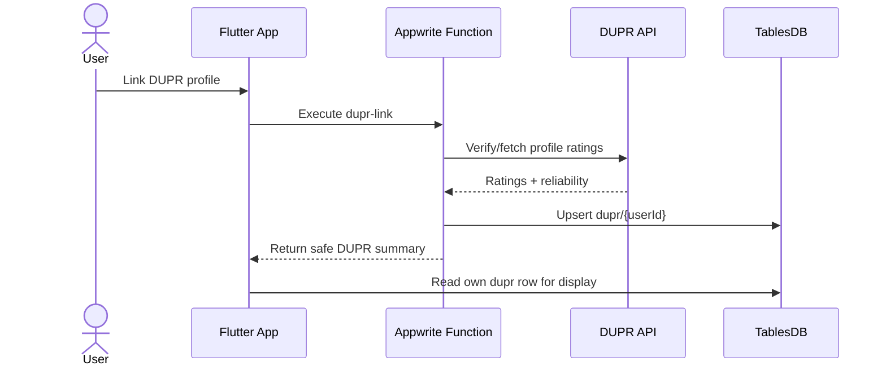
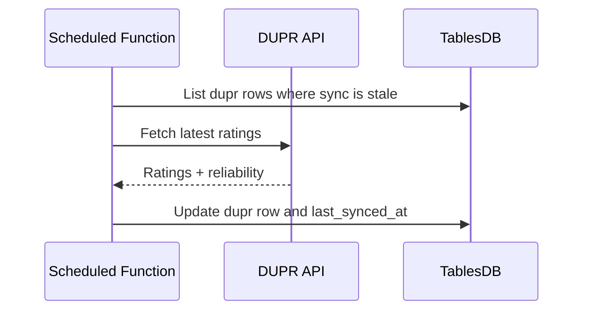

# DUPR Implementation Planning

This document is a future-stage implementation plan. DUPR is not part of the current MVP active schema or app flow.

## Current position

- The active MVP does not create a `dupr` table.
- The active Mermaid ERD in `docs/database.md` intentionally excludes DUPR.
- DUPR fields must not be stored on `users`.
- Flutter must not call DUPR directly or store DUPR credentials/tokens.
- DUPR integration should be promoted only after API/partner access and privacy requirements are confirmed.

## Goal

Allow a PikaCircle user to link a DUPR profile, sync verified DUPR singles/doubles ratings, and display those ratings in
profile/admin contexts without replacing PikaCircle's internal `skills` source of truth.

## Non-goals

- Do not auto-update `skills.level` from DUPR in the first DUPR phase.
- Do not require DUPR to join sessions initially.
- Do not put DUPR ratings directly in `users`.
- Do not expose DUPR API secrets to Flutter.
- Do not add DUPR to the MVP schema before the future phase starts.

## Phase 0 - API and product discovery

Deliverables:

1. Confirm DUPR API or partner access.
2. Confirm whether DUPR supports OAuth/user consent, profile search, or verified linking.
3. Confirm API rate limits, terms, fields returned, and caching rules.
4. Decide whether PikaCircle should support singles, doubles, or both ratings in UI.
5. Define privacy copy for storing external DUPR data.

Exit criteria:

- API access path is known.
- Required user consent language is documented.
- Product has decided where DUPR ratings appear and whether they affect matching.

## Phase 1 - Promote future schema

Add a dedicated `dupr` table to the active schema.

Recommended table:

| Field                       | Type                    | Notes                                             |
| --------------------------- | ----------------------- | ------------------------------------------------- |
| `$id` / `id`                | string                  | Use Appwrite user ID for one-row-per-user lookup. |
| `user_id`                   | relationship -> `users` | Unique one-to-one relationship.                   |
| `dupr_id`                   | string                  | External DUPR profile ID; unique when present.    |
| `singles_rating`            | float                   | Latest synced singles rating.                     |
| `singles_reliability_score` | float                   | DUPR singles reliability score.                   |
| `doubles_rating`            | float                   | Latest synced doubles rating.                     |
| `doubles_reliability_score` | float                   | DUPR doubles reliability score.                   |
| `last_synced_at`            | datetime                | Last successful sync.                             |

Relationships and indexes:

- Relationship: `dupr.user_id -> users`, one-to-one, unique.
- Unique index: `dupr.dupr_id`.
- Optional index: `last_synced_at` for scheduled refresh jobs.
- Update `docs/database.md` active ERD with `USERS ||--o| DUPR : "user_id"` only when this phase starts.

Permissions:

- `dupr` must use row security.
- Users may read their own DUPR row.
- Users must not directly create/update/delete DUPR rows.
- All writes must happen through trusted Appwrite Functions or server-side code.

Exit criteria:

- After this future phase is promoted to active schema, schema setup creates `dupr` idempotently.
- Remote schema has no client write permission on `dupr`.
- Docs and ERD are updated from future-only to active.

## Phase 2 - Trusted backend functions

Implement DUPR through trusted functions only.

### Function: `dupr-link`

Purpose: Link a signed-in PikaCircle user to a DUPR profile.

Input options depend on DUPR capability:

- OAuth callback data, if DUPR supports OAuth.
- DUPR profile ID or claim token, if DUPR supports profile claiming.
- Admin-entered DUPR profile ID, if linking is manual/admin-reviewed.

Required behavior:

1. Derive caller from Appwrite authenticated execution context.
2. Validate the submitted DUPR identity.
3. Fetch DUPR profile/rating data server-side.
4. Verify ownership or admin approval according to product policy.
5. Upsert `dupr/{userId}`.
6. Return a safe summary to Flutter.

Must reject:

- attempts to link another user's PikaCircle account;
- duplicate `dupr_id` already linked to another user;
- unverified profile ownership, unless admin-approved;
- malformed or unsupported DUPR identifiers.

### Function: `dupr-sync`

Purpose: Refresh linked DUPR ratings.

Modes:

- User-triggered refresh for the signed-in user.
- Admin-triggered refresh for one user.
- Scheduled refresh for stale linked rows.

Required behavior:

1. Load linked `dupr` rows due for sync.
2. Respect DUPR API rate limits.
3. Fetch latest singles/doubles ratings and reliability scores.
4. Update only DUPR fields and `last_synced_at`.
5. Preserve existing ratings on transient API failure.
6. Log failures for admin review.

### Function: `dupr-unlink`

Purpose: Let a user or admin disconnect a DUPR profile.

Product decision required:

- Delete the `dupr` row entirely, or
- keep row with ratings cleared and audit metadata.

Recommended initial behavior: delete the `dupr` row through trusted backend after confirming the caller owns it or is
admin.

Exit criteria:

- Link, sync, and unlink flows work through Functions.
- Duplicate linking is prevented.
- API errors do not corrupt existing ratings.
- Function logs are sufficient for support/debugging.

## Phase 3 - Flutter UI

Add UI only after backend functions exist.

Profile UI:

- Show DUPR linked/unlinked state.
- Show singles rating, doubles rating, reliability scores, and last sync time.
- Add “Link DUPR” action.
- Add “Refresh DUPR” action with rate-limit-friendly UX.
- Add “Unlink DUPR” action with confirmation.

Admin/host UI:

- Show DUPR rating as context when reviewing hosted session participants.
- Clearly label DUPR as external evidence, not PikaCircle's official skill level.

UX rules:

- If no DUPR row exists, show no rating rather than placeholder fake data.
- If `last_synced_at` is stale, show “Last synced …” and allow refresh when permitted.
- If reliability score is low, display a caution label rather than hiding the rating.

Exit criteria:

- User can link, view, refresh, and unlink DUPR from Profile.
- Host/admin review screens can read DUPR context without making it authoritative.
- UI handles no-DUPR, stale-DUPR, and API-error states gracefully.

## Phase 4 - Optional matching policy

Do not enable matching impact until product rules are explicit.

Possible future policies:

1. Display-only: DUPR never affects session eligibility.
2. Advisory: hosts/admins can see DUPR when reviewing players.
3. Hybrid eligibility: DUPR can satisfy skill requirements when reliability is high.
4. Admin override: host/admin can override DUPR mismatch with a note.

Recommended first policy: display-only/advisory.

Before enabling eligibility impact, define:

- singles vs doubles mapping;
- reliability threshold;
- fallback when DUPR is missing;
- conflict policy between DUPR and `skills.level`;
- audit history for decisions based on DUPR.

## Data flow

Scheduled sync:

## Security requirements

- DUPR API credentials stay server-side only.
- Flutter only calls Appwrite Functions and reads permitted rows.
- The backend derives user identity from Appwrite authenticated execution context.
- Never trust user-submitted ratings.
- Prevent one DUPR profile from being linked to multiple PikaCircle users unless product explicitly allows it.
- Keep row-level write permissions off for clients.
- Store only fields required for PikaCircle features.

## Testing plan

Backend tests:

- Link succeeds for verified DUPR profile.
- Link fails for duplicate `dupr_id`.
- Link fails for invalid profile ID.
- Sync updates ratings and `last_synced_at`.
- Sync preserves old values on transient API failure.
- Unlink removes or clears the row according to policy.
- Non-owner cannot link/update/unlink another user's DUPR row.

Flutter tests:

- Profile shows unlinked state.
- Profile shows linked ratings and last sync time.
- Link action handles success and error states.
- Refresh action handles loading, success, stale, and rate-limit errors.
- Unlink action requires confirmation.

Integration tests:

- End-to-end link -> display -> refresh -> unlink.
- Duplicate link attempt across two users.
- Admin/host review screen displays DUPR context when available.

## Rollout plan

1. Keep DUPR hidden behind a feature flag.
2. Deploy schema and functions to staging.
3. Test with a small internal set of DUPR profiles.
4. Validate privacy copy and consent flow.
5. Enable profile display only.
6. Monitor API errors, duplicate-link attempts, and stale sync rates.
7. Decide later whether DUPR should influence matching or remain display-only.

## Implementation checklist

- [ ] Confirm DUPR API/partner access and terms.
- [ ] Confirm user consent/linking method.
- [ ] Promote `dupr` table from future schema to active schema.
- [ ] Add `dupr.user_id` one-to-one relationship and unique index.
- [ ] Add unique `dupr.dupr_id` index.
- [ ] Update active Mermaid ERD with `USERS ||--o| DUPR`.
- [ ] Add trusted `dupr-link` Function.
- [ ] Add trusted `dupr-sync` Function.
- [ ] Add trusted `dupr-unlink` Function.
- [ ] Add scheduled stale-rating sync if allowed by DUPR terms.
- [ ] Add Flutter profile link/display/refresh/unlink UI.
- [ ] Add host/admin DUPR context display if needed.
- [ ] Add backend, Flutter, and integration tests.
- [ ] Roll out behind feature flag.

## Open questions

- Does DUPR provide OAuth, partner API, profile search, or another verified linking method?
- What exact fields and reliability scores are available?
- What are DUPR's rate limits and data retention requirements?
- Should PikaCircle show singles, doubles, or both by default?
- Should DUPR influence matching in a later phase?
- What reliability threshold is acceptable for eligibility decisions?
- Can a DUPR profile be linked to multiple PikaCircle accounts, or must it be unique?
- What should happen when a user unlinks DUPR?
- Should admin be able to manually link a DUPR profile for a user?
