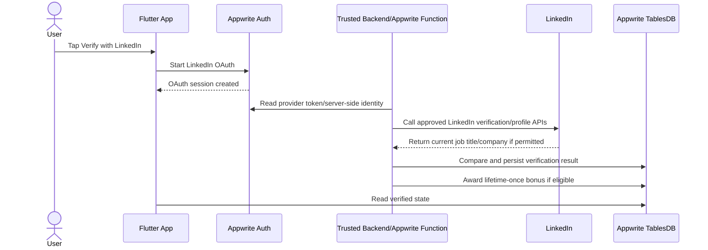

# LinkedIn Implementation Planning

This document explains how PikaCircle should implement LinkedIn account linking, job-title verification, and the
verified job-title badge.

## Current decision

PikaCircle should support two levels of LinkedIn behavior:

1. **MVP / current phase** - user manually enters `linkedin_profile_url` and `job_title`; admin reviews it manually. The
   app may show `Job title added`, but should only show the verified badge when backend/admin data marks it verified.
2. **Future LinkedIn API phase** - after approved LinkedIn access, backend verifies current job title through LinkedIn
   APIs and can set `job_title_verified = true`.

Normal Sign In with LinkedIn using OpenID Connect cannot verify a user's current job title. Do not market OIDC sign-in
as employment verification.

## Official LinkedIn API reality

### Standard Sign In with LinkedIn using OpenID Connect

Official docs: <https://learn.microsoft.com/en-us/linkedin/consumer/integrations/self-serve/sign-in-with-linkedin-v2>

Standard self-serve scopes:

| Scope     | Purpose                                      |
| --------- | -------------------------------------------- |
| `openid`  | Required for OpenID Connect authentication.  |
| `profile` | Lite profile: ID, name, profile picture.     |
| `email`   | Primary email and optional `email_verified`. |

LinkedIn OIDC userinfo endpoint:

```text
GET https://api.linkedin.com/v2/userinfo
```

Typical available claims:

- `sub`
- `name`
- `given_name`
- `family_name`
- `picture`
- `locale`
- `email` - optional
- `email_verified` - optional

Important limitations:

- No structured current job title.
- No structured current company.
- No public `vanityName`/`linkedin.com/in/...` lookup for normal apps.
- OIDC proves the user controls a LinkedIn identity; it does not prove current employment.

### Verified on LinkedIn APIs

Official docs:

- Authentication:
  <https://learn.microsoft.com/en-us/linkedin/consumer/integrations/verified-on-linkedin/api-reference/authentication>
- Implementation guide:
  <https://learn.microsoft.com/en-us/linkedin/consumer/integrations/verified-on-linkedin/guides/implementation-guide>
- Plus tier quickstart:
  <https://learn.microsoft.com/en-us/linkedin/consumer/integrations/verified-on-linkedin/guides/plus-tier/quickstart>

Verified on LinkedIn is the official path for stronger verification, but access is tiered and gated.

Relevant scopes:

- **`r_profile_basicinfo`**
  - Availability: Verified on LinkedIn tiers
  - Purpose: Basic profile info, including LinkedIn-provided profile URL.
- **`r_verify`**
  - Availability: Development/Lite
  - Purpose: Verification categories only.
- **`r_verify_details`**
  - Availability: Plus only
  - Purpose: Detailed verification metadata.
- **`r_primary_current_experience`**
  - Availability: Plus only
  - Purpose: Current job title and company.
- **`r_validation_status`**
  - Availability: Plus only
  - Purpose: Bulk validation status checks.

The `r_primary_current_experience` scope is the key requirement for automated job-title verification. Without Plus-tier
approval, PikaCircle should not claim it can fetch official current position data.

## Appwrite integration

Appwrite supports OAuth2 providers including LinkedIn, but the current PikaCircle code does not wire LinkedIn yet.
Current code only exposes Apple, Google, and Facebook in `SocialAuthProvider` and onboarding UI.

### Appwrite Console setup

1. Create a LinkedIn Developer app at <https://www.linkedin.com/developers/>.
2. Add **Sign In with LinkedIn using OpenID Connect**.
3. In Appwrite Console, go to **Auth -> Settings -> OAuth2 Providers**.
4. Enable **LinkedIn**.
5. Paste the LinkedIn Client ID and Client Secret.
6. Copy the Appwrite LinkedIn OAuth callback URL.
7. Add that callback URL to the LinkedIn app's allowed redirect URLs.

Use the exact callback URL shown by Appwrite Console. It is usually shaped like:

```text
https://<appwrite-domain>/v1/account/sessions/oauth2/callback/linkedin/<project-id>
```

The Flutter callback scheme must still match the Appwrite project callback setup. Current project scheme:

```text
appwrite-callback-6a0a88940013e0e16b8b
```

### Flutter code changes needed for LinkedIn sign-in

Current code does not include LinkedIn in `SocialAuthProvider`. To add it later:

1. Add `linkedin` to `SocialAuthProvider` in `lib/domain/models/account_models.dart`.
2. Map it in `AppwriteAuthService._oauthProvider()` to Appwrite's LinkedIn OAuth provider enum.
3. Add a LinkedIn button to onboarding/social sign-in UI.
4. Request only OIDC scopes for basic sign-in unless PikaCircle has approved Verified on LinkedIn access.

Basic sign-in scopes:

```text
openid profile email
```

If Appwrite SDK enum naming differs by version, use the provider name supported by the installed Appwrite Dart SDK and
verify with `flutter analyze`.

## MVP manual verification workflow

Until LinkedIn Plus-tier API access is approved:

1. User inputs `linkedin_profile_url` and `job_title` in PikaCircle.
2. Save these fields as user-editable profile data.
3. Show neutral `Job title added` state, not a verified badge.
4. Admin reviews the LinkedIn URL manually.
5. If approved, backend/admin sets:
   - `job_title_verified = true`
   - `job_title_verified_at`
   - `job_title_verified_by` to an admin/system actor id
6. Backend/admin grants the 5-credit job-title bonus only if the user has never received it before.
7. Flutter displays the verified badge from backend state.

This is compliant because it does not scrape LinkedIn or claim unsupported API verification.

## Future automated verification workflow

Only implement this after PikaCircle receives approved access to the required LinkedIn APIs.



Future Plus-tier scopes may include:

```text
r_profile_basicinfo r_verify_details r_primary_current_experience
```

Do not request Plus-tier scopes until LinkedIn has approved the app for those products. Unapproved scopes will fail or
be unavailable.

## User-submitted URL verification limitations

PikaCircle should not attempt to verify arbitrary `linkedin.com/in/...` URLs by scraping or resolving vanity names.

Safe rules:

- Do not scrape LinkedIn pages.
- Do not use unofficial Voyager/browser APIs.
- Do not assume the public vanity URL is available through standard OIDC.
- Require the user to authenticate/link with LinkedIn for automated verification.
- Compare against LinkedIn API data only when approved scopes return current job title/company.
- Otherwise, use manual admin review.

## Data mapping

Canonical database fields in `users`:

- `job_title`
- `linkedin_profile_url`
- `job_title_verified`
- `job_title_verified_at`
- `job_title_verified_by` - optional admin/system actor id
- `job_title_credit_awarded_at`
- `company` - optional

Current Flutter/Appwrite prefs use camelCase fields:

- `jobTitle`
- `linkedInUrl`
- `jobTitleVerified`

Until the app moves profile data fully into the `users` table, document and keep this mapping explicit.

## Credit bonus rule

- The initial job-title verification bonus is `5` credits.
- The amount should be backend-configurable.
- The bonus is lifetime-once per user.
- Later job changes may require re-verification for the badge, but must not award another 5 credits.
- Backend must check `job_title_credit_awarded_at` and/or the transaction ledger before awarding.
- Award through `transactions.type = adjustment`, not client-side logic.

## What is correct about the verified badge workflow

`docs/app workflows/linkedin-verified-badge-workflow.md` is correct if interpreted with these constraints:

- `LinkedIn API/backend/admin review` means either manual admin review now or restricted LinkedIn API verification
  later.
- Automated current-position verification requires Verified on LinkedIn Plus-tier access, especially
  `r_primary_current_experience`.
- Standard OIDC cannot verify job title.
- The app should show verified state only from trusted backend data.
- The 5-credit bonus remains lifetime-once.

## Implementation checklist

MVP/manual phase:

- [ ] Keep user-editable LinkedIn URL and job title fields.
- [ ] Store submitted values in profile data.
- [ ] Add admin/backend action to mark job title verified.
- [ ] Add admin/backend action to grant lifetime-once 5-credit bonus.
- [ ] Show verified badge only from backend state.

LinkedIn OAuth phase:

- [ ] Enable LinkedIn provider in Appwrite Console.
- [ ] Add LinkedIn to `SocialAuthProvider`.
- [ ] Add LinkedIn provider mapping in `AppwriteAuthService`.
- [ ] Add LinkedIn sign-in/link button.
- [ ] Request only `openid profile email` unless approved for more.

LinkedIn Plus verification phase:

- [ ] Apply for Verified on LinkedIn Plus-tier access.
- [ ] Confirm access to `r_primary_current_experience`.
- [ ] Implement server-side API calls only.
- [ ] Persist verification metadata.
- [ ] Re-verify after user edits job title or LinkedIn URL.
