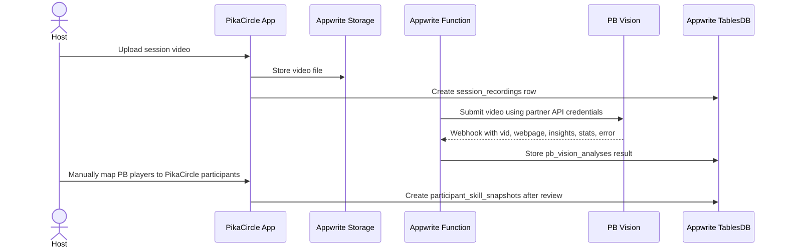

# PB Vision Implementation Planning

This document is planning-only. PB Vision is not integrated into the PikaCircle app yet.

Current MVP operating mode:

1. Hosted session host records the game.
2. Host uploads/analyzes the video manually in PB Vision outside PikaCircle.
3. Host reviews PB Vision output manually.
4. Host or admin manually enters the useful player analysis back into PikaCircle when the related screens/admin tools
   exist.

Future automation through PB Vision partner API, Appwrite Functions, webhooks, or in-app upload is out of scope for the
current phase and is documented only as a later roadmap option.

## Sources

- PB Vision API Partner Guide: <https://help.pb.vision/articles/2793895-pb-vision-api-partner-guide>
- PB Vision video upload troubleshooting: <https://help.pb.vision/articles/1981767-video-upload-troubleshooting>
- PB Vision framing and court alignment guidelines:
  <https://help.pb.vision/articles/1108176-video-recording-and-framing-tips>
- PB Vision Partner SDK reference: <https://github.com/pbv-public/partner-sdk-nodejs>
- PikaCircle session workflow: `docs/app workflows/session-workflow.md`
- PikaCircle database model: `docs/database.md`

## Current implementation status

PB Vision is currently only documented in this repository.

Implemented today:

- Appwrite Storage exists only for profile/avatar flows.
- Session docs already describe future tables such as `session_recordings`, `pb_vision_analyses`, and
  `participant_skill_snapshots`.

Not implemented today:

- No in-app recording upload flow.
- No PB Vision API call.
- No PB Vision webhook handler.
- No automated player-index mapping.
- No automatic skill update from PB Vision results.

## Manual-host SOP for hosted sessions

### 1. Before the session

The host should prepare recording equipment before players arrive.

Checklist:

- Use a phone, GoPro, DSLR, or other camera that records at least 30 FPS.
- Prefer 1080p, 30 FPS, MP4, H.264.
- Use landscape orientation.
- Mount the camera on a tripod, fence mount, or stable platform.
- Keep the camera at least 5 feet off the ground.
- Ensure all 4 court corners are visible.
- Ensure all players remain visible throughout rallies and serves.
- Avoid recording into direct sunlight.
- Disable image stabilization or HDR if it causes framing/processing issues.
- Do not record warmups or drills for PB Vision analysis. Record actual singles or doubles gameplay.

### 2. During the session

Recording rules:

- Start recording at the first serve.
- End recording at paddle tap or game completion.
- Keep the camera fixed; do not hand-hold or move it during play.
- Do not cut out dead time between rallies. PB Vision uses idle time for calibration and automatically removes it.
- For long sessions, record each game as its own video where possible.

### 3. After the session

The host uploads the video to PB Vision manually using PB Vision's app or web flow.

PB Vision upload requirements:

| Requirement | SOP value                                                                             |
| ----------- | ------------------------------------------------------------------------------------- |
| File type   | `.mp4`                                                                                |
| Codec       | H.264                                                                                 |
| Resolution  | Prefer 1080p. 4K may require Premium/API enablement.                                  |
| Frame rate  | 30 or 60 FPS                                                                          |
| Duration    | Maximum 30 minutes per game/video                                                     |
| File size   | Use 5GB as the operational limit. PB Vision also recommends 2GB for best API results. |
| Content     | One singles or doubles pickleball game; no drills/warmups                             |

If PB Vision shows `Taking Longer Than Expected`, do not re-upload immediately. PB Vision says this usually means manual
review; most such videos complete within 24 hours.

If PB Vision reports an error, check:

- wrong codec, such as H.265/HEVC, VP9, or AV1;
- file larger than 5GB;
- video longer than 30 minutes;
- court boundaries not visible;
- camera moved during play;
- not a valid pickleball game;
- players are not visible throughout the game.

### 4. Host reviews PB Vision output

After PB Vision finishes, the host should review:

- PB Vision video page/webpage;
- player stats;
- shot-level insights;
- player movement or positioning notes;
- skill rating outputs, if available;
- player thumbnails or labels used by PB Vision.

Important: PB Vision player indices are per-video only. For example, `Player 0` in one video is not guaranteed to be the
same person as `Player 0` in another video.

### 5. Manual entry back into PikaCircle

Until app integration exists, the host/admin should manually map PB Vision outputs to real PikaCircle participants.

Manual mapping checklist:

- Identify the PikaCircle session.
- Confirm the session participant list.
- Open the PB Vision result page.
- Match each PB Vision player to a PikaCircle participant using visual review, player order, host memory, thumbnails, or
  player confirmation.
- Record only validated participant-level results.
- Do not update a user's current skill from PB Vision output without review.

Recommended manual fields to capture later:

- **`session_id`**
  - Purpose: Links the analysis to the PikaCircle session.
- **`participant_id`**
  - Purpose: Links output to the roster row.
- **`user_id`**
  - Purpose: Links output to the user profile.
- **`pb_vision_video_url`**
  - Purpose: Link to PB Vision video/result page.
- **`pb_vision_player_index`**
  - Purpose: Temporary PB Vision player number for this video only.
- **`source`**
  - Purpose: Use `pb_vision_manual` or `pb_vision` depending on schema decision.
- **`level`**
  - Purpose: PB Vision-derived or host-confirmed level.
- **`serve`**
  - Purpose: Optional serve metric.
- **`return`**
  - Purpose: Optional return metric.
- **`offense`**
  - Purpose: Optional offense metric.
- **`defense`**
  - Purpose: Optional defense metric.
- **`agility`**
  - Purpose: Optional agility/movement metric.
- **`consistency`**
  - Purpose: Optional consistency metric.
- **`overall_skill_rating`**
  - Purpose: Average of `serve`, `return`, `offense`, `defense`, `agility`, and `consistency`; compute as
    `(serve + return + offense + defense + agility + consistency) / 6` after review.
- **`confidence_score`**
  - Purpose: Optional confidence indicator if available.
- **`reviewed_by_user_id`**
  - Purpose: Host/admin who confirmed the mapping.
- **`reviewed_at`**
  - Purpose: Timestamp of manual review.
- **`notes`**
  - Purpose: Human-readable host/admin notes.

## Long-video recommendation

PB Vision recommends a maximum of 30 minutes and one game per upload.

For PikaCircle hosted sessions, which may be 2 hours long:

1. Do not upload a full 2-hour session as one analysis unit.
2. Split by game or meaningful segment before upload.
3. Keep each segment under 30 minutes.
4. Preserve idle time inside each game; do not remove dead time between rallies.
5. Name each segment clearly, for example:
   - `session-2026-06-01-court-a-game-1.mp4`
   - `session-2026-06-01-court-a-game-2.mp4`
6. Record the segment order manually so results can be interpreted in context.
7. Map players per segment because PB Vision player indices may change between uploaded videos.

If PB Vision support confirms multi-game splitting for PikaCircle's use case, treat that as a future operational
improvement. The safe MVP SOP is still one game per upload.

## Result interpretation policy

PB Vision output should be treated as analysis evidence, not an automatic source of truth for user skill.

Use this review policy:

- PB Vision result creates or informs a historical skill snapshot.
- Host/admin validates player identity before assigning results to users.
- Host/admin reviews unusual ratings before updating current user skill.
- Historical snapshots should not be overwritten. If the same video is reprocessed, create a new reviewed snapshot or
  mark the older one superseded.
- Current `skills` should only change after review and acceptance.

## Future automation roadmap, not current scope

The following is for later planning only.

### Future partner API flow

Future safeguards:

- Never store PB Vision API keys in Flutter/client code.
- Use Appwrite Functions or another trusted backend for partner API calls.
- Treat webhook ingestion as idempotent because retries may happen.
- PB Vision currently does not provide webhook signature verification, so correlate callbacks against known submitted
  `vid` values and use an unguessable webhook URL or internal route token.
- Store raw PB Vision payloads for audit/debugging.
- Require manual player mapping before writing participant-level snapshots.

### Future data flow

The existing database planning already has suitable destination tables:

- `session_recordings`: uploaded video metadata and file reference.
- `pb_vision_analyses`: analysis job state, PB Vision IDs, summary, error, raw result reference.
- `participant_skill_snapshots`: participant-level reviewed skill graph from PB Vision.
- `skills`: current user skill profile, updated only after accepted review.

## Planning decisions

| Decision                                    | Current answer                                             |
| ------------------------------------------- | ---------------------------------------------------------- |
| Is PB Vision integrated now?                | No.                                                        |
| Who uploads video now?                      | Hosted host manually uploads to PB Vision.                 |
| Does PikaCircle call PB Vision now?         | No.                                                        |
| Does PikaCircle store raw video now?        | Not required for MVP manual SOP.                           |
| Does PikaCircle auto-update user skill now? | No. Host/admin review is required.                         |
| How are long videos handled?                | Split into per-game videos under 30 minutes.               |
| Should future automation use PB Vision API? | Yes, only after partner access and backend implementation. |

## Open questions before future integration

- Which hosted sessions require PB Vision review versus optional review?
- Who is responsible for manual player mapping: host, admin, or both?
- What minimum PB Vision metrics should be entered into PikaCircle first?
- Should PB Vision snapshots affect matching immediately or only after admin approval?
- Should PikaCircle store PB Vision webpage links only, or also downloaded JSON exports?
- What retention/privacy policy applies to hosted session videos and analysis data?
- Does PikaCircle need PB Vision partner API access in Phase 1, or can manual upload continue through MVP validation?
